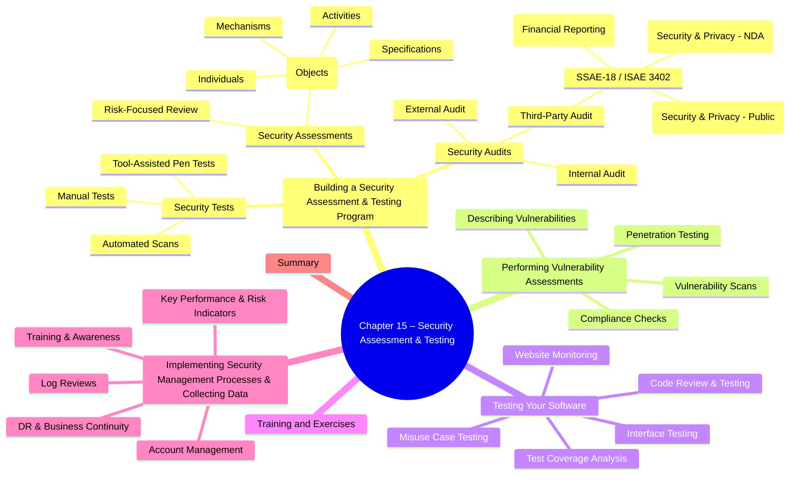

# Chapter 15: Security Assessment and Testing

- [Building a Security Assessment and Testing Program](#building-a-security-assessment-and-testing-program)
  - [Security Testing](#security-testing)
  - [Security Assessments](#security-assessments)
  - [Security Audits](#security-audits)
- [Performing Vulnerability Assessments](#performing-vulnerability-assessments)
  - [Describing Vulnerabilities](#describing-vulnerabilities)
  - [Vulnerability Scans](#vulnerability-scans)
  - [Penetration Testing](#penetration-testing)
  - [Compliance Checks](#compliance-checks)
- [Testing Your Software](#testing-your-software)
  - [Code Review and Testing](#code-review-and-testing)
  - [Interface Testing](#interface-testing)
  - [Misuse Case Testing](#misuse-case-testing)
  - [Test Coverage Analysis](#test-coverage-analysis)
  - [Website Monitoring](#website-monitoring)
- [Training and Exercises](#training-and-exercises)
- [Implementing Security Management Processes and Collecting Security Process Data](#implementing-security-management-processes-and-collecting-security-process-data)
  - [Log Reviews](#log-reviews)
  - [Account Management](#account-management)
  - [Disaster Recovery and Business Continuity](#disaster-recovery-and-business-continuity)
  - [Training and Awareness](#training-and-awareness)
  - [Key Performance and Risk Indicators](#key-performance-and-risk-indicators)
- [Summary](#summary)

> **Goal of the chapter:** Understand how to **plan, execute, and evaluate** tests, assessments, and audits that prove security controls are *present, operating correctly, and effective* across on-prem, cloud, and hybrid environments.

## Building a Security Assessment and Testing Program
| What | Why |
|------|-----|
|**Security Tests**|Verify **control operation** (working as intended).|
|**Security Assessments**|Broader **risk-focused reviews**; identify & remediate weaknesses.|
|**Security Audits**|**Independent attestation** that controls meet a defined standard; results shared with 3rd-parties.|

> ✅ **CISSP-Key:** A *test* checks a control; an *assessment* weighs risk & gives recs; an *audit* proves compliance **independently**.

### Security Testing
#### Definition  
Automated scans, tool-assisted pen tests, or manual exploits run on a **scheduled, risk-prioritized** basis.

#### Scheduling / Prioritization Factors  
- ❑ Availability of security testing resources
- ❑ Criticality of the systems and applications protected by the tested controls
- ❑ Sensitivity of information contained on tested systems and applications
- ❑ Likelihood of a technical failure of the mechanism implementing the control
- ❑ Likelihood of a misconfiguration of the control that would jeopardize security
- ❑ Risk that the system will come under attack
- ❑ Rate of change of the control configuration
- ❑ Other changes in the technical environment that may affect the control performance
- ❑ Difficulty and time required to perform a control test
- ❑ Impact of the test on normal business operations

#### Good Practice  
1. Design a **comprehensive plan** (no haphazard “scan-everything” approach).  
2. Blend **frequent automated** scans (low impact) with **periodic manual** testing (higher assurance).  
3. **Review results**:  
   * Manual analyst validation *or*  
   * Automated log + alert/ticket on findings.  

### Security Assessments
#### Definition  
A **trained security professional** performs a holistic risk assessment, factoring **threats, vulnerabilities, asset value, and future risks**.  
**Deliverable:** *Management report* (plain language) + **remediation recommendations**.

#### Execution  
- May be **internal** or **outsourced**.  
- Uses testing tools **plus** reasoning & expert judgment (beyond raw scan output).

#### NIST SP 800-53A “Assessing Security & Privacy Controls”  
| Assessment **Objects** | Meaning |
|-|-|
|**Specifications**|Docs: policies, procedures, requirements, designs.|
|**Mechanisms**|Security controls (hw / sw / fw).|
|**Activities**|Human actions (backups, log reviews).|
|**Individuals**|People who implement the above.|

*Assessors **examine, interview, and test** these objects to rate control effectiveness.*

### Security Audits
**Purpose:** Provide an **impartial, unbiased opinion** on control effectiveness against a standard.  
*Must be performed by auditors **independent** of those who design/operate the controls.*

#### Audit Types  
| Type | Who controls scope? | Typical Audience |
|-|-|-|
|**Internal**|Organization’s own **independent audit dept** | Management / Board |
|**External**|Outside audit firm hired by org (e.g., **Big 4**) | Shareholders, regulators |
|**Third-Party**|Initiated & scoped by **another entity** (client, regulator) | Requesting entity |

> **Exam Tip:** *Control of the engagement* distinguishes internal, external, and third-party audits.

#### SOC / SSAE-18 / ISAE 3402 Audits  
| Engagement | Focus |
|-|-|
|**SOC 1**|Controls that affect **financial reporting**.|
|**SOC 2**|Controls over **security, availability, confidentiality, processing integrity, privacy** (results = confidential).|
|**SOC 3**|Same domains as SOC 2, but **public report**.|

**Report Types**  
- **Type I:** Design & description of controls at a **point-in-time**.  
- **Type II:** Design **and operating effectiveness** over **≥ 6 months** (more trusted on the exam).

#### Real-World Example  
*2015 GAO audit* → found significant weaknesses in **FAA Air Traffic Control** systems (boundary, authn, encryption, logging).

#### Auditing Standards & Frameworks
| Standard | Use in CISSP context |
|-|-|
|**COBIT (ISACA)**|Control objectives for IT & assurance framework.|
|**ISO 27001**|Specifies **ISMS** requirements (can certify).|
|**ISO 27002**|Code of practice — detailed **control catalog**.|

*(Know that audits/assessments compare org controls to a chosen **standard**.)*

#### Key Takeaways for the Exam
1. **Test ≠ Assessment ≠ Audit** – know definitions & goals.  
2. **Risk-prioritized schedule** drives testing frequency.  
3. Assessment objects per **NIST 800-53A:** specifications, mechanisms, activities, individuals.  
4. Audit independence: internal vs external vs third-party; **SOC reports (Type I vs II)**.  
5. Common frameworks (COBIT, ISO 27001/27002) provide **control objectives** for audits.

## Performing Vulnerability Assessments  
Vulnerability assessments systematically **discover, validate and prioritise technical weaknesses** (🔑 *vulnerabilities*) in hosts, apps or networks so that risk can be reduced to an acceptable level.  
Process flow ➜ *Detection → Validation → Remediation* (workflow becomes part of your org’s **vulnerability-management programme**).

### Describing Vulnerabilities  
To speak a common language, the industry relies on **NIST SCAP** (🔑 *Security Content Automation Protocol*).  
| SCAP Component | Purpose | Remember This |
|----------------|---------|--------------|
| **CVE** | Naming scheme for individual vulnerabilities | *CVE-2023-1234* style IDs |
| **CVSS** | 0–10 severity score (Base/Temporal/Environmental) | Exam loves “**exploitability × impact**” concept |
| **CCE** | Names misconfigurations | Hardening benchmarks map to CCEs |
| **CPE** | Names products/platforms | e.g., *cpe:/o:microsoft:windows_10* |
| **XCCDF** | Checklist language | Used by SCAP scanners for benchmark content |
| **OVAL** | Testing/probing language | Drives automated checks |

### Vulnerability Scans  
Automated probing that can run **on a schedule** and diff results over time.  
Major categories & typical 🛠:

| Scan Type | Goal | Example Tools |
|-----------|------|---------------|
| **Network discovery** | Find live hosts & open ports | Nmap, Masscan |
| **Network vulnerability** | Match services to known CVEs | Nessus, Qualys |
| **Web app vulnerability** | Detect SQLi, XSS, CSRF, etc. | OWASP ZAP, Burp Scanner |
| **Database vulnerability** | Probe DB engines for misconfig & SQLi | sqlmap, AppDetective |

> ⚠️  Attackers use the *exact same* scanners—treat “scan noise” as potential recon!

#### Network Discovery Scanning  
- **Port-state vocabulary** in Nmap: *open, closed, filtered, unfiltered, open|filtered*  
- Common probe techniques (memorise!):  
  - **TCP SYN** (half-open)  
  - **TCP Connect** (full 3-way handshake)  
  - **TCP ACK** (firewall rule mapping)  
  - **UDP Scan** (no handshake)  
  - **Xmas Scan** (FIN + PSH + URG flags)

#### Network Vulnerability Scanning  
- Unauthenticated vs **Authenticated scans** (latter reduce false-positives/-negatives).  
- **False positive** = vuln reported but not real.  
- **False negative** = real vuln missed (⚠️ more dangerous).  
- Cannot detect **zero-day** (no CVE exists yet).

#### Web Application Scanning  
- Exam loves **PCI-DSS** requirement: annual web scan **or** WAF.  
- Run baseline scan ➜ before prod release ➜ after any code change ➜ periodic by criticality.  
- Tools: Burp Suite, OWASP ZAP, Acunetix.  
- Banner-grabbing & version fingerprinting common techniques.

####  Database Scanning  
- Targets SQL Server, Oracle, MySQL etc.; looks for SQLi, weak auth, default creds.  
- sqlmap can *exploit* found vulns → sometimes bridges into penetration testing territory.

##### Must-know TCP Ports  
| Service | Port(s) | Notes |
|---------|---------|-------|
| SSH | 22 | Secure CLI admin |
| HTTP / HTTPS | 80 / 443 | Web traffic |
| RDP | 3389 | Windows remote desktop |
| *…know list from book* |

### Penetration Testing  
**Differences from vuln scanning**: actively *exploits* weaknesses to prove impact.  
NIST SP 800-115 phases (memorise diagram!):  
1. **Planning** – scope, rules of engagement, *written authorisation*.  
2. **Discovery** – info gathering + vulnerability analysis.  
3. **Attack** – exploit, escalate, pivot, maintain access.  
4. **Reporting** – detail findings, business impact, remediation roadmap.

| Pen-Test Type | Knowledge Provided | AKA |
|---------------|--------------------|-----|
| **White-box** | Full details | Known environment |
| **Gray-box** | Limited / partial | Partially known |
| **Black-box** | No details | Unknown environment |

Tools & Automation:  
- **Metasploit Framework** (exploit scripts, payloads, post-exploitation).  
- **Breach & Attack Simulation (BAS)** platforms (continuous, automated “mini-pen-tests”).  

> ⚠️  Pen-testing can disrupt services—ensure maintenance window & rollback plan.

### Compliance Checks  
- Map **regulatory obligations** → **security controls** → verify operation.  
- Examples: HIPAA, GDPR, SOX, PCI-DSS.  
- Regular compliance audits avoid fines & demonstrate **due care/diligence** (Domain 1 buzzwords).

#### Quick Flashcards  
- **SCAP** = umbrella framework (CVE, CVSS, CCE, CPE, XCCDF, OVAL).  
- **False positive vs false negative** – which is riskier? (False negative).  
- **Unauthenticated vs authenticated scan** – trade-off speed vs accuracy.  
- **Port 22 / 80 / 443 / 3389** – know at least top 15 from book.  
- **Pen-test phases** – Planning → Discovery → Attack → Reporting.

#### Exam-Day Takeaways  
1. **Get authorisation** before any scan or test—otherwise it’s hacking.  
2. Distinguish **scan types** and when each is appropriate.  
3. Remember SCAP pieces and **CVSS scoring** purpose.  
4. Be able to walk through **Nmap port states and flags**.  
5. Tie vulnerability management into **workflow & prioritisation** (severity × likelihood × remediation effort).  

---

