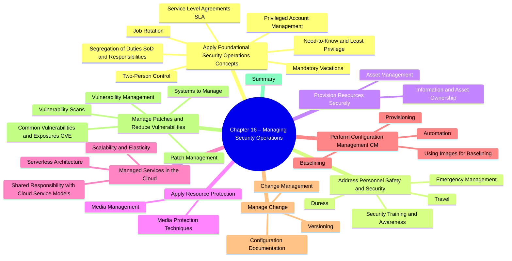

# Chapter 16: Managing Security Operations

- [Apply Foundational Security Operations Concepts](#apply-foundational-security-operations-concepts)
  - [Need-to-Know and Least Privilege](#need-to-know-and-least-privilege)
  - [Segregation of Duties (SoD) and Responsibilities](#segregation-of-duties-sod-and-responsibilities)
  - [Two-Person Control](#two-person-control)
  - [Job Rotation](#job-rotation)
  - [Mandatory Vacations](#mandatory-vacations)
  - [Privileged Account Management](#privileged-account-management)
  - [Service-Level Agreements (SLAs)](#service-level-agreements-slas)
- [Address Personnel Safety and Security](#address-personnel-safety-and-security)
  - [Duress](#duress)
  - [Travel](#travel)
  - [Emergency Management](#emergency-management)
  - [Security Training and Awareness](#security-training-and-awareness)
- [Provision Information and Assets Securely](#provision-information-and-assets-securely)
  - [Information and Asset Ownership](#information-and-asset-ownership)
  - [Asset Management](#asset-management)
- [Apply Resource Protection](#apply-resource-protection)
  - [Media Management](#media-management)
  - [Media Protection Techniques](#media-protection-techniques)
- [Managed Services in the Cloud](#managed-services-in-the-cloud)
  - [Shared Responsibility with Cloud Service Models](#shared-responsibility-with-cloud-service-models)
  - [Scalability and Elasticity](#scalability-and-elasticity)
  - [Serverless Architecture](#serverless-architecture)
- [Perform Configuration Management (CM)](#perform-configuration-management-cm)
  - [Provisioning](#provisioning)
  - [Baselining](#baselining)
  - [Using Images for Baselining](#using-images-for-baselining)
  - [Automation](#automation)
- [Manage Change](#manage-change)
  - [Change Management](#change-management)
  - [Versioning](#versioning)
  - [Configuration Documentation](#configuration-documentation)
- [Manage Patches and Reduce Vulnerabilities](#manage-patches-and-reduce-vulnerabilities)
  - [Systems to Manage](#systems-to-manage)
  - [Patch Management](#patch-management)
  - [Vulnerability Management](#vulnerability-management)
  - [Vulnerability Scans](#vulnerability-scans)
  - [Common Vulnerabilities and Exposures](#common-vulnerabilities-and-exposures)
- [Summary](#summary)

##  Apply Foundational Security Operations Concepts  

> *These operating-level controls show “due care” (setting reasonable safeguards) and “due diligence” (maintaining them over time).  Expect scenario questions that ask which control best **detects**, **deters**, or **prevents** insider abuse.*

| Concept | Key Points for CISSP | Why It Matters |
|---------|---------------------|----------------|
| **16.1.1 Need-to-Know & Least Privilege** | *Need-to-Know* = grant access **only** to information required for a task (most common with classified data). *Least Privilege* = grant the **minimum** permissions/rights (file permissions, system commands) required to perform job functions. Assumes well-defined job roles; revisit when roles change. | ✔ Limits attack surface & insider curiosity. ✔ Protects confidentiality **and** integrity. ❓ Exam trick: clearance ≠ automatic access—need-to-know still applies. |
| &emsp;• Need-to-Know Access | Examples: DBA can patch DB server but **not** read customer PII tables. Secret-cleared user must still be added to each individual Secret project. | |
| &emsp;• Principle of Least Privilege | Applies to **users, apps, services, processes**. Never add “everyone” to *Administrators* or run services as *root*. Privilege escalation = threat when violated. | |
| **16.1.2 Segregation of Duties (SoD)** | No single person can perform **all** steps of a critical task. Requires collusion to commit fraud ⇒ deterrent. | ✔ Checks & balances. ✔ Reduces single-point failure. |
| &emsp;• Two-Person Control / Two-Man Rule | Two individuals must **act together** (e.g., each holds half of a password, dual keys for bank vault). | |
| &emsp;• Split Knowledge | Combines SoD + two-person control—each person knows **only a portion** of a secret (e.g., crypto key components). | |
| **16.1.3 Job Rotation** | Periodic swap of roles/responsibilities. Benefits: peer review, fraud detection, cross-training, workforce resilience. | |
| **16.1.4 Mandatory Vacations** | 1- or 2-week continuous leave; substitute performs duties → exposes anomalies. | Widely used in banking/financial sector. |
| **16.1.5 Privileged Account Management (PAM)** | Controls creation, use & monitoring of **administrator/root**-level accounts.  Techniques: Just-In-Time (JIT) elevation, time-boxed Kerberos tickets, password vaults, SIEM alerts on privileged actions (e.g., PowerShell Event ID 4104). | ✔ Deters abuse, detects APTs. ✔ Supports least privilege. |
| &emsp;• Detecting APT Activity | APT playbook: escalate, wipe logs, create admin users, open RDP (3389), schedule tasks. PAM + SIEM correlation catches anomalies early. | |
| **16.1.6 Service-Level Agreements (SLAs)** | Contract with vendor defining **measurable** performance (uptime, RTO, RPO, response time) and penalties. Often paired with **MOU** (intent, no penalties). | ✔ Sets expectations for cloud/outsourced services. ✔ Supports availability objectives. |

### Need-to-Know vs. Least Privilege
Both principles **constrain access**, but they answer two different questions:

| Principle | **What it limits** | **Core Question** | Typical Controls / Examples |
|-----------|-------------------|-------------------|-----------------------------|
| **Need-to-Know** | *Which* **information** a subject can see | “**Do I need this specific data to do my job right now?**” | • Row- or field-level DB masking • Compartmented military intel (“read into” a program) • HR staff can open personnel files only for employees they administer |
| **Least Privilege** | *Which* **capabilities** (rights/permissions) a subject can exercise | “**What is the minimum set of actions I must be allowed to carry out?**” | • No local-admin rights for ordinary users • Service account granted only *Read* on its log directory • Cloud IAM role with `GetObject` but not `PutObject` |

### Quick Memory Aids
- **Need-to-Know → Data** access; **Least Privilege → Function** access.
- **SoD + Two-Man Rule + Split Knowledge** = “No one can cheat alone.”
- **JIT Admin** = Admin rights appear *just in time* and disappear *just as fast.*
- **Mandatory Vacation** exposes “ghost activities” when the user is gone.
- **SLA = “Uptime insurance”**; penalties motivate vendor compliance.

> **Exam-Ready Tip:**  When asked which control *prevents* an administrator from single-handedly altering logs **and** enforces peer review, choose **Segregation (Separation) of Duties** or **Two-Person Control**, not least privilege.

