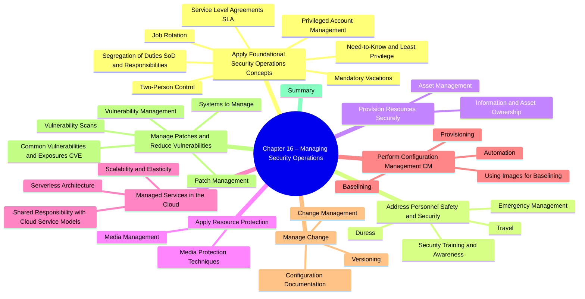

# Chapter 16: Managing Security Operations

- [Apply Foundational Security Operations Concepts](#apply-foundational-security-operations-concepts)
  - [Need-to-Know and Least Privilege](#need-to-know-and-least-privilege)
  - [Segregation of Duties (SoD) and Responsibilities](#segregation-of-duties-sod-and-responsibilities)
  - [Two-Person Control](#two-person-control)
  - [Job Rotation](#job-rotation)
  - [Mandatory Vacations](#mandatory-vacations)
  - [Privileged Account Management](#privileged-account-management)
  - [Service-Level Agreements (SLAs)](#service-level-agreements-slas)
- [Address Personnel Safety and Security](#address-personnel-safety-and-security)
  - [Duress](#duress)
  - [Travel](#travel)
  - [Emergency Management](#emergency-management)
  - [Security Training and Awareness](#security-training-and-awareness)
- [Provision Information and Assets Securely](#provision-information-and-assets-securely)
  - [Information and Asset Ownership](#information-and-asset-ownership)
  - [Asset Management](#asset-management)
- [Apply Resource Protection](#apply-resource-protection)
  - [Media Management](#media-management)
  - [Media Protection Techniques](#media-protection-techniques)
- [Managed Services in the Cloud](#managed-services-in-the-cloud)
  - [Shared Responsibility with Cloud Service Models](#shared-responsibility-with-cloud-service-models)
  - [Scalability and Elasticity](#scalability-and-elasticity)
  - [Serverless Architecture](#serverless-architecture)
- [Perform Configuration Management (CM)](#perform-configuration-management-cm)
  - [Provisioning](#provisioning)
  - [Baselining](#baselining)
  - [Using Images for Baselining](#using-images-for-baselining)
  - [Automation](#automation)
- [Manage Change](#manage-change)
  - [Change Management](#change-management)
  - [Versioning](#versioning)
  - [Configuration Documentation](#configuration-documentation)
- [Manage Patches and Reduce Vulnerabilities](#manage-patches-and-reduce-vulnerabilities)
  - [Systems to Manage](#systems-to-manage)
  - [Patch Management](#patch-management)
  - [Vulnerability Management](#vulnerability-management)
  - [Vulnerability Scans](#vulnerability-scans)
  - [Common Vulnerabilities and Exposures](#common-vulnerabilities-and-exposures)
- [Summary](#summary)

##  Apply Foundational Security Operations Concepts  

> *These operating-level controls show “due care” (setting reasonable safeguards) and “due diligence” (maintaining them over time).  Expect scenario questions that ask which control best **detects**, **deters**, or **prevents** insider abuse.*

| Concept | Key Points for CISSP | Why It Matters |
|---------|---------------------|----------------|
| **16.1.1 Need-to-Know & Least Privilege** | *Need-to-Know* = grant access **only** to information (= permission only) required for a task (most common with classified data). *Least Privilege* = grant the **minimum** permissions/rights (file permissions, system commands) required to perform job functions. Assumes well-defined job roles; revisit when roles change. | ✔ Limits attack surface & insider curiosity. ✔ Protects confidentiality **and** integrity. ❓ Exam trick: clearance ≠ automatic access—need-to-know still applies. |
| &emsp;• Need-to-Know Access | Examples: DBA can patch DB server but **not** read customer PII tables. Secret-cleared user must still be added to each individual Secret project. | |
| &emsp;• Principle of Least Privilege | Applies to **users, apps, services, processes**. Never add “everyone” to *Administrators* or run services as *root*. Privilege escalation = threat when violated. | |
| **16.1.2 Segregation of Duties (SoD)** | No single person can perform **all** steps of a critical task. Requires collusion to commit fraud ⇒ deterrent. | ✔ Checks & balances. ✔ Reduces single-point failure. |
| &emsp;• Two-Person Control / Two-Man Rule | Two individuals must **act together** (e.g., each holds half of a password, dual keys for bank vault). | |
| &emsp;• Split Knowledge | Combines SoD + two-person control—each person knows **only a portion** of a secret (e.g., crypto key components). | |
| **16.1.3 Job Rotation** | Periodic swap of roles/responsibilities. Benefits: peer review, fraud detection, cross-training, workforce resilience. | |
| **16.1.4 Mandatory Vacations** | 1- or 2-week continuous leave; substitute performs duties → exposes anomalies. | Widely used in banking/financial sector. |
| **16.1.5 Privileged Account Management (PAM)** | Controls creation, use & monitoring of **administrator/root**-level accounts.  Techniques: Just-In-Time (JIT) elevation, time-boxed Kerberos tickets, password vaults, SIEM alerts on privileged actions (e.g., PowerShell Event ID 4104). | ✔ Deters abuse, detects APTs. ✔ Supports least privilege. |
| &emsp;• Detecting APT Activity | APT playbook: escalate, wipe logs, create admin users, open RDP (3389), schedule tasks. PAM + SIEM correlation catches anomalies early. | |
| **16.1.6 Service-Level Agreements (SLAs)** | Contract with vendor defining **measurable** performance (uptime, RTO, RPO, response time) and penalties. Often paired with **MOU** (intent, no penalties). | ✔ Sets expectations for cloud/outsourced services. ✔ Supports availability objectives. |

### Need-to-Know vs. Least Privilege
Both principles **constrain access**, but they answer two different questions:

| Principle | **What it limits** | **Core Question** | Typical Controls / Examples |
|-----------|-------------------|-------------------|-----------------------------|
| **Need-to-Know** | *Which* **information** (permission only) a subject can see | “**Do I need this specific data to do my job right now?**” | • Row- or field-level DB masking • Compartmented military intel (“read into” a program) • HR staff can open personnel files only for employees they administer |
| **Least Privilege** | *Which* **capabilities** (rights/permissions) a subject can exercise | “**What is the minimum set of actions I must be allowed to carry out?**” | • No local-admin rights for ordinary users • Service account granted only *Read* on its log directory • Cloud IAM role with `GetObject` but not `PutObject` |

### Quick Memory Aids
- **Need-to-Know → Data** access; **Least Privilege → Function** access.
- **SoD + Two-Man Rule + Split Knowledge** = “No one can cheat alone.”
- **JIT Admin** = Admin rights appear *just in time* and disappear *just as fast.*
- **Mandatory Vacation** exposes “ghost activities” when the user is gone.
- **SLA = “Uptime insurance”**; penalties motivate vendor compliance.

> **Exam-Ready Tip:**  When asked which control *prevents* an administrator from single-handedly altering logs **and** enforces peer review, choose **Segregation (Separation) of Duties** or **Two-Person Control**, not least privilege.

# Chapter 16 – Managed Services in the Cloud (CISSP Quick-Notes)

> **Purpose:** capture every testable concept from the “Managed Services in the Cloud” section so you can recall responsibilities, security requirements, and key terms on exam day.

--- 
##  Managed Services in the Cloud
| Key Point | In-Plain-English Summary |
|-----------|-------------------------|
| **Cloud = “managed service.”** | Org rents resources (compute, storage, apps) from a CSP or hosts its own on-premises cloud. |
| **Control vs. convenience trade-off** | Off-prem cloud → less direct control = higher risk; on-prem cloud → more control but less convenience. |
| **Data protection** |  • Encrypt **in transit** & **at rest**.  • *Customer* should own/hold keys (DoD CC SRG).  • Crypto-erase = strong data destruction control. |
| **DoD CC SRG (info-impact levels 2-6)** | U.S. gov guide defining security baselines for Secret & below; stresses encryption & customer-controlled keys. |

### Shared Responsibility with Cloud Service Models  

> **Figure 16-1** ➜ vendor vs. customer duties.

| Model | CSP Owns | Customer Owns | CISSP “Gotchas” |
|-------|----------|---------------|-----------------|
| **SaaS** | Everything from **HW → app code** | Data integrity, user config, access control | Example – Gmail. |
| **PaaS** | HW, OS, **runtime** | Deployed apps + some host configs | Dev builds/maintains code. |
| **IaaS** | Physical infra (compute, storage, network) | **OS, patches, middleware, apps, data** | Treat VM as on-prem server. |

#### Cloud *Deployment* Models  
| Model | Who Can Use | Who Usually Maintains | Notes |
|-------|-------------|-----------------------|-------|
| **Public** | Anyone (multi-tenant) | CSP | Use SLAs to lock in uptime/security. |
| **Private** | Single org | Org itself *or* CSP | On-prem or dedicated off-prem. |
| **Community** | 2+ orgs w/ shared mission | Shared / joint | Similar policy/reg/compliance drivers. |
| **Hybrid** | Mix of 2+ clouds | Shared | Needs secure data/app portability tech. |

####  Anything-as-a-Service (XaaS)  
- Umbrella term for “____ as a service.”  
- **Security as a Service (SECaaS)** aka **MSP / MSSP**: off-prem backup, IAM, SIEM, IDS/IPS, etc.  
  - **Benefit:** 24×7 expertise & elasticity.  
  - **Risk:** vendor lock-in, third-party trust, data sovereignty.

###  Scalability and Elasticity  
| Term | What It Means | Exam Hooks |
|------|---------------|------------|
| **Scalability** | System **can grow** (add CPU/RAM/bandwidth). Often manual → may require reboot. | “Vertical (up) / Horizontal (out) scaling.” |
| **Elasticity** | **Auto-grow/shrink** on demand without downtime. | Paid by actual use; key cloud value prop. |

#### Services / Cloud Integration (iPaaS, SDDC)  
- Goal: stitch on-prem + cloud apps → **no data silos**.  
- Improves visibility & process flow; often implemented via *integration platform as a service* (iPaaS).  
- Architect’s job: ensure secure APIs, data classification, consistent IAM.

### Serverless Architecture
| Aspect | Serverless / FaaS | Contrast with PaaS |
|--------|------------------|--------------------|
| **Developer focus** | Only write & upload *functions* | Build & manage whole app stack. |
| **Billing** | Pay per invocation (runs, then stops) | VM/container runs continuously. |
| **Scaling** | Automatic per-function | Must scale full runtime env. |
| **Security duty** | Code logic & data; CSP secures runtime & infra | Shared host OS config still customer’s. |
| **Example** | AWS Lambda, Azure Functions, Google Cloud Functions | Google App Engine, AWS Elastic Beanstalk |

### Quick Memory Aids  

- **SaaS = Finished Software**  
- **PaaS = Platform for Programmers**  
- **IaaS = Infrastructure you Admin**  
- **Elasticity = Elastic band auto-stretch**  
- **Serverless = “Functions only” – pay when it runs**

### Exam Checklist  

- [ ] Encrypt cloud data; **customer holds keys**.  
- [ ] Map duties: **SaaS (data), PaaS (apps), IaaS (OS)**.  
- [ ] Know 4 **deployment models** and their control splits.  
- [ ] Recognize **SECaaS / MSSP** benefits & risks.  
- [ ] Differentiate **scalability** (manual) vs. **elasticity** (auto).  
- [ ] Recall **serverless/FaaS** cost & security implications.

## Perform Configuration Management (CM)

### Provisioning
- **Definition:** Installing + configuring OS & apps on new systems.
- **Don’t use defaults!** Default installs enable many vulnerabilities.
- **Hardening steps:**
  1. **Disable unused services**  
     e.g. file server → turn off FTP if not used  
  2. **Close unused logical ports**  
     typically done by disabling services  
  3. **Remove unused applications**  
     uninstall any bundled apps you don’t need  
  4. **Change default passwords**  
     attackers know vendor defaults  

### Baselining
- **Definition:** A “starting configuration” – a list of secure settings for a system role.
- **Role-specific:**  
  - File server baseline ≠ desktop baseline  
- **Flexible:** Admins tailor the baseline for variations (e.g. branch office file server).

### Using Images for Baselining
1. **Build & Harden**  
   - Install OS + apps on a “gold” machine  
   - Apply all secure settings & test thoroughly  
2. **Capture Image**  
   - Use imaging software to snapshot the “gold” machine  
   - Store on an image server (or USB/DVD)  
3. **Deploy Image**  
   - Push the snapshot to new systems  
   - Finalize each (hostname, IP, group membership)  

> **Benefits:**  
> - **Consistency:** identical secure configs every time  
> - **Speed:** deploy in minutes vs. hours  
> - **Recovery:** rapidly rebuild corrupted machines  
>
> **Warning:** Protect image files! A malware-tainted image propagates infections.

### Automation
- **Combine images + scripts:**  
  - One base image + automated post-install tasks  
  - e.g. install department-specific apps via PowerShell or Ansible  
- **Group Policy (Windows):**  
  - Centralize registry & security settings for all domain machines  
  - Apply per-OU or per-role (file servers, desktops, accounting PCs)  
- **Registry hardening:**  
  - Block or restrict PowerShell to thwart attackers (see Chapter 14)  
  - Enable detailed logging for forensic visibility  
  - Deploy via Group Policy to enforce across all endpoints  

---

> **Exam Tips:**  
> - Know the difference between **provisioning**, **baselining**, **imaging**, and **automation**.  
> - Remember the four hardening steps under provisioning.  
> - Visualize the 3-step image workflow.  
> - Be able to explain how GPO (or equivalent) drives registry hardening at scale.

