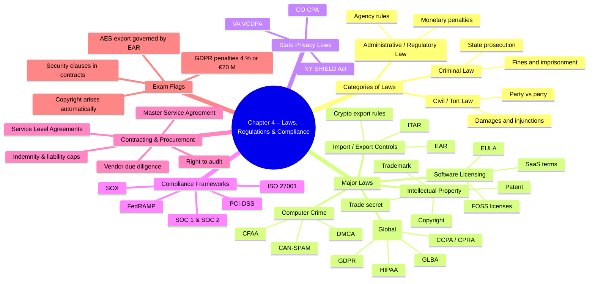

# Chapter 4 — Laws, Regulations & Compliance  

- [Categories of Laws](#categories-of-laws)
  - [Criminal Law](#criminal-law)
  - [Civil Law](#civil-law)
  - [Administrative Law](#administrative-law)
- [Laws](#laws)
  - [Computer Crime](#computer-crime)
  - [Intellectual Property (IP)](#intellectual-property-ip)
  - [Software Licensing](#software-licensing)
  - [Import/Export](#importexport)
  - [Privacy](#privacy)
- [State Privacy Laws](#state-privacy-laws)
- [Compliance](#compliance)
- [Contracting and Procurement](#contracting-and-procurement)
- [Summary](#summary)

## Categories of Laws  
**Core idea:**  Different legal branches govern how infractions are prosecuted and penalized. Know which applies to a given security scenario.

### Criminal Law  
- **Purpose:**  Protect society; acts viewed as offenses against the state.  
- **Burden of proof:** *Beyond a reasonable doubt* (highest standard).  
- **Penalties:**  Prison, fines, probation, asset forfeiture.  
- **CISSP angle:**  Computer fraud, unauthorized access, sabotage can trigger criminal liability.

### Civil Law  
- **Purpose:**  Resolve disputes; compensate injured parties (torts, contracts).  
- **Burden:** *Preponderance of evidence* (>50%).  
- **Penalties:**  Monetary damages, injunctions, specific performance.  
- **CISSP angle:**  Breach-of-contract, negligence in data protection → civil lawsuits/class actions.

### Administrative Law  
- **Purpose:**  Grant regulatory agencies rule-making/enforcement power.  
- **Burden:**  Varies (“substantial evidence” or “clear weight”).  
- **Penalties:**  Fines, license revocation, consent decrees.  
- **CISSP angle:**  HIPAA OCR fines, GDPR administrative penalties, SEC cyber-disclosure rules.

---

## Laws  

### Computer Crime  
- Statutes: **CFAA, DMCA, ECPA (US); CMA 1990 (UK); Budapest Convention**.  
- Offenses: unauthorized access, malware distribution, DDoS, identity theft.  
- Penalties include felony charges, *up to 20 yrs* prison in severe cases.

### Intellectual Property (IP)  
- **Copyright** (software code, docs), **Trademark**, **Patent**, **Trade secret**.  
- Security role: protect employer IP (NDAs, DLP) & avoid infringement.  
- Exam watchword: *“Work for hire”*, *“first-sale doctrine”*, *“fair use”*.

### Software Licensing  
- Models: **Per-seat, OEM, subscription (SaaS), GPL/MIT (open-source)**.  
- Violations → vendor audits, civil damages, sometimes criminal copyright suits.  
- Understand **shrink-wrap, click-wrap, EULA** enforceability.

### Import/Export  
- Crypto & dual-use tech governed by **EAR, ITAR, Wassenaar**.  
- Key length thresholds (e.g., >56-bit historically restricted).  
- Obtain export licenses; apply geoblocking for sanctioned nations.

| Concept | What you need to know for the exam |
|---------|------------------------------------|
| **Import / Export controls** | U.S. law restricts sending certain hardware, software, technical data, and even PII across borders. Two core rule sets: • **ITAR** – Defense articles/services on the *U.S. Munitions List* (22 CFR 121). • **EAR** – “Dual-use” commercial items on the *Commerce Control List* (Dept. of Commerce / BIS). EAR Category 5 covers **information-security products**, including cryptography. |
| **Countries of Concern** | BIS designates embargoed / high-risk destinations (e.g., **Cuba, Iran, North Korea, Syria**). Exports of high-performance computers or strong crypto to these states normally **require a license or are prohibited**. |
| **Encryption Export Controls** | Historically, strong crypto was almost impossible to export. Current BIS rules create **“retail” / “mass-market”** categories: vendors submit products for a ≤ 30-day review; once approved, items may be exported worldwide except to embargoed countries. Stronger or custom crypto may still fall under EAR 5A002 / 5D002 and need a license. |

> **Exam Tip**: Security professionals must perform **due-diligence and license checks** before shipping equipment, software, or data internationally; negligence can lead to civil or criminal penalties.

### Privacy  
- Global requirements:  
  - **GDPR** (EU) — lawful basis, DPIA, 72-hr breach notice, *up to 4 % global revenue fines*.  
  - **HIPAA** (US health), **GLBA** (US finance), **COPPA**, **FERPA**, **PIPEDA** (CA), **POPIA** (SA).  
- Principles: data minimization, purpose limitation, data-subject rights, transparency.

---

## State Privacy Laws  
- Notable US examples: **CCPA/CPRA (California)**, **NY SHIELD Act**, **Virginia CDPA**, **Colorado CPA**.  
- Often add:  
  - “**Private right of action**” for consumers.  
  - 30-day cure periods, statutory damages per record.  
  - stricter breach-notification timelines (<30 days).  

---

## Compliance  
**Core idea:**  Demonstrating adherence to statutory, regulatory, and contractual controls to avoid penalties and maintain customer trust.  
- Frameworks: **PCI-DSS, SOX, FISMA, FedRAMP, ISO/IEC 27001, NIST 800-53, COBIT**.  
- Evidence via **audits, SOC 2 reports, continuous monitoring**, GRC tooling.  
- Remember: *Compliance ≠ Security* but synergy is vital for funding and governance.

---

## Contracting and Procurement  
- Insert security clauses into **RFP/SOW/SLA**:  
  - Right-to-audit, breach-notification SLA (<24 hr), data-location, encryption, subcontractor flow-down.  
  - **Termination/exit strategy** for data return & sanitization.  
  - **SBOM** & secure-coding attestations for software supply chain.  
- Evaluate vendor risk with questionnaires, on-site audits, penetration-test attestation.

---

## Summary  
CISSPs must pair technical savvy with legal fluency:

* Differentiate **criminal, civil, administrative** repercussions.  
* Familiarize with major **computer-crime** statutes and **privacy regulations** (GDPR, HIPAA, CCPA).  
* Protect and respect **intellectual property**; manage **software licenses**.  
* Avoid export-control violations for crypto/dual-use tech.  
* Build a **compliance program** that maps controls to multiple frameworks and embeds robust security clauses in contracts.  

Expect exam scenarios on breach-notification timing, cross-border data transfers, IP infringement, and regulatory fines.
