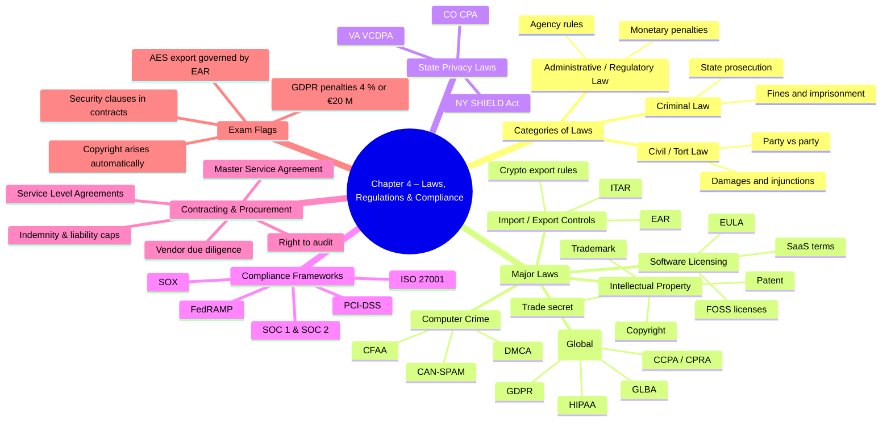

# Chapter 4 — Laws, Regulations & Compliance  

- [Categories of Laws](#categories-of-laws)
  - [Criminal Law](#criminal-law)
  - [Civil Law](#civil-law)
  - [Administrative Law](#administrative-law)
- [Laws](#laws)
  - [Computer Crime](#computer-crime)
  - [Intellectual Property (IP)](#intellectual-property-ip)
  - [Software Licensing](#software-licensing)
  - [Import/Export](#importexport)
  - [Privacy](#privacy)
- [State Privacy Laws](#state-privacy-laws)
- [Compliance](#compliance)
- [Contracting and Procurement](#contracting-and-procurement)
- [Summary](#summary)

## Categories of Laws  
**Core idea:**  Different legal branches govern how infractions are prosecuted and penalized. Know which applies to a given security scenario.
U.S. information-security professionals routinely encounter **three categories of law**.  
Understanding the purpose, scope, enforcement, and CISSP implications of each helps determine when to call legal counsel and how to design compliant security programs.

| Law Category | What It Covers | Who Enforces It | Typical Penalties | CISSP Angle |
|--------------|---------------|-----------------|-------------------|-------------|
| **Criminal Law** | Acts viewed as offenses against society (e.g. hacking, fraud, assault, arson) | Prosecutors, police, FBI/Secret Service, DoJ | Fines, imprisonment, community service, loss of civil liberties | Know key federal cyber-crime statutes (CFAA, ECPA, ITADA, etc.) and incident-response evidence handling. |
| **Civil Law** | Disputes between private parties (contracts, employment, real-estate, negligence) | Plaintiff’s attorneys; adjudicated by civil courts | Monetary damages, injunctions, specific performance | Contract language, SLAs, privacy and negligence exposure; common source of **liability** for data breaches. |
| **Administrative Law** | Regulations issued by executive-branch agencies to operationalize statutes (e.g. FCC, FTC, DHS, SEC rules) | Regulator itself (audits, fines); reviewed by courts | Fines, revocation of licenses, cease-and-desist orders | Compliance frameworks (HIPAA, GLBA, SOX, FISMA, FedRAMP) stem from administrative rules; non-compliance can trigger separate civil/criminal actions. |

### 1. Criminal Law

* **Purpose** – Protect society at large, deter harmful acts, and punish offenders.  
* **Source** – Federal & state legislatures; must align with the U.S. Constitution.  
* **Process** – Government (prosecution) vs. defendant; burden of proof *beyond a reasonable doubt*.  
* **Cyber-Security Focus**  
  * **Computer Fraud and Abuse Act (CFAA)** – Primary federal anti-hacking statute.  
  * **ECPA & Wiretap Act** – Unauthorized interception of electronic communications.  
  * **Identity Theft & Assumption Deterrence Act (ITADA)** – Criminalizes identity theft.  
* **Exam Tip** – Be able to cite when criminal authorities must be involved and understand chain-of-custody requirements for digital evidence.

---

### 2. Civil Law

* **Purpose** – Resolve non-criminal disputes and provide restitution to injured parties.  
* **Source** – Same legislative process as criminal law; codified in the **United States Code (USC)** or state statutes.  
* **Process** – Plaintiff vs. defendant; burden of proof is *preponderance of evidence* (lower threshold).  
* **Cyber-Security Focus**  
  * **Tort liability** – Negligence in safeguarding PII may result in class-action lawsuits.  
  * **Contract enforcement** – Breach of NDA or SLA due to security failure.  
* **Exam Tip** – Understand organizational exposure to civil suits after a breach and the role of insurance, due care, and due diligence.

---

### 3. Administrative Law

* **Purpose** – Enable executive agencies to implement and enforce detailed regulations that support statutes.  
* **Source** – Published in the **Code of Federal Regulations (CFR)**; must not conflict with higher laws.  
* **Process** – Agency rule-making (notice-and-comment), compliance audits, fines; subject to judicial review.  
* **Cyber-Security Focus**  
  * **NIST standards via FISMA/FISMA-2014** (e.g. SP 800-53)  
  * **HIPAA Security Rule** (HHS), **GLBA Safeguards Rule** (FTC), **SOX IT controls** (SEC/PCAOB)  
  * **FTC Act §5** – “Unfair or deceptive” practices for poor security.

* **Exam Tip** – Map administrative requirements to controls; ensure policies and procedures satisfy agency mandates to avoid fines and injunctions.

---

> **Remember for CISSP:**  
> *Criminal = society vs. individual, Civil = individual vs. individual, Administrative = agency rules.* Always verify which category applies before acting, and engage qualified legal counsel for gray areas.

---

## Laws  

### Computer Crime  
- **Why it matters:** CISSP pros must know the legal landscape impacting information security operations and data flows—domestic **and** international.  
- **Key point:** Always recognize when to involve legal counsel; the real skill is knowing the limits of your own expertise. 
- The earliest “computer-centric” statutes sought to criminalize hacking‐style activities that didn’t cleanly fit traditional theft or fraud laws.  
- Each U.S. state also has its own computer-crime laws, but Internet incidents typically cross state lines, giving **federal courts** jurisdiction.

- Statutes: **CFAA, DMCA, ECPA (US); CMA 1990 (UK); Budapest Convention**.  
- Offenses: unauthorized access, malware distribution, DDoS, identity theft.  
- Penalties include felony charges, *up to 20 yrs* prison in severe cases.

#### Computer Fraud and Abuse Act (CFAA) — 1986 (original)  
- **Focus:** Federal-interest computers (later broadened), classified info, banking records.  
- **Criminalized:** Unauthorized access, fraud via federal systems, password trafficking, and damage > $5 000.  
- **Exam cue:** First broad U.S. anti-hacking law; foundation for nearly all federal cyber prosecutions.

#### CFAA Amendments (1994 → 2008)
- Added **malicious-code outlaw**, expanded scope to **any computer in interstate commerce**, and allowed **civil suits** by victims.  
- Criticized for over-breadth: violating a website’s Terms of Service **could** be charged as a crime.  
- Recent cases (e.g., *Van Buren* 2021) are narrowing that scope.

#### National Information Infrastructure Protection Act (NIIPA) — 1996
- **Broadened CFAA** to cover computers in **international** commerce.  
- Extended felony penalties to attacks on critical infrastructure (power grids, pipelines, telecom, rail, etc.).

#### Federal Information Security Management Act (FISMA) — 2002
- Mandates **agency-wide information-security programs** for U.S. federal systems and contractor systems.  
- Requires **risk assessments, policies, training, annual testing, incident handling, and continuity planning**.

#### Federal Cybersecurity Laws (Modernization) — 2014
| Law | Core Idea (CISSP view) | Lead Agency |
| ---- | ---------------------- | ----------- |
| **FISMA Modernization Act** | Centralizes most federal cyber-oversight with **DHS**; DoD & Intel remain separate. | DHS |
| **Cybersecurity Enhancement Act** | NIST made the national coordinator for **voluntary standards** (→ NIST CSF). | NIST |
| **National Cybersecurity Protection Act** | Creates NCCIC as the **public/private info-sharing hub** for threats & incidents. | DHS |

#### NIST Special Publications & CSF
- **SP 800-53:** Baseline security & privacy controls for **federal** (and often commercial) systems.  
- **SP 800-171:** Extends similar controls to contractors handling **Controlled Unclassified Information (CUI)**.  
- **Cybersecurity Framework (CSF):** Voluntary, risk-based guidance (Identify, Protect, Detect, Respond, Recover) used globally.

> **Exam-Side Tip:** Be able to pair each law with its primary purpose, scope, and responsible agency—and know that export/import, privacy, and IP laws appear elsewhere in Domain 1.

### Intellectual Property (IP)  
- **Copyright** (software code, docs), **Trademark**, **Patent**, **Trade secret**.  
- Security role: protect employer IP (NDAs, DLP) & avoid infringement.  
- Exam watchword: *“Work for hire”*, *“first-sale doctrine”*, *“fair use”*.

### Software Licensing  
- Models: **Per-seat, OEM, subscription (SaaS), GPL/MIT (open-source)**.  
- Violations → vendor audits, civil damages, sometimes criminal copyright suits.  
- Understand **shrink-wrap, click-wrap, EULA** enforceability.

### Import/Export  
- Crypto & dual-use tech governed by **EAR, ITAR, Wassenaar**.  
- Key length thresholds (e.g., >56-bit historically restricted).  
- Obtain export licenses; apply geoblocking for sanctioned nations.

| Concept | What you need to know for the exam |
|---------|------------------------------------|
| **Import / Export controls** | U.S. law restricts sending certain hardware, software, technical data, and even PII across borders. Two core rule sets: • **ITAR** – Defense articles/services on the *U.S. Munitions List* (22 CFR 121). • **EAR** – “Dual-use” commercial items on the *Commerce Control List* (Dept. of Commerce / BIS). EAR Category 5 covers **information-security products**, including cryptography. |
| **Countries of Concern** | BIS designates embargoed / high-risk destinations (e.g., **Cuba, Iran, North Korea, Syria**). Exports of high-performance computers or strong crypto to these states normally **require a license or are prohibited**. |
| **Encryption Export Controls** | Historically, strong crypto was almost impossible to export. Current BIS rules create **“retail” / “mass-market”** categories: vendors submit products for a ≤ 30-day review; once approved, items may be exported worldwide except to embargoed countries. Stronger or custom crypto may still fall under EAR 5A002 / 5D002 and need a license. |

> **Exam Tip**: Security professionals must perform **due-diligence and license checks** before shipping equipment, software, or data internationally; negligence can lead to civil or criminal penalties.

### Privacy  
- Global requirements:  
  - **GDPR** (EU) — lawful basis, DPIA, 72-hr breach notice, *up to 4 % global revenue fines*.  
  - **HIPAA** (US health), **GLBA** (US finance), **COPPA**, **FERPA**, **PIPEDA** (CA), **POPIA** (SA).  
- Principles: data minimization, purpose limitation, data-subject rights, transparency.
- **Privacy in the U.S. vs. Europe** – U.S. privacy protections arise piecemeal from court decisions and sector-specific statutes, whereas the EU historically adopts comprehensive, omnibus laws that apply to all personal data.

#### U.S. Privacy Laws  
- Notable US examples: **CCPA/CPRA (California)**, **NY SHIELD Act**, **Virginia CDPA**, **Colorado CPA**.

- Often add:  
  - “**Private right of action**” for consumers.  
  - 30-day cure periods, statutory damages per record.  
  - stricter breach-notification timelines (<30 days).  

##### Fourth Amendment  
Guarantees people are secure from unreasonable government searches and seizures; courts extend this to wiretaps and surveillance, providing the constitutional basis for modern privacy claims.

##### United States – Federal Statutes  

| Law / Year | Core Purpose | Key Points |
|------------|--------------|------------|
| **Privacy Act 1974** | Limits what federal agencies may collect and how they disclose personal data | Requires minimal, necessary records; access/amendment rights; only applies to federal agencies |
| **ECPA 1986** | Protects electronic communications content & storage | Criminalizes unauthorized interception/access; covers email, voicemail, mobile calls |
| **CALEA 1994** | Ensures lawful intercept capability | Carriers must build in wire-tap access after court order, regardless of tech |
| **Economic Espionage Act 1996** | Extends theft to include trade secrets | Enables prosecution of industrial espionage |
| **HIPAA 1996** | Safeguards medical information | Privacy & Security Rules, patient rights to access/correct PHI |
| **HITECH 2009** | Modernizes HIPAA, adds breach notification | Business Associates directly liable; 60-day breach notice >500 records |
| **Data Breach Notification Laws** | SB 1386 (CA, 2002) → all 50 states (2018) | Mandate timely notice when PII exposed; details vary by state |
| **COPPA 1998** | Protects children (<13) online | Parental consent, privacy notice, review & deletion rights |
| **GLBA 1999** | Regulates financial-institution privacy | Requires privacy policies, limits data sharing among subsidiaries |
| **USA PATRIOT 2001 / USA FREEDOM 2015** | Expands surveillance powers for national-security purposes | Roving wiretaps, ISP disclosures, enhanced CFAA penalties; provisions repeatedly sunset/renew |
| **CLOUD Act 2018** | Cross-border law-enforcement data access | Allows warrants for data held abroad by U.S. firms; enables bilateral data-sharing pacts |
| **FERPA** | Student educational-record privacy | Inspection/correction rights; limits disclosure without consent |
| **Identity Theft & Penalty Enhancements 1998/2004** | Criminalizes identity theft against individuals | Up to 15-year sentences & fines |

##### U.S. Workplace Privacy  
Employees have **no reasonable expectation of privacy** on employer-owned devices. Employers should disclose monitoring via contracts, policies, banners, and device labels.

#### European Union  

##### GDPR 2016 → 2018  
- **Applies worldwide** to entities processing EU residents’ data.  
- Core principles: *lawfulness/fairness/transparency*, *purpose limitation*, *data minimization*, *accuracy*, *storage limitation*, *integrity & confidentiality*, *accountability*.  
- **Data subject rights**: access, rectification, erasure (“right to be forgotten”), portability, objection.  
- **Breach notice**: 72 hr to authority.  
- **Cross-border transfers**: Standard Contractual Clauses (SCCs) or Binding Corporate Rules (BCRs); Privacy Shield invalidated by *Schrems II* (2020).

#### APEC Privacy Framework  
Voluntary principles (notice, choice, security, etc.) promoting cross-border data flows among Asia-Pacific economies; relies on Accountability Agents and CBPR certification.

#### Canada – PIPEDA  
Nationwide commercial-sector law governing identifiable personal information. Grants individuals access, correction rights; superseded by “substantially similar” provincial laws (AB, BC, QC). Exempts personal, non-commercial, and government uses.

#### China – PIPL 2021  
First comprehensive Chinese data-protection law:  
- Requires *explicit consent*, *data minimization*, security measures.  
- Establishes rights of access, correction, deletion.  
- Restricts outbound transfers (security assessment, “equivalent protection”).  
- Heavy fines, business suspension, license revocation for violations.

#### South Africa – POPIA 2020  
Eight processing conditions paralleling GDPR. Highlights: consent, purpose specification, special-category & children data controls, Information Regulator enforcement, steep fines/prison for non-compliance.

---

#### State Privacy Laws  

##### CCPA (California) 2018  
- Rights to know, delete, and opt-out of sale of personal info; no retaliation.  
- Inspired similar laws in other states; federal analogue still pending.

States frequently pioneer privacy regulation that later influences nationwide or even federal rules.  
A prime illustration is **California’s Consumer Privacy Act (CCPA)**, enacted in 2018 (GDPR-inspired) and effective as of 2020.

##### Core Rights Granted by the CCPA
1. **Right to Know**  
   *Consumers may request full disclosure of the personal data collected, purposes of use, and third-party sharing.*

2. **Right to Deletion (“Right to be Forgotten”)**  
   *Under defined conditions, individuals can require a business to erase their personal information.*

3. **Right to Opt-Out of Sale**  
   *Individuals may direct a business to stop selling their personal data.*

4. **Right to Non-Discrimination**  
   *Businesses may not retaliate or discriminate against consumers for exercising CCPA rights.*

##### Broader Impact
- California has already expanded the CCPA (e.g., CPRA amendments).  
- Multiple other states (CO, CT, UT, VA, etc.) have introduced similar comprehensive privacy statutes.  
- Organizations operating across the U.S. must now navigate a patchwork of state privacy obligations while anticipating eventual federal harmonization.

---

## Compliance  
**Core idea:**  Demonstrating adherence to statutory, regulatory, and contractual controls to avoid penalties and maintain customer trust.  
- Frameworks: **PCI-DSS, SOX, FISMA, FedRAMP, ISO/IEC 27001, NIST 800-53, COBIT**.  
- Evidence via **audits, SOC 2 reports, continuous monitoring**, GRC tooling.  
- Remember: *Compliance ≠ Security* but synergy is vital for funding and governance.

---

## Contracting and Procurement  
- Insert security clauses into **RFP/SOW/SLA**:  
  - Right-to-audit, breach-notification SLA (<24 hr), data-location, encryption, subcontractor flow-down.  
  - **Termination/exit strategy** for data return & sanitization.  
  - **SBOM** & secure-coding attestations for software supply chain.  
- Evaluate vendor risk with questionnaires, on-site audits, penetration-test attestation.

---

## Summary  
CISSPs must pair technical savvy with legal fluency:

* Differentiate **criminal, civil, administrative** repercussions.  
* Familiarize with major **computer-crime** statutes and **privacy regulations** (GDPR, HIPAA, CCPA).  
* Protect and respect **intellectual property**; manage **software licenses**.  
* Avoid export-control violations for crypto/dual-use tech.  
* Build a **compliance program** that maps controls to multiple frameworks and embeds robust security clauses in contracts.  

Expect exam scenarios on breach-notification timing, cross-border data transfers, IP infringement, and regulatory fines.
