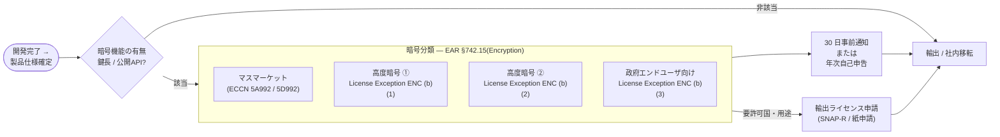

# Chapter 4 法律・規制・コンプライアンス

---

## 1. 法律の3カテゴリ

| 区分 | 目的 | 例 |
|------|------|----|
| **刑法 (Criminal Law)** | 社会秩序を守り、違反者を罰する | 不正アクセス・詐欺・マルウェア配布 |
| **民事法 (Civil Law)** | 損害賠償や契約トラブルを解決 | プライバシー侵害・知財侵害の賠償 |
| **行政法 (Administrative Law)** | 政府/規制当局が業界を監督 | 金融・医療・電気通信の業界規制 |

---

## 2. 主要な法律・規制と所管機関

| 分野 | 法律 / 規制 | 所管・執行機関 (主な管轄) |
|------|-------------|---------------------------|
| **プライバシー** | GDPR（EU一般データ保護規則） | 欧州データ保護会議 (EDPB)、各国DPA |
| | CCPA / CPRA（カリフォルニア州） | *California Privacy Protection Agency*、州司法長官 |
| | APPI（改正個人情報保護法・日本） | 個人情報保護委員会 (PPC) |
| **医療** | HIPAA（米） | *HHS* 傘下 **OCR** |
| **金融** | GLBA（米金融機関） | *FTC*、連邦金融監督機関 (FDIC/FRB/ OCC 等) |
| | SOX（企業会計透明化） | *SEC*、*PCAOB* |
| | FISMA（連邦政府情報システム） | *OMB*／*NIST*（SP800 シリーズ策定） |
| **決済** | PCI-DSS（カード業界標準） | *PCI SSC*（Visa・Mastercard 等の共同団体） |
| **輸出管理** | EAR（米商務省） | *Bureau of Industry and Security* (BIS) |
| | ITAR（米国務省） | *DDTC* |
| **サイバー犯罪** | CFAA（米コンピュータ詐欺取締法） | 連邦捜査局 (FBI)、司法省 (DoJ) |
| **インフラ** | NERC-CIP（北米電力） | North American Electric Reliability Corporation |
| **汎用ガイドライン** | ISO/IEC 27001 | ISO（策定）／適用組織を第三者認証機関が審査 |

> **ワンポイント**  
> - **国内外で重複適用**される例多数。クラウド利用時は「所在地＋アクセス主体＋データ主体」3軸で判断。  
> - 業界標準（PCI-DSSなど）は**法的強制力はない**が、契約や罰則条項で実質義務となる場合が多い。

---

## 3. コンプライアンス対応の4ステップ

1. **要求事項の洗い出し**  
   - 契約（顧客・サプライヤ）  
   - 業界標準（PCI-DSS など）  
   - 法令（GDPR、個人情報保護法 など）

2. **ギャップ分析** – 現状との差分を評価  
3. **コントロール実装** – ポリシー・手順・技術的対策  
4. **監査 & 証跡管理** – 定期監査とログ保存で遵守を証明

---

## 4. 契約・調達の注意点

| 契約書 | 主なチェック項目 |
|--------|----------------|
| **NDA (機密保持契約)** | 対象情報範囲・存続期間・例外規定 |
| **SLA (サービス水準合意)** | 可用性・応答時間・ペナルティ |
| **DPA (データ処理契約)** | 処理目的・越境転送条件・監査権限 |
| **ソフトウェアエスクロー** | ベンダ倒産時のソースコード受領条件 |

---

## 5. 重要キーワード

| 用語 | ポイント |
|------|----------|
| **コンピュータ犯罪** | ハッキング・サイバー詐欺など IT 犯罪全般 |
| **知的財産 (IP)** | 著作権・特許・商標・営業秘密等 |
| **輸出入規制** | 暗号化ソフトの輸出は各国輸出管理法に注意 |
| **越境データ転送** | GDPR 等、域外適用のプライバシー法に従う |
| **プライバシー法** | GDPR, CCPA など制裁金を伴う法が拡大中 |

### 暗号化製品を海外拠点へ持ち出す／輸出する場合の輸出管理ポイント

*暗号化技術は「軍事にも転用可能な“デュアルユース”」と位置づけられるため、  
米国なら **EAR/ITAR**、日本なら **外為法（外為令・輸出令）** の管理対象になります。  
規制を正しく把握し、ライセンス不要の例外（License Exception）を活用しつつ、必要時は輸出許可を取得しましょう。*

---

#### 1. 米国：EAR と ITAR のどちら？

| スキーム | 所管官庁 | 主な対象 | 暗号化が該当する USML/ECCN |
|----------|-----------|---------|-----------------------------|
| **EAR** (Export Administration Regulations) | 商務省 BIS | 民生品・デュアルユース | **5A002／5D002** (高度暗号)  **5A992／5D992** (マスマーケット暗号) |
| **ITAR** (International Traffic in Arms Regulations) | 国務省 DDTC | 防衛装備、軍事用暗号 | **USML Cat. XI(a)/(b)**, **Cat. XII(d)** など |

> ✅ **判断基準**  
> 1. **「設計目的」** が軍事・宇宙・諜報用途 → **ITAR**  
> 2. それ以外の商用暗号 → **EAR**（BIS 管轄）

---

##### 1.1 EAR（BIS）の暗号分類と輸出許可フロー

---

## 6. よくある疑問 & かんたん回答

| 疑問 | 回答 |
|------|------|
| 海外クラウドに個人データを置ける？ | **誰がアクセスできるか** が鍵。データ主体の同意や SCC を活用 |
| OSS ライセンスは要確認？ | GPL などコピーレフトは派生物のソース公開義務アリ |
| 暗号化製品を海外拠点へ？ | 米 ITAR/EAR・日本 外為法など輸出許可を確認 |

---

## まとめ

* 法律は **刑事・民事・行政** の3分類で整理  
* **プライバシー・金融・輸出管理** は IT 部門の必須知識  
* コンプライアンスは **要求 → ギャップ分析 → 実装 → 監査** が基本  
* **NDA・SLA・第三者監査** でサプライチェーンリスクを低減

自社の業種・データに合わせたポリシー整備で、法律違反や罰金を未然に防ぎましょう。
