# Chapter 5 - Protecting Security of Assets

- [Identifying and Classifying Information and Assets](#identifying-and-classifying-information-and-assets)  
  - [Defining Sensitive Data](#defining-sensitive-data)  
  - [Defining Data Classifications](#defining-data-classifications)  
  - [Defining Asset Classifications](#defining-asset-classifications)  
  - [Understanding Data States](#understanding-data-states)  
  - [Determining Compliance Requirements](#determining-compliance-requirements)  
  - [Determining Data Security Controls](#determining-data-security-controls)  
- [Establishing Information and Asset Handling Requirements](#establishing-information-and-asset-handling-requirements)  
  - [Data Maintainance](#data-maintainance)  
  - [Data Loss Prevention](#data-loss-prevention)  
  - [Labeling Sensitive Data and Assets](#labeling-sensitive-data-and-assets)  
  - [Handling Sensitive Information and Assets](#handling-sensitive-information-and-assets)  
  - [Data Collection Limitation](#data-collection-limitation)  
  - [Data Location](#data-location)  
  - [Storing Sensitive Data](#storing-sensitive-data)  
  - [Data Destruction](#data-destruction)  
  - [Ensuring Appropriate Data and Asset Retention](#ensuring-appropriate-data-and-asset-retention)  
- [Data Protection Methods](#data-protection-methods)  
  - [Digital Rights Management](#digital-rights-management)  
  - [Cloud Access Security Broker](#cloud-access-security-broker)  
  - [Pseudonymization](#pseudonymization)  
  - [Tokenization](#tokenization)  
  - [Anonymization](#anonymization)  
- [Understanding Data Roles](#understanding-data-roles)  
  - [Data Owners](#data-owners)  
  - [Data Controllers and Processors](#data-controllers-and-processors)  
  - [Data Custodians](#data-custodians)  
  - [Users and Subjects](#users-and-subjects)  
- [Using Security Baselines](#using-security-baselines)  
  - [Comparing Tailoring and Scoping](#comparing-tailoring-and-scoping)  
  - [Standards Selection](#standards-selection)  
- [Summary](#summary)
- [Japanese](#japanese)

```mermaid
mindmap
  root((Chapter 5: Protecting Security of Assets))
    Identifying & Classifying Information & Assets
      Defining Sensitive Data
        PII: can distinguish or trace an individual (name, SSN, biometrics)
        PHI: health data under HIPAA, excludes employment/education records
        Proprietary Data: source code, designs, trade secrets
      Defining Data Classifications
        Tiers: Highest, High, Moderate, None
        Labels: Top Secret→Confidential/Proprietary, Secret→Private, etc.
        Impact: Exceptionally grave→No damage
        Sub-labels: FOUO, SBU, CUI
      Defining Asset Classifications
        Inheritance: hardware/media inherits data classification
        Marking: physical and electronic labels
      Understanding Data States
        At Rest: encrypt (AES-256)
        In Transit: secure with TLS/IPsec
        In Use: flush buffers, consider homomorphic
      Determining Compliance Requirements
        Identify laws: PII, PHI, export, industry standards
        Compliance officer role
      Determining Data Security Controls
        Map policy to controls (e.g., “encrypt non-public email”)
        Select tech: DLP gateways, secure mail, endpoint encryption
        Automate: labeling, enforce “no forward/print”
    Establishing Info & Asset Handling Requirements
      Data Maintenance
        Life-cycle care: creation→disposal
        Segmentation: separate networks, air-gaps
        Policy reviews: audit and learn from breaches
      Data Loss Prevention
        Network DLP: perimeter monitoring/blocks
        Endpoint DLP: stops copy/print, mass scans
        Cloud DLP: native to services
        Discovery mode: find data “hot spots”
      Labeling Sensitive Data & Assets
        Physical tags: tapes, drives, folders
        Electronic labels: metadata, watermarks
        Public marking: tag “Public” too
        Downgrade controls: sanitization before relabel
      Handling Sensitive Info & Assets
        Secure transport: locked containers
        Physical security: vaults, HVAC, fire suppression
        Cloud caution: secure buckets, IAM rules
        Verification: logs, audits, monitoring
      Data Collection Limitation
        Minimize scope: only necessary data
        Privacy by design: reduce breach risk
      Data Location
        On-site + off-site backups
        Geographic diversity: regions, AZs
        Cloud replication across zones
      Storing Sensitive Data
        Encryption at rest on disks and object storage
        Use tamper-resistant media
        Physical safeguards for removable media
      Data Destruction
        Erase vs clear vs purge vs degauss vs destroy
        Cryptographic erasure: key destruction on SEDs
        Verify each sanitization step
      Ensuring Appropriate Retention
        Schedules: legal and business requirements
        EOL/EOS: align refresh cycles
        Litigation holds vs over-retention cost
    Data Protection Methods
      Digital Rights Management
        Licenses + decryption keys + watermarking
        Always-on auth, audit trails, expiration
      Cloud Access Security Broker
        Middleware enforces authN/Z, encryption, DLP
        Shadow IT discovery, activity monitoring
      Pseudonymization
        Replace IDs with aliases, mapping stored securely
        GDPR: still personal data with relaxed controls
      Tokenization
        Replace sensitive data with random tokens in vault
        Minimizes PCI scope, supports recurring billing
      Anonymization
        Irreversible transform to prevent reidentification
        Statistical masking preserves aggregates only
    Understanding Data Roles
      Data Owners
        Senior execs define rules, classify, label, approve controls
        Liable for negligence
      Data Controllers & Processors
        Controller: defines why/how data is used (GDPR)
        Processor: handles data per controller
        GDPR fines up to 4% global revenue
      Data Custodians
        IT/admin staff implement controls, backups, audits
      Users & Subjects
        Users: least-privilege access for work tasks
        Data Subjects: natural persons identified by data
    Using Security Baselines
      Imaging & Group Policy
        Create golden image → clone
        GPO for drift detection & remediation
      NIST SP 800-53 Baselines
        Low/Moderate/High impact → CIA loss levels
        Privacy controls for PII processing
      Selecting a Baseline
        Assess worst-case CIA impact
        Choose matching baseline + privacy
        Implement all controls
    Tailoring & Scoping
      Tailoring
        Adjust parameters (lockout threshold, etc.)
        Add compensating controls
      Scoping
        Remove non-applicable controls
        Document justification for omissions
    Standards Selection
      Mandatory: PCI DSS, GDPR, HIPAA, SOX, FedRAMP
      Voluntary: NIST SP series, ISO 27001, CIS Benchmarks
    Summary
      End-to-end asset protection: classify, label, protect, destroy
      Role clarity drives accountability
      Layered controls across data states  
      Baseline tailoring ensures risk-aligned security

```



## Identifying and Classifying Information and Assets
- **Life-cycle protection**: safeguard data **from creation through destruction**  
- **Assets**: not just data—also the **hardware** processing it and the **media** storing it  
- **Policy labeling**: include classification definitions in your security policy; personnel must **mark** every asset accordingly  

## Defining Sensitive Data
Any non-public information requiring extra protection—confidential, proprietary, regulated, etc.

### Personally Identifiable Information (PII)
- **NIST SP 800-122**: info that can **distinguish or trace** an individual (name, SSN, biometrics) or anything **linkable** (medical, financial)  
- **Obligation**: protect all PII and **notify** individuals if it’s breached (GDPR, CCPA, etc.)

### Protected Health Information (PHI)
- **HIPAA**: health data created/received by covered entities **and** stored/transmitted electronically or otherwise  
- **Scope**: applies to providers, insurers, clearinghouses, **business associates**; excludes education/employment records, >50-year-old deceased data

### Proprietary Data
- **Competitive edge**: source code, designs, trade secrets, internal processes  
- **Legal vs. technical**: copyrights/patents help, but criminals ignore them—**technical controls** are essential  

## Defining Data Classifications
Assign **value tiers** so controls match the risk of unauthorized disclosure.

| Tier                  | Government label | Civilian label           | Impact of breach           |
|-----------------------|------------------|--------------------------|----------------------------|
| Highest               | Top Secret       | Confidential/Proprietary | Exceptionally grave damage |
| High                  | Secret           | Private                  | Serious damage             |
| Moderate              | Confidential     | Sensitive                | Damage                     |
| None (public)         | Unclassified     | Public                   | No damage                  |

- **Sub-labels**: FOUO, SBU, CUI… tighten “unclassified” controls  
- **Flexibility**: you decide labels; consistency & training matter most  

## Defining Asset Classifications
- **Inheritance**: hardware/media handling classified data must carry **that same** classification  
- **Marking**: label systems & storage so users always see the sensitivity level  

## Understanding Data States
1. **At Rest**: on disks, tapes, SANs → encrypt (e.g. AES-256)  
2. **In Transit**: over networks → secure with TLS/IPsec (hybrid cryptography)  
3. **In Use**: in memory during processing → flush buffers; consider homomorphic methods  

## Determining Compliance Requirements
- **Identify applicable laws**: PII, PHI, export controls, industry standards in every jurisdiction you operate  
- **Compliance officer**: many orgs appoint one to **track & enforce** global regulations  

## Determining Data Security Controls
1. **Map policy→controls**: e.g. “encrypt all non-public email”  
2. **Select technology**: DLP gateways, managed mail servers, endpoint encryption  
3. **Automate**: users apply labels; systems enforce “no print,” “no forward,” etc.  

> **Tip:** Always start with **classification**. Under- or over-protecting data leads to risk or wasted resources.  

---

## Establishing Information and Asset Handling Requirements
A data breach occurs when unauthorized parties access sensitive data. To prevent breaches, every organization must define clear handling requirements for all information and assets.

### Data Maintenance
- **Life-cycle care:** Keep sensitive data organized and under control from creation until disposal.  
- **Segmentation:** Store classified and unclassified data on separate networks (e.g., air-gapped or one-way bridges/guards).  
- **Policy reviews:** Regularly audit data-handling policies and learn from recent breaches to close gaps.  

### Data Loss Prevention
- **DLP engines** scan _unencrypted_ traffic/files for keywords (e.g., “Confidential”) or patterns (e.g., SSN `###-##-####`).  
- **Network DLP:** Monitors outbound traffic at the perimeter; blocks/examines detected violations.  
- **Endpoint DLP:** Runs on workstations/servers; stops copy/print of classified files and can mass-scan storage for disallowed data.  
- **Cloud DLP:** Tailored to native cloud storage and services.  
- **Discovery mode:** Locates “hot spots” of sensitive data so you can apply stronger protection.  
- **Limitations:** Cannot inspect encrypted data; relies on proper labeling/tagging.  

### Labeling Sensitive Data and Assets
- **Physical tags:** Mark tapes, drives, printed folders, server cases with their highest classification.  
- **Electronic labels:** Embed headers/footers or metadata watermarks in documents; use clearly branded desktop wallpapers on processing systems.  
- **Unclassified marking:** Tag “Public” media too—any unlabeled item stands out as suspicious.  
- **Downgrade controls:** Define strict sanitization steps (or outright destroy) before relabeling any asset to a lower classification.  

### Handling Sensitive Information and Assets
- **Secure transport:** Move tapes and drives in locked containers or through controlled channels.  
- **Physical security:** Store media in safes/vaults or inside locked server rooms with environmental (HVAC, fire suppression) safeguards.  
- **Cloud caution:** Misconfigured buckets can expose PII/PHI—apply the same handling rules as on-premises.  
- **Verify:** Use logging, monitoring, and periodic audits to ensure people follow proper handling steps.  

### Data Collection Limitation
- **Minimize scope:** Only gather data that’s _strictly necessary_ for a business purpose.  
- **Privacy by design:** Fewer records = less risk. If you never store credit card numbers, they can never be breached.  

### Data Location
- **On-site + off-site:** Keep one backup locally and one in a remote facility or cross-region cloud data center.  
- **Geographic diversity:** Ensure off-site copies aren’t vulnerable to the same natural or man-made disasters.  
- **Cloud replication:** Leverage multiple availability zones/regions to guarantee availability.  

### Storing Sensitive Data
- **Encryption at rest:** Use strong algorithms (e.g., AES-256) for disks, databases, and object storage.  
- **Quality media:** Invest in tamper-resistant USBs and tapes, even biometric-protected flash drives if budgets allow.  
- **Physical safeguards:** Lock away removable media; apply the same vault and environmental controls as servers.  

### Data Destruction
Align your methods to the classification level, per NIST SP 800-88:

1. **Erasing:** “Delete”—only removes pointers; _not_ secure.  
2. **Clearing:** Single or multi-pass overwrite (e.g., write 0xFF, 0x00, then random) to thwart most recovery tools.  
3. **Purging:** High-assurance overwrite or firmware-based secure erase—_may_ leave hidden remanence.  
4. **Degaussing:** Strong magnetic field to wipe HDDs/tapes—_destroys_ media, _doesn’t_ work on SSDs or optical.  
5. **Destruction:** Shredding, pulverizing, incinerating, or NSA-approved disintegration of SSDs to ≤2 mm fragments.  
6. **Cryptographic erasure:** Destroy only the keys—_always_ combine with a self-encrypting drive and verify.  

> **Always verify** each sanitization step—software bugs, hardware quirks, or user errors can leave remnants.

### Ensuring Appropriate Data and Asset Retention
- **Retention schedules:** Define how long to keep audit logs, records, tapes, and systems—driven by laws, regulations, or business need.  
- **EOL / End of Support:** Align hardware refresh cycles to vendor support lifecycles; don’t risk running out-of-support devices.  
- **Litigation holds:** Suspend automated deletion if you anticipate legal action. Over-retention can also incur liabilities (e.g., Boeing’s $92.5 M lawsuit).  
- **Right-sized retention:** Balance cost of storage/protection against business value and legal requirements.  

---

## Data Protection Methods

Beyond encrypting data in transit or at rest and using DLP to block unauthorized exfiltration, Chapter 5 introduces several specialized techniques for safeguarding sensitive information, each tailored to different use-cases and regulatory requirements.

### Digital Rights Management

- **Purpose**  
  Prevent unauthorized use, copying, modification and redistribution of copyrighted material (e-books, music, software, video, etc.).

- **Key Components**  
  - **DRM License**: Small file bundling usage terms + decryption key.  
  - **Persistent Online Authentication** (“always-on”): Product must periodically validate via Internet; failure → lockout.  
  - **Continuous Audit Trail**: Logs every use; with persistence, flags concurrent/remote abuses.  
  - **Automatic Expiration**: Subscription-based content self-expires (e.g. 30-day movie rental).

- **Watermarking & Metadata**  
  - **Digital Watermarks** (steganography): Invisible markers embed copyright info in audio/video.  
  - **File Metadata**: Buyer/user IDs stamped into documents.

- **Pros & Cons**  
  - **Pros**: Strong enforcement for piracy; trace unauthorized sharing.  
  - **Cons**: Inconvenient for legitimate “fair use” (e.g., multi-device playback); can be bypassed by determined attackers.

### Cloud Access Security Broker

- **Definition**  
  Middleware (on-prem or cloud-hosted) sitting between users and cloud services to enforce enterprise security policies.

- **Core Functions**  
  1. **Authentication & Authorization**: Ensure only approved users/devices access cloud resources.  
  2. **Encryption Enforcement**: E.g., block uploads unless data is encrypted.  
  3. **Activity Monitoring & Audit**: Log every cloud transaction; alert on anomalies.  
  4. **DLP Extension**: Apply on-prem DLP rules to cloud traffic.  

- **Shadow IT Detection**  
  - Ingest logs from firewalls & proxies to discover unauthorized SaaS usage.  
  - Enforce policy on all cloud-bound traffic, visible or hidden.

### Pseudonymization

- **Definition**  
  Replace real identifiers (names, addresses, IDs) with consistent aliases (“pseudonyms”) so data no longer directly reveals identity.

- **GDPR Context**  
  - **Pseudonymized data** is still “personal data” under GDPR but benefits from relaxed controls if properly separated from real identifiers.  
  - Original ↔ pseudonym mapping stored in a separate “key” table, under stricter controls.

- **Process**  
  1. Remove direct identifiers from records.  
  2. Assign a stable pseudonym (e.g. Patient 23456).  
  3. Store mapping in a secured lookup table.  

- **Use Case**  
  Share medical datasets with researchers: they see “Patient 23456” instead of “Jane Doe,” yet clinic can reidentify if needed.

### Tokenization

- **Definition**  
  Substitute sensitive data with short, random tokens; actual data resides encrypted in a secure vault.

- **Typical Flow (Credit-Card Example)**  
  1. **Registration**: Card data sent to token vault → vault stores encrypted PAN + issues token.  
  2. **Usage**: Merchant/POS only sees token.  
  3. **Validation**: Payment processor sends token to vault → vault returns PAN for authorization.  
  4. **Settlement**: POS receives only “approved/declined” response, never the PAN itself.

- **Advantages**  
  - Merchants never handle actual PANs—minimizes PCI scope.  
  - Tokens are useless if stolen outside token vault.  
  - Supports recurring billing without storing real card data.

- **Comparison with Pseudonymization**  
  - Both replace real data with surrogate values.  
  - **Tokenization**: Vault can reverse to real data; third-parties (payment networks) see both token & real data internally.  
  - **Pseudonymization**: Intended for data sharing without allowing reidentification by third-parties.

### Anonymization

- **Definition**  
  Irreversibly strip or transform data so individuals cannot be reidentified—fully outside GDPR’s “personal data” scope if done properly.

- **Challenges: Reidentification Attacks**  
  - Attackers may use external datasets or unique attribute combinations (e.g., movie credit records) to reidentify “anonymous” data.

- **Randomized Masking (Statistical Anonymization)**  
  - **Shuffling/Permutation**: Columns are randomly reordered record-to-record.  
  - Keeps aggregate statistics (means, totals) intact.  
  - Example:  
    ```text
    Original:      Masked:
    Joe Smith 25   Sally Doe   37
    Sally Jones 28 Maria Johnson 25
    Bob Johnson 37 Bob Smith   28
    Maria Doe  26 Joe Jones    26
    ```
  - Aggregate stats (e.g., average age = 29) remain correct, but no row links name↔age.

- **Key Point**  
  - **Anonymization** ≠ reversible; **pseudonymization/tokenization** are reversible via protected mappings.

---

## Understanding Data Roles

Many hands touch an organization’s data—each with distinct responsibilities. Clear role definitions ensure accountability and proper protection of sensitive information.

| **Role**             | **Description**                                                                            | **Key Responsibilities**                                                                                      | **Example**                                                                 |
|----------------------|--------------------------------------------------------------------------------------------|---------------------------------------------------------------------------------------------------------------|------------------------------------------------------------------------------|
| **Data Owner**        | Person or entity ultimately accountable for a dataset                                     | - Define data classification<br>- Approve access rights<br>- Set usage policy<br>- Ensure data is protected  | Department head sets classification and access policy for financial data    |
| **Data Controller**   | Entity that decides **why** and **how** personal data is processed (GDPR-specific)        | - Determine purpose and means of processing<br>- Ensure GDPR compliance<br>- Choose & oversee processors      | HR department defines how employee data is collected and managed            |
| **Data Processor**    | Third party that processes data **on behalf** of the controller (per instruction only)     | - Perform processing as directed<br>- Implement technical and organizational safeguards                       | A payroll company processes salary data for a client company                |
| **Data Custodian**    | Technical role managing the day-to-day security and storage of data                       | - Apply encryption, backups, logging<br>- Maintain access controls<br>- Ensure data integrity and availability| System administrator manages backups and security patches on servers        |
| **Data User**         | End user who accesses or uses data as part of their job                                  | - Access data per policy<br>- Use data responsibly<br>- Report anomalies or breaches                           | Salesperson views customer data in CRM to follow up on leads                |

## ✅ Summary Table

| **Feature**             | **Owner** | **Controller** | **Processor** | **Custodian** | **User** |
|-------------------------|-----------|----------------|----------------|----------------|----------|
| Sets purpose of use     | ✅        | ✅             | ❌             | ❌             | ❌       |
| Uses data directly      | ❌        | ✅ (sometimes) | ✅             | ❌             | ✅       |
| Implements technical controls | ❌ | ❌             | ✅ (if delegated) | ✅             | ❌       |
| Legal accountability    | ✅        | ✅             | ✅ (shared)     | ❌             | ❌       |

> 📝 **Tip for CISSP:**  
> - Understand who is **legally responsible** (Owner, Controller)  
> - Know who **implements controls** (Processor, Custodian)  
> - Remember users should follow **least privilege** and security policies 

### Data Owners  
- **Who?**  
  Senior executives or department heads with ultimate responsibility for specific data sets.  
- **Responsibilities (per NIST SP 800-18):**  
  - Define rules of behavior (acceptable use) for their data  
  - Classify and label data according to impact/value  
  - Specify required security controls and approve system security plans  
  - Decide who gets access, and with what privilege levels  
  - Help assess shared (common) security controls  
- **Liability:**  
  May be held negligent if they fail to enforce due diligence in protecting data.

### Data Controllers and Processors  
- **Data Controller (GDPR):**  
  Entity that **determines “why” and “how”** personal data is collected and used.  
- **Data Processor (GDPR):**  
  Third party that **processes** personal data **on behalf** of the controller.  
- **Example:**  
  Employer (controller) outsources payroll to a service (processor)—processor may only use data for payroll, per controller’s instructions.  
- **GDPR Impact:**  
  - Extraterritorial reach (anyone handling EU residents’ data)  
  - Fines up to 4 % of global revenue or €20 million  
  - Complex legal requirements → many orgs appoint a Data Protection Officer (DPO)

### Data Custodians  
- **Who?**  
  IT staff or system administrators delegated day-to-day data care.  
- **Duties:**  
  - Implement owner-mandated security controls (e.g., backups, encryption)  
  - Maintain audit logs and system configurations  
  - Enforce access rights assigned by the owner/controller  
- **Goal:**  
  Ensure data integrity, availability, and proper handling per policy.

### Users and Subjects  
- **Users:**  
  Anyone accessing systems/data to perform work tasks. Should have **least-privilege** access.  
- **Data Subjects (GDPR):**  
  Natural persons identified (directly or indirectly) by personal data—e.g., “Sally Smith” in a customer record.

---

## Using Security Baselines

Baselines define a **minimum** security “template” for systems. They accelerate secure deployments and simplify compliance.

- **Imaging & Group Policy:**  
  - Build a “golden” system image with hardening settings → clone to new machines  
  - Use tools (e.g., Microsoft GPO) to **audit** and **reapply** settings, ensuring drift correction  

- **NIST SP 800-53 Baselines:**  
  Controls grouped by **impact level** (confidentiality, integrity, availability loss):  
  - **Low-Impact**: Loss has **limited** adverse effect  
  - **Moderate-Impact**: Loss has **serious** adverse effect  
  - **High-Impact**: Loss has **severe**/catastrophic effect  
  - **Privacy Baseline**: For systems processing personally identifiable information  

- **Selecting a Baseline:**  
  1. Estimate worst-case impact on CIA objectives  
  2. Pick corresponding baseline (low/moderate/high + privacy)  
  3. Implement **all** controls in that baseline  

---

### Comparing Tailoring and Scoping

After choosing a baseline, refine it to fit your environment:

- **Tailoring:**  
  “Altering the suit”  
  - Adjust control parameters (e.g., **account lockout** threshold from 5 → 3)  
  - Add compensating or supplemental controls as needed  
  - Follow NIST SP 800-53B process: identify common controls, set parameters, document additions

- **Scoping:**  
  “Removing controls that don’t apply”  
  - Review **each** control → justify omissions (e.g., no concurrent‐session risk → drop that control)  
  - Document rationale to demonstrate due diligence  

---

### Standards Selection

Ensure your baseline and controls meet any **mandatory** external requirements, or leverage respected **community** benchmarks:

- **Examples of Mandatory Standards:**  
  - **PCI DSS:** Cardholder data protection for any org handling payment cards  
  - **GDPR:** Privacy controls for EU personal data  
  - **HIPAA**, **SOX**, **FedRAMP**, etc., depending on industry/jurisdiction  

- **Community Standards (Voluntary):**  
  - NIST SP series, ISO/IEC 27001, CIS Benchmarks  
  - Even if not legally required, adopting them boosts maturity and simplifies audits  
---

## Summary  
Asset protection starts with **proper classification** and **role assignment**, then layers technical & administrative controls across **data states**. Key CISSP exam themes:

* Understand **classification schemes** & how they dictate handling/destruction.  
* Recognize data-protection techniques (DLP, tokenization, DRM, CASB).  
* Distinguish **pseudonymization vs anonymization** and related compliance impacts.  
* Apply **scoping/tailoring** to security baselines for pragmatic, risk-aligned control sets.  

## Japanese
# 🛡️ CISSP 第5章 資産のセキュリティ保護 - 学習ノート

## 🔍 情報と資産の特定・分類

### 🔄 ライフサイクル保護
- 情報は「作成 → 使用 → 保管 → 移動 → 破棄」まで安全に管理する。
- 情報だけでなく、**使用中のデバイスや媒体（HDD、USB等）も資産**として扱う。

### 🏷️ ポリシーとラベル付け
- セキュリティポリシーに**分類基準を明記**する。
- 社員はすべての資産に分類ラベルを正しく付けること。

---

## 🔐 機密情報の種類と保護

### 🧍 PII（個人を特定できる情報）
- 例：氏名、マイナンバー、指紋、住所、メールアドレス
- **GDPRやCCPAなど**の法令により厳格な保護が義務化

### 🏥 PHI（医療情報）
- 健康保険・診療履歴など
- 米国ではHIPAAにより保護対象
- 教育・雇用記録や50年以上前の情報は対象外

### 🏢 企業の機密情報（Proprietary Data）
- ソースコード、設計図、製造工程など
- 法的対策（特許・著作権）だけでなく、**技術的対策（暗号化）**が重要

---

## 🏷️ データ分類レベルと影響度

| 分類レベル     | 政府用語       | 民間用語         | 漏洩の影響               |
|----------------|----------------|------------------|--------------------------|
| **最重要**     | Top Secret     | Confidential     | 甚大な損害               |
| **高**         | Secret         | Private          | 深刻な損害               |
| **中**         | Confidential   | Sensitive        | 中程度の損害             |
| **なし**       | Unclassified   | Public           | 影響なし                 |

- 未分類の情報も「Public」と明示しておくこと
- FOUO、SBU、CUIなどの**サブラベル**を使って「Unclassified」の制御を強化

---

## 💾 データの状態と保護方法

| 状態       | 例                     | 保護方法                  |
|------------|------------------------|---------------------------|
| 保存中     | HDD, クラウドなど       | AES-256などで暗号化       |
| 移動中     | ネットワーク通信        | TLS, IPsecで保護          |
| 使用中     | メモリ上の処理中        | メモリ消去、同型暗号など |

---

## 📜 コンプライアンス確認

- 法令・規制：GDPR、HIPAA、PCI DSS など
- 国や業界ごとに適用されるルールを確認する
- **コンプライアンス責任者**を設置して運用する企業も多い

---

## ⚙️ 情報保護コントロールの設定

- ポリシー → 技術で具現化
  - 例：「機密メールは暗号化」→ メールDLP導入
- **自動化が鍵**：
  - 文書の自動ラベル付け
  - 印刷・転送の制限などを自動で制御

---

## 📦 情報と資産の取り扱いルール

### 📁 データ維持管理
- 機密データを分類して**別ネットワーク**に分離（例：エアギャップ）
- 定期的に運用ポリシーを見直す

### 🔍 DLP（データ損失防止）
- **キーワード検出、個人情報パターン検出（SSNなど）**
- 種類：
  - ネットワーク型（出口監視）
  - エンドポイント型（PC内の制御）
  - クラウドDLP（SaaS連携）

---

## 🏷️ ラベリングと資産の識別

- **物理ラベル**：HDD、USB、フォルダに貼付
- **電子ラベル**：文書内のフッターやメタデータ
- 「Public」メディアにも明示して誤解を避ける

---

## 📦 機密データの保管と破棄

### 🔒 保管時の対策
- 暗号化（AES-256）
- セキュアなメディアを選択（指紋認証付きUSBなど）

### 🗑️ データ破棄（NIST SP 800-88）

| 方法       | 説明                             | 備考                       |
|------------|----------------------------------|----------------------------|
| 削除       | ファイル削除のみ                 | 簡単に復元される可能性あり |
| クリア     | 上書き消去（複数回）             | HDD向け                   |
| パージ     | 高保証の上書き／FWベースの消去   | SSDには不向き              |
| デガウス   | 強力な磁場で消去                 | HDD専用                   |
| 物理破壊   | 粉砕、焼却                        | 最も確実（SSDも含む）     |
| 暗号消去   | 暗号鍵を削除                      | セルフ暗号化と併用必須     |

---

## ⏳ 情報の保存と保持

- 保持期間は**法律・業務・監査要件**で決まる
- 古いサーバや機器は**EOL/EOS**に注意
- 訴訟の可能性がある場合、**削除を保留**（Litigation Hold）

---

## 🛠️ 情報保護の追加技術

### 📚 DRM（デジタル著作権管理）
- 無断コピーや共有を制限
- 機能：認証、ログ、期限、ウォーターマーク

### ☁️ CASB（クラウドセキュリティ仲介）
- クラウド利用を監視・制御するミドルウェア

### 🧬 仮名化・匿名化・トークン化

| 方法           | 特徴                                        |
|----------------|---------------------------------------------|
| 仮名化         | 「田中 → 顧客123」に変換（復号可）         |
| トークン化     | カード番号 → トークンに置換、Vaultで管理   |
| 匿名化         | 復号不可なデータ変換。GDPRの対象外となる    |

---

## 👥 情報に関わる役割と責任

| **役割**               | **説明**                                                                 | **主な責任**                                                                                          | **具体例**                                                                 |
|------------------------|--------------------------------------------------------------------------|--------------------------------------------------------------------------------------------------------|------------------------------------------------------------------------------|
| **データオーナー**     | 特定のデータに対して最終的な責任を持つ人または部門                        | - データの分類を決定<br>- アクセス権の承認<br>- 使用ポリシーの設定<br>- 保護策の指示                  | 経理部長が財務レポートの分類と共有ルールを決定                             |
| **データコントローラー** | 個人データの **収集目的と方法** を決定する組織（GDPR用語）                | - 収集の目的と方法を定義<br>- GDPR等の法令遵守<br>- 外部処理業者（プロセッサ）の選定・管理           | 人事部が社員情報の収集・使用方針を定める                                   |
| **データプロセッサー**   | コントローラーの **指示に従って** データを処理する第三者（外部業者）        | - 指示された範囲内でのみ処理を実施<br>- 技術的・組織的なセキュリティ対策を実装                       | 給与処理会社が企業の給与データを処理する                                   |
| **データカストディアン** | データの **日常的な管理とセキュリティ** を担当するIT技術者や管理者          | - 暗号化、バックアップ、アクセス制御の実装<br>- システムログ管理と保守                               | システム管理者がデータベースの暗号化とバックアップを実施                 |
| **データユーザー**       | 業務でデータを使用する一般利用者                                           | - 許可された範囲内でデータを使用<br>- セキュリティポリシーの遵守<br>- 不正使用の報告                 | 営業担当が顧客情報をCRMで閲覧して営業フォローを行う                        |

## ✅ サマリー比較表

| **特徴**                        | **オーナー** | **コントローラー** | **プロセッサー** | **カストディアン** | **ユーザー** |
|----------------------------------|---------------|----------------------|--------------------|---------------------|----------------|
| 目的・方法の決定                 | ✅            | ✅                   | ❌                 | ❌                  | ❌             |
| データの直接利用                 | ❌            | ✅（場合による）     | ✅                 | ❌                  | ✅             |
| 技術的対策の実装                 | ❌            | ❌                   | ✅（委託時）        | ✅                  | ❌             |
| 法的責任                         | ✅            | ✅                   | ✅（一部共有）       | ❌                  | ❌             |

> 💡 **CISSP試験対策ヒント**  
> - 誰が「目的・方法」を決めるか（Owner / Controller）  
> - 誰が「技術的な保護策」を実行するか（Processor / Custodian）  
> - ユーザーは**最小権限の原則**に従って行動することが重要

---

## 🧱 セキュリティベースラインと調整

### 💾 ベースラインとは？
- 最低限必要なセキュリティ設定のひな形
- 例：ゴールデンイメージ、GPO適用

### 🧪 調整方法

- **スコーピング**：不要なコントロールを除外（例：ターミナル利用なしなら制御除外）
- **テイラリング**：制御値の調整・追加（例：パスワード回数制限 5→3）

---

## ✅ まとめ

- 情報セキュリティの出発点は「分類」！
- 「人」「ルール」「技術」を組み合わせた防御が必須
- 試験では現実のシナリオを想定した設問が出る

---

📚 **覚えておくべき用語リスト**（例）
- PII, PHI, DRM, DLP, CASB, Pseudonymization, Tokenization, Scoping, Tailoring

🧠 **理解しておきたいテーマ**
- データ分類とラベル
- 各状態での保護方法（At rest, In transit, In use）
- データ破棄方法（NIST SP 800-88）
- GDPRなどのコンプライアンス用語


Master these concepts to answer scenario questions on safeguarding information assets end-to-end.

