# Chapter 5 - Protecting Security of Assets

- [Identifying and Classifying Information and Assets](#identifying-and-classifying-information-and-assets)  
  - [Defining Sensitive Data](#defining-sensitive-data)  
  - [Defining Data Classifications](#defining-data-classifications)  
  - [Defining Asset Classifications](#defining-asset-classifications)  
  - [Understanding Data States](#understanding-data-states)  
  - [Determining Compliance Requirements](#determining-compliance-requirements)  
  - [Determining Data Security Controls](#determining-data-security-controls)  
- [Establishing Information and Asset Handling Requirements](#establishing-information-and-asset-handling-requirements)  
  - [Data Maintainance](#data-maintainance)  
  - [Data Loss Prevention](#data-loss-prevention)  
  - [Labeling Sensitive Data and Assets](#labeling-sensitive-data-and-assets)  
  - [Handling Sensitive Information and Assets](#handling-sensitive-information-and-assets)  
  - [Data Collection Limitation](#data-collection-limitation)  
  - [Data Location](#data-location)  
  - [Storing Sensitive Data](#storing-sensitive-data)  
  - [Data Destruction](#data-destruction)  
  - [Ensuring Appropriate Data and Asset Retention](#ensuring-appropriate-data-and-asset-retention)  
- [Data Protection Methods](#data-protection-methods)  
  - [Digital Rights Management](#digital-rights-management)  
  - [Cloud Access Security Broker](#cloud-access-security-broker)  
  - [Pseudonymization](#pseudonymization)  
  - [Tokenization](#tokenization)  
  - [Anonymization](#anonymization)  
- [Understanding Data Roles](#understanding-data-roles)  
  - [Data Owners](#data-owners)  
  - [Data Controllers and Processors](#data-controllers-and-processors)  
  - [Data Custodians](#data-custodians)  
  - [Users and Subjects](#users-and-subjects)  
- [Using Security Baselines](#using-security-baselines)  
  - [Comparing Tailoring and Scoping](#comparing-tailoring-and-scoping)  
  - [Standards Selection](#standards-selection)  
- [Summary](#summary)

```mermaid
mindmap
  root((Chapter 5: Protecting Security of Assets))
    Identifying & Classifying Information & Assets
      Defining Sensitive Data
        PII: can distinguish or trace an individual (name, SSN, biometrics)
        PHI: health data under HIPAA, excludes employment/education records
        Proprietary Data: source code, designs, trade secrets
      Defining Data Classifications
        Tiers: Highest, High, Moderate, None
        Labels: Top Secret→Confidential/Proprietary, Secret→Private, etc.
        Impact: Exceptionally grave→No damage
        Sub-labels: FOUO, SBU, CUI
      Defining Asset Classifications
        Inheritance: hardware/media inherits data classification
        Marking: physical and electronic labels
      Understanding Data States
        At Rest: encrypt (AES-256)
        In Transit: secure with TLS/IPsec
        In Use: flush buffers, consider homomorphic
      Determining Compliance Requirements
        Identify laws: PII, PHI, export, industry standards
        Compliance officer role
      Determining Data Security Controls
        Map policy to controls (e.g., “encrypt non-public email”)
        Select tech: DLP gateways, secure mail, endpoint encryption
        Automate: labeling, enforce “no forward/print”
    Establishing Info & Asset Handling Requirements
      Data Maintenance
        Life-cycle care: creation→disposal
        Segmentation: separate networks, air-gaps
        Policy reviews: audit and learn from breaches
      Data Loss Prevention
        Network DLP: perimeter monitoring/blocks
        Endpoint DLP: stops copy/print, mass scans
        Cloud DLP: native to services
        Discovery mode: find data “hot spots”
      Labeling Sensitive Data & Assets
        Physical tags: tapes, drives, folders
        Electronic labels: metadata, watermarks
        Public marking: tag “Public” too
        Downgrade controls: sanitization before relabel
      Handling Sensitive Info & Assets
        Secure transport: locked containers
        Physical security: vaults, HVAC, fire suppression
        Cloud caution: secure buckets, IAM rules
        Verification: logs, audits, monitoring
      Data Collection Limitation
        Minimize scope: only necessary data
        Privacy by design: reduce breach risk
      Data Location
        On-site + off-site backups
        Geographic diversity: regions, AZs
        Cloud replication across zones
      Storing Sensitive Data
        Encryption at rest on disks and object storage
        Use tamper-resistant media
        Physical safeguards for removable media
      Data Destruction
        Erase vs clear vs purge vs degauss vs destroy
        Cryptographic erasure: key destruction on SEDs
        Verify each sanitization step
      Ensuring Appropriate Retention
        Schedules: legal and business requirements
        EOL/EOS: align refresh cycles
        Litigation holds vs over-retention cost
    Data Protection Methods
      Digital Rights Management
        Licenses + decryption keys + watermarking
        Always-on auth, audit trails, expiration
      Cloud Access Security Broker
        Middleware enforces authN/Z, encryption, DLP
        Shadow IT discovery, activity monitoring
      Pseudonymization
        Replace IDs with aliases, mapping stored securely
        GDPR: still personal data with relaxed controls
      Tokenization
        Replace sensitive data with random tokens in vault
        Minimizes PCI scope, supports recurring billing
      Anonymization
        Irreversible transform to prevent reidentification
        Statistical masking preserves aggregates only
    Understanding Data Roles
      Data Owners
        Senior execs define rules, classify, label, approve controls
        Liable for negligence
      Data Controllers & Processors
        Controller: defines why/how data is used (GDPR)
        Processor: handles data per controller
        GDPR fines up to 4% global revenue
      Data Custodians
        IT/admin staff implement controls, backups, audits
      Users & Subjects
        Users: least-privilege access for work tasks
        Data Subjects: natural persons identified by data
    Using Security Baselines
      Imaging & Group Policy
        Create golden image → clone
        GPO for drift detection & remediation
      NIST SP 800-53 Baselines
        Low/Moderate/High impact → CIA loss levels
        Privacy controls for PII processing
      Selecting a Baseline
        Assess worst-case CIA impact
        Choose matching baseline + privacy
        Implement all controls
    Tailoring & Scoping
      Tailoring
        Adjust parameters (lockout threshold, etc.)
        Add compensating controls
      Scoping
        Remove non-applicable controls
        Document justification for omissions
    Standards Selection
      Mandatory: PCI DSS, GDPR, HIPAA, SOX, FedRAMP
      Voluntary: NIST SP series, ISO 27001, CIS Benchmarks
    Summary
      End-to-end asset protection: classify, label, protect, destroy
      Role clarity drives accountability
      Layered controls across data states  
      Baseline tailoring ensures risk-aligned security

```

[CISSP Study Guide 10ed 2024 Chapter 5](https://www.youtube.com/watch?v=c-D9SBeHBl4&t=679s)

## Identifying and Classifying Information and Assets

### Defining Sensitive Data
*Sensitive data* is any information whose **unauthorized disclosure, alteration, or destruction** could harm individuals, an organization, or the public.  
Key categories include:

| Category | Definition | Typical Examples | Primary Legal Drivers |
|----------|------------|------------------|-----------------------|
| Personally Identifiable Information (PII) | Data that can uniquely identify or trace an individual. | Name, passport #, SSN, email, biometrics | GDPR, NIST SP 800-122, CCPA |
| Protected Health Information (PHI) | Health data created, received, or stored by covered entities/business associates. | Medical records, lab results, insurance claims | HIPAA, HITECH |
| Proprietary / Trade Secrets | Data granting a competitive edge. | Source code, R&D plans, formulas | Trade Secret Act, NDA contracts |
| Financial Data | Information about monetary transactions. | Credit-card PAN, bank details, tax filings | PCI-DSS, SOX |
| Government Classified | Data whose exposure damages national security. | Military plans, diplomatic cables | Executive Order 13526 |

🔑 **Exam Tip:** Know *why* each category must be protected (privacy rights, competitive advantage, national security, etc.).

### Defining Data Classifications
Classifications map a *value* and *impact level* to data, guiding safeguards.

| Government (U.S.) | Impact if Disclosed | Commercial Equivalent | Typical Controls |
|-------------------|---------------------|-----------------------|------------------|
| Top Secret | Exceptionally grave damage | Confidential / Proprietary | Need-to-know, air-gap, MFA, AES-256 |
| Secret | Serious damage | Private | Encryption at rest & transit, DLP |
| Confidential | Damage | Sensitive | Least privilege, secure erasure |
| Unclassified | No expected damage | Public | Integrity controls (hashes, WAF) |

*Classification authority* (e.g., data owner, government OCA) assigns labels and reviews them periodically.  
🛡️ Proper *marking, handling, storage, and destruction* procedures must align with the label.

### Defining Asset Classifications
Hardware, firmware, and media inherit the highest classification of the data they handle.

* **Devices:** Laptops processing *Secret* data become *Secret* assets—require encrypted drives, TEMPEST shielding, secure disposal.  
* **Removable Media:** External SSDs storing *Confidential* projects must be labeled and stored in locked containers.  
* **Cloud Resources:** Virtual machines hosting PHI must meet HIPAA technical safeguards (audit logs, strong access control).

| Asset Type | Common Label | Extra Safeguards |
|------------|-------------|------------------|
| Workstation | Same as data | Full-disk encryption, endpoint DLP |
| Server | Highest data label | HSM for key storage, hardened OS |
| Backup Tape | Matches backup content | Off-site vaulting, chain of custody |
| Mobile Device | Corporate restricted | Remote wipe, containerization |

### Understanding Data States

| State | Definition | Common Threats | Primary Protections |
|-------|------------|----------------|---------------------|
| **Data At Rest** | Data stored on physical or virtual media (HDD, SSD, backups, cloud object storage). | Theft, unauthorized copy, improper disposal, offline tampering. | AES-256 or stronger encryption, FIPS 140-3-validated cryptomodules, access control lists (ACL/RBAC), secure storage rooms, HSM-managed keys. |
| **Data In Transit** | Data traveling over **external or untrusted networks** (Internet, partner links, removable media). | Packet sniffing, man-in-the-middle (MITM), downgrade/strip attacks, rogue Wi-Fi AP. | TLS 1.3, IPSec VPN, SMTP STARTTLS, S/MIME, DNSSEC, certificate pinning. |
| **Data in Motion** | Data moving **within trusted or semi-trusted environments** (east-west traffic in data centers, OT networks, internal message queues, micro-service calls). | Lateral movement, traffic replay, ARP spoofing, tapware implants. | MACsec, TLS mutual auth, Zero-Trust segmentation, secure service mesh (mTLS), network-based DLP, micro-segmentation firewalls. |
| **Data In Use** | Data actively loaded in memory, CPU caches, or registers for processing. | Memory scraping malware, side-channel attacks (Spectre, Meltdown), DMA attacks, debugger exposure. | Trusted execution environments (Intel SGX, ARM TrustZone), secure coding & input validation, memory zeroization, homomorphic / format-preserving encryption, endpoint EDR. |

🔍 *Always* assume data moves through **all three states**; controls must cover each.

### Determining Compliance Requirements
1. **Identify Jurisdictions:** Map where data is collected, stored, processed, or accessed (multi-national implications).  
2. **Map Applicable Laws/Standards:**  
   * Privacy → GDPR, LGPD, CCPA, PIPEDA  
   * Health → HIPAA, GDPR Art 9  
   * Financial → SOX, GLBA, PCI-DSS  
   * Sector-Specific → FedRAMP, NERC CIP, CJIS  
3. **Gap Analysis:** Compare current controls to statutory requirements.  
4. **Assign Accountability:** Designate a *Data Protection Officer* or *Compliance Officer* for oversight.  
5. **Document & Audit:** Maintain evidence for regulators and e-discovery.

📌 **Remember:** Non-compliance risks include fines, legal action, loss of certification, and reputational harm.

### Determining Data Security Controls
Controls are selected to enforce confidentiality, integrity, and availability commensurate with classification and compliance.

| Classification | Example Email Controls | Storage Controls | Additional Safeguards |
|----------------|------------------------|------------------|-----------------------|
| Confidential / Proprietary | • AES-256 end-to-end encryption • No external recipients • DRM: no forward/print | Encrypted file systems, HSM key escrow | Pocket-free clean-desk zones, document shred bins |
| Private | • TLS-protected transmission • Internal recipients only | Database column-level encryption | RBAC, privacy notices |
| Sensitive | • Opportunistic TLS allowed | Container encryption | Logging, SIEM alerting |
| Public | Cleartext allowed | Checksums for integrity | WAF for website content |

**Technical, Administrative, and Physical** controls must synergize:

* Technical → Encryption, DLP, CASB, IAM 🔐  
* Administrative → Policies, classification training, NDAs 📚  
* Physical → Access badges, safes, CCTV 🏢

### Quick Review Checklist
- ✅ Can you differentiate PII, PHI, proprietary, and public data?  
- ✅ Do you know both government and commercial classification tiers and their impact statements?  
- ✅ Are you fluent in protections for data *at rest*, *in transit*, and *in use*?  
- ✅ Can you map laws like GDPR or PCI-DSS to specific data types?  
- ✅ Do you understand how controls scale with classification?

📝 Master these points, and you cover the **core exam objectives** for Chapter 5’s information/asset identification and classification topics!

## Establishing Information and Asset Handling Requirements
| Data Lifecycle Phase | Concise Definition | Core Security Objectives | Typical Controls / Best Practices |
|------------------|--------------------|--------------------------|-----------------------------------|
| **Data Collection** | Acquisition or generation of data from subjects, sensors, transactions, etc. | • Collect only what is necessary (data-minimization) • Obtain lawful basis/consent 💡 | - Privacy Impact Assessments (PIA/DPIA) - Secure collection channels (TLS, input validation) |
| **Data Maintenance** | Ongoing care: patching, restructuring, quality assurance, migration. | • Preserve integrity & confidentiality during changes • Maintain accurate metadata/classification | - Change-management workflow - Version control & checksums - Data quality dashboards |
| **Data Destruction** | Final, irreversible elimination of data/media. | • Guarantee confidentiality post-disposal • Comply with NIST SP 800-88 & industry regs | - Shredding, pulverizing, incineration (2 mm for SSD per NSA) - Certificates of destruction and audit logging |

### Data Maintenance
- **Goal:** Keep sensitive data organized, protected, and located where controls can be enforced. 🛡️  
- **Centralization vs. Sprawl**  
  - **Centralized storage** simplifies access control and monitoring.  
  - **Distributed storage** increases attack surface and complicates classification enforcement.  
- **Segregated Networks**  
  - *Air-gap*: physically isolates classified from unclassified networks.  
  - *Unidirectional bridge (data diode)*: permits one-way traffic (e.g., patches into a classified enclave).  
  - *Guard solution*: hardware/software filter that inspects and sanitizes data between networks.  
- **Policy Refresh:** Regularly review lessons from recent breaches; update procedures, backups, and patch channels accordingly.

### Data Loss Prevention
| DLP Type | Monitoring Point | Typical Use Cases | Limitations |
|----------|------------------|-------------------|-------------|
| Network DLP | Internet gateway, SMTP relay, VPN concentrator | Inspect outbound traffic; block PII/PHI/PCI leakage | Cannot decrypt TLS without SSL proxy; blind to local copies |
| Endpoint DLP | Host OS kernel/agent | Prevent USB copy, screenshot, print, unauthorized file types | Agent must stay up-to-date; user may tamper |
| Cloud DLP | API integration, CASB | Scan SaaS, IaaS buckets for risky objects; apply labels | Depends on provider APIs; disparate multi-cloud policies |

- **Techniques:** keyword scans, pattern matching (e.g., \d{3}-\d{2}-\d{4} for SSN), fingerprinting, optical char-recognition.  
- **Discovery Mode:** inventory sensitive data at rest; prioritize remediation.  
- **Response Actions:** block, quarantine, encrypt, red-flag notify, or allow with justification.

### Labeling Sensitive Data and Assets
- **Physical Labels:** stickers on tapes, servers, laptops indicating highest data classification.  
- **Electronic Labels:** headers, footers, watermarks, metadata tags; recognized by DLP or DRM.  
- **Desktop Backgrounds:** visual reminder of classification on-screen.  
- **Downgrading Rules:** only after *sanitization*; often disallowed for top-secret media—destroy instead. ☑️

### Handling Sensitive Information and Assets
- **Transport Security:** sealed containers, tamper-evident bags, bonded couriers, chain-of-custody logs.  
- **Cloud Equivalents:** enforce bucket ACLs, object encryption (SSE-KMS, client-side keys), and logging (S3 access logs, CloudTrail).  
- **Trust but Verify:** continuous monitoring, audit trails, and incident response drills to reinforce policy compliance.

### Data Collection Limitation
- **Principle:** *Do not collect what you cannot protect.*  
- Minimizes breach impact, reduces regulatory scope (GDPR data-minimization), and lowers storage cost. 🎯  
- Conduct **Purpose Assessments**—map each collected attribute to an explicit business/legal reason.

### Data Location
- **On-Site + Off-Site** backup strategy; consider regionally diverse DR sites.  
- **Data Residency & Sovereignty:** ensure storage location complies with privacy regulations (e.g., GDPR, localization laws).  
- **Cloud Replication:** verify provider replication regions; avoid same hazard zone (earthquake/flood plains).

### Storing Sensitive Data
- **Encryption at Rest:** AES-256, database TDE, column-level or field-level encryption; keys in HSMs.  
- **Physical Controls:** locked safes, server-room cages, smart-cards for entry, CCTV.  
- **Environmental Controls:** HVAC, fire suppression, humidity sensors.  
- **High-Reliability Media:** enterprise-grade SSD/HDD, encrypted USBs with biometric unlock. 🔐

### Data Destruction
| Method | Media Types | Security Level | CISSP Key Points |
|--------|-------------|---------------|------------------|
| **Erase (Delete)** | All | Low | Removes directory pointer only; data recoverable. |
| **Clear (Overwrite)** | HDD, some SSD | Moderate | Single/multi-pass writes; may miss spare sectors. |
| **Purge** | HDD | High | Multiple overwrite passes + verification; still unsuitable for *top-secret* in gov usage. |
| **Degauss** | Magnetic media only | High | Strong magnetic field disables drive; ineffective on SSD/optical. |
| **Cryptographic Erasure** | Any encrypted media | High* | Destroy keys; ensure no backups exist; combine with overwrite when possible. |
| **Physical Destruction** | All | Very High | Shred (<2 mm for SSD), incinerate, pulverize; meets NSA standards. 🔥 |

Align your methods to the classification level, per NIST SP 800-88:

| Rank | Method                      | Description                                                                                               | Effectiveness   | NIST Classification        | Notes                                                                 |
|------|-----------------------------|-----------------------------------------------------------------------------------------------------------|------------------|-----------------------------|-----------------------------------------------------------------------|
| 🥇 1 | **Destruction**             | Physically destroys media (e.g., shredding, pulverizing, NSA-approved ≤2mm particle size)                 | ✅✅ Maximum      | **Destruction**             | Irreversible; applies to HDDs, SSDs, tapes, optical media             |
| 🥈 2 | **Degaussing**              | Strong magnetic field disrupts magnetic domains in HDDs and tapes                                         | ✅ High          | **Purging (magnetic)**      | Not effective on SSDs or optical; also renders media unusable         |
| 🥉 3 | **Purging**                 | High-assurance firmware-based or software-level secure erase                                              | ✅ High          | **Purging**                 | Suitable for HDDs/SSDs if verified; may leave hidden sectors          |
| 4️⃣ | **Clearing**                | Overwrites data with one or more patterns (e.g., 0xFF, 0x00, random)                                       | ⚠️ Medium-High   | **Clearing**                | Reliable for HDDs; **not sufficient** for SSDs                        |
| 5️⃣ | **Formatting the Disks**    | Removes filesystem structure (Quick/Full); does **not** overwrite actual data                             | ❌ Low–Medium    | ❌ Not NIST-sanctioned       | Full format is better, but recovery still possible                    |
| 6️⃣ | **Erasing (Deleting Files)**| Deletes file pointers from the directory table, but leaves data intact on disk                            | ❌ Very Low      | ❌ Not NIST-sanctioned       | Easily recoverable using forensic tools                               |
| 7️⃣ | **Defragmenting the Disks** | Reorganizes data blocks for performance; **does not remove or modify** data                               | ❌ None          | ❌ Not a destruction method | Zero impact on data security — only affects disk layout               |

*High when strong encryption was used originally.*

- **Data Remanence:** residual flux or charge; requires degauss or destruction to defeat lab recovery techniques.  
- **NIST SP 800-88 Rev. 1:** authoritative guide on sanitization decisions and methods.

### Ensuring Appropriate Data and Asset Retention
- **Retention Schedule:** align with laws (SOX, HIPAA, PCI-DSS) plus business needs—e.g., audit logs for ≥1 year.  
- **Litigation Hold:** suspend deletions when legal action is *reasonably anticipated*. ⚖️  
- **Email & File Purge Policies:** automated deletion after X months to limit e-discovery scope (see Boeing $92.5 M case).  
- **Hardware Lifecycle:** track EOL/EOS; replace unsupported gear to avoid unpatched vulnerabilities.  
- **Legacy Access:** maintain minimal legacy systems solely for reading archival media; isolate and harden.  
- **Cost–Benefit:** balance storage costs vs. regulatory fines or lost evidence.

### Quick Review Checklist
- Can you outline air-gap, unidirectional bridge, and guard differences?  
- Do you know three DLP deployment models and their blind spots?  
- Can you match sanitization terms (clear, purge, degauss, destroy) to correct use cases?  
- Are you confident in retention vs. litigation-hold distinctions and why over-retention is risky?

## Data Protection Methods

### Digital Rights Management
Digital Rights Management (DRM) is a set of technologies and policies that **control access, modification, and distribution** of copyrighted digital content.  
Key techniques and terms:

| Technique | Purpose | CISSP Notes |
|-----------|---------|-------------|
| DRM License | Supplies decryption keys and usage terms | Often embedded as a small file or in application metadata |
| Persistent Online Authentication | Requires periodic contact with an auth-server | Blocks offline piracy; availability risk if the server is down |
| Continuous Audit Trail | Records each access/use event | Supports non-repudiation and forensic investigations 🕵️ |
| Automatic Expiration | Revokes access after a subscription or rental period ends | Implemented via time-bombed keys or token validity windows |

*Exam Angle:* Understand common arguments against DRM (fair-use restrictions, usability issues) and know that DRM **protects copyrights only**—not trademarks, patents, or trade secrets.

### Cloud Access Security Broker
A Cloud Access Security Broker (CASB) is a **policy enforcement point** situated between cloud consumers and cloud workloads.

| Capability | Description | Example Controls |
|------------|-------------|------------------|
| Visibility | Enumerates sanctioned/unsanctioned apps, detects shadow IT | API discovery, firewall log ingestion |
| Compliance | Maps regulatory obligations to SaaS usage | PCI scope tagging, HIPAA encryption checks |
| Data Security | Enforces DLP, encryption, tokenization on data-in-transit and at rest | Inline encryption, quarantine policy |
| Threat Protection | Monitors user behavior, flags anomalies | UEBA, impossible-travel alerts |

Deployment modes include **API-based**, **reverse-proxy**, **forward-proxy**, or **hosted agent** models. 🔑 Remember that a CASB can replicate on-prem security stacks (DLP, IAM, logging) for consistent governance in multi-cloud environments.

### Pseudonymization
Pseudonymization replaces identifiers with **persistent pseudonyms** that can be **re-mapped** using a separate lookup key.

- Lowers GDPR compliance burden by severing direct linkage to individuals 🙂  
- Still reversible by the data controller (lookup table, secure index)  
- Common in medical research (e.g., *Patient-12345* instead of full PHI)  

Security hinges on **segregating the mapping database**; if both datasets are breached, privacy is lost.

### Tokenization
Tokenization substitutes sensitive values with **random, non-deterministic tokens** stored in a secure vault.

| Process Step | Who Stores What? |
|--------------|------------------|
| Vault | Holds encrypted original data + token mapping |
| App / POS | Stores only the token, never the real PAN/SSN |
| Authorization | Token → Vault → Real Data → Payment Network |

Distinctive traits:

* Designed for high-speed lookups (payment authorization) 🏦  
* Tokens usually **format-preserving** (last four digits retained) to aid business logic  
* If vault is unreachable, transaction fails—ensure redundancy.

### Anonymization
Anonymization **irreversibly removes** personal identifiers so that data subjects **cannot be re-identified** (in theory).

Methods:

1. **Aggregation / Generalization** – Coarse buckets (age 20-29)  
2. **Randomized Masking / Shuffling** – Swaps column values while retaining statistical properties  
3. **Noise Addition** – Differential privacy adds mathematically-bounded noise  

⚠️ Re-identification risk persists via **linkage or inference attacks**. True anonymization is extremely difficult; exam questions often highlight that anonymized data falls **outside GDPR scope** once effectively de-identified.

### Comparative Snapshot

| Feature | Pseudonymization | Tokenization | Anonymization |
|---------|------------------|--------------|---------------|
| Reversible? | Yes (by controller) | Yes (via vault) | No |
| Typical Use | Research datasets, logs | Payment processing, API calls | Open data sets, statistics |
| Storage of Mapping | Separate DB or index | Secure token vault | None |
| Regulatory Impact | Reduced GDPR obligations but still personal data | Often removes PCI storage requirement from merchant | GDPR/PCI not applicable if truly anonymous |
| Performance Impact | Minimal | Lookup latency; vault redundancy needed | None |

*Memory Jog:* **Pseudonym ≈ Alias**, **Token ≈ Random Stub**, **Anonymization ≈ One-Way**.

## Understanding Data Roles

Many hands touch an organization’s data—each with distinct responsibilities. Clear role definitions ensure accountability and proper protection of sensitive information.

| **Role**             | **Description**                                                                            | **Key Responsibilities**                                                                                      | **Example**                                                                 |
|----------------------|--------------------------------------------------------------------------------------------|---------------------------------------------------------------------------------------------------------------|------------------------------------------------------------------------------|
| **Data Owner**        | Person or entity ultimately accountable for a dataset                                     | - Define data classification - Approve access rights - Set usage policy - Ensure data is protected  | Department head sets classification and access policy for financial data    |
| **Data Controller**   | Entity that decides **why** and **how** personal data is processed (GDPR-specific)        | - Determine purpose and means of processing - Ensure GDPR compliance - Choose & oversee processors      | HR department defines how employee data is collected and managed            |
| **Data Processor**    | Third party that processes data **on behalf** of the controller (per instruction only)     | - Perform processing as directed - Implement technical and organizational safeguards                       | A payroll company processes salary data for a client company                |
| **Data Custodian**    | Technical role managing the day-to-day security and storage of data                       | - Apply encryption, backups, logging - Maintain access controls - Ensure data integrity and availability| System administrator manages backups and security patches on servers        |
| **Data User**         | End user who accesses or uses data as part of their job                                  | - Access data per policy - Use data responsibly - Report anomalies or breaches                           | Salesperson views customer data in CRM to follow up on leads                |

### ✅ Summary Table

| **Feature**             | **Owner** | **Controller** | **Processor** | **Custodian** | **User** |
|-------------------------|-----------|----------------|----------------|----------------|----------|
| Sets purpose of use     | ✅        | ✅             | ❌             | ❌             | ❌       |
| Uses data directly      | ❌        | ✅ (sometimes) | ✅             | ❌             | ✅       |
| Implements technical controls | ❌ | ❌             | ✅ (if delegated) | ✅             | ❌       |
| Legal accountability    | ✅        | ✅             | ✅ (shared)     | ❌             | ❌       |

> 📝 **Tip for CISSP:**  
> - Understand who is **legally responsible** (Owner, Controller)  
> - Know who **implements controls** (Processor, Custodian)  
> - Remember users should follow **least privilege** and security policies 

### Data Owners
- **Accountability:** Senior executives or department heads who hold **final authority** over specific data sets.
- **Key Duties**
  - Determine classification & labeling 🏷️
  - Define “rules of behavior” (AUP) and acceptable use
  - Approve access levels and review permissions
  - Ensure security controls meet policy and legal requirements
  - May be held liable for negligence (lack of due care/diligence)

#### NIST SP 800-18 Responsibilities of the Information (Data) Owner

| Role | Key Responsibilities (Excerpt) |
|------|--------------------------------|
| **System Owner** | - Develop and maintain the **System Security Plan (SSP)** - Select, implement, and verify security controls - Ensure system users receive appropriate security training - Track residual risks via **Plan of Action & Milestones (POA&M)** |
| **Information / Data Owner** | - Classify and label data assets - Define “**Rules of Behavior**” (equivalent to an Acceptable Use Policy) - Decide who may access the data and under what conditions - Assist in identifying and assessing inherited/common security controls |

| Responsibility | Practical Interpretation | CISSP Connection |
|----------------|--------------------------|------------------|
| **Define “rules of behavior”** | Publish acceptable-use guidance that specifies proper handling, security expectations, and penalties for misuse. | Equivalent to an **AUP**; users must periodically acknowledge compliance (often via electronic signature). |
| **Provide security requirements to system owners** | Supply business-driven confidentiality, integrity, and availability needs so that system owners can select appropriate controls. | Ties data classification to technical safeguards (e.g., encryption, IAM). |
| **Authorize access & privilege levels** | Decide *who* may access the information system and *what* rights (read, write, admin) they receive. | Enforces **least privilege** and **need-to-know**. |
| **Assist with common-control assessments** | Participate in identifying, evaluating, and documenting shared controls (e.g., facility security, enterprise firewalls). | Supports risk management and control inheritance. |

> **Rules of behavior** ≈ Acceptable Use Policy (AUP)  
> • Establish user expectations and accountability.  
> • Must be acknowledged periodically—many agencies provide a web portal for digital acceptance.  

**Key Takeaway for CISSP:**  
The data (information) owner is ultimately accountable for defining how information is protected, who can use it, and ensuring that systems implement controls aligned with those requirements.

### Data Controllers and Processors
| Role | Core Function | Typical Examples | GDPR Liability |
|------|---------------|------------------|----------------|
| Data Controller | Decides **why** and **how** personal data is processed | Employer HR, SaaS vendor | Full compliance responsibility; up to 4 % global turnover fines |
| Data Processor | Processes data **solely on behalf** of controller | Payroll bureau, Cloud IaaS | Must follow controller’s instructions; subject to penalties if negligent |

- **Data Protection Officer (DPO):** Mandatory for many EU-facing entities; oversees GDPR adherence.

### Data Custodians
- IT or security staff **delegated** by owners to perform daily protection tasks.
- Responsibilities: backup/restore, patching, logging, access provisioning, storage encryption.
- Operate technical controls but do **not** decide business purpose or classification.

### Users and Subjects
- **User (Subject in access control):** Any individual accessing data to perform work; must follow least-privilege and AUP requirements.
- **Data Subject (GDPR):** Identified or identifiable person whose personal data is processed; holds rights of access, rectification, erasure, etc.

## Using Security Baselines

### Baseline Concept
- **Baseline:** Minimum agreed security configuration for systems or environments; often implemented via golden images or configuration templates.
- **NIST SP 800-53B Baselines**
  - Low-Impact
  - Moderate-Impact
  - High-Impact
  - Privacy (for any system processing PII)

### Comparing Tailoring and Scoping
| Aspect | Tailoring | Scoping |
|--------|-----------|---------|
| Purpose | Adjust baseline controls to fit **mission/business needs** | Remove non-applicable controls based on **system characteristics** |
| Actions | - Select compensating controls - Set control parameters (e.g., lockout = 3 attempts) - Add enhancements | - Document rationale for each excluded control - Apply only to systems lacking the control’s applicability |
| Result | Customized control set aligned to risk tolerance | Streamlined baseline without unnecessary controls |

*Compensating controls* provide alternate safeguards when baseline controls are impractical.

### Standards Selection
- Controls must satisfy **external obligations** (PCI DSS, HIPAA, GDPR, ISO 27001).
- Even without legal mandate, adopting well-known frameworks (e.g., NIST, CIS) improves consistency and audit readiness.
- Evaluate overlap: a PCI-scoped environment will still inherit GDPR requirements if it stores EU customer data.

## Summary
- **Roles:** Owners set policy; controllers decide purpose; processors act on instructions; custodians administer; users operate; data subjects are protected entities.  
- **Baselines:** Establish foundational safeguards; refined through tailoring (modify/augment) and scoping (eliminate irrelevant).  
- **Compliance:** External standards guide control selection—failure to align risks penalties, breaches, and reputational harm.  
Mastery of these concepts ensures you can map responsibilities, implement minimum controls, and justify deviations—core competencies tested in the CISSP Asset Security domain.
