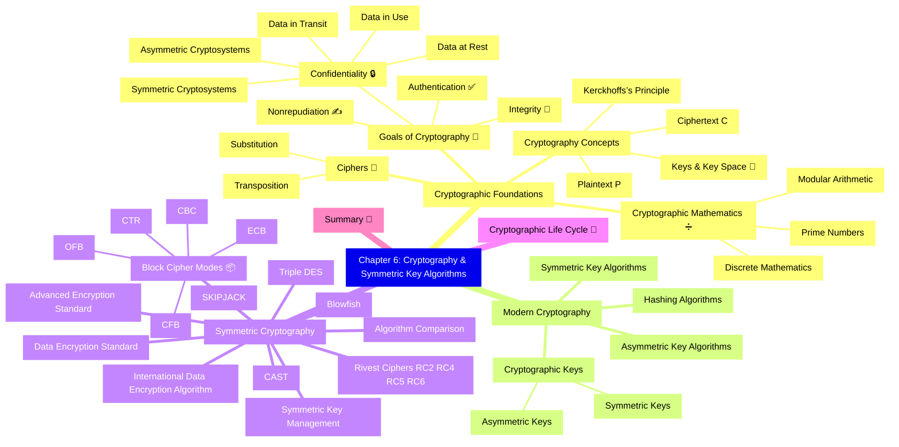

# Chapter 6: Cryptography and Symmetric Key Algorithms

- [Cryptographic Foundations](#cryptographic-foundations)
  - [Goals of Cryptography](#goals-of-cryptography)
  - [Cryptography Concepts](#cryptography-concepts)
  - [Cryptographic Mathematics](#cryptographic-mathematics)
  - [Ciphers](#ciphers)
- [Modern Cryptography](#modern-cryptography)
  - [Cryptographic Keys](#cryptographic-keys)
  - [Symmetric Key Algorithms](#symmetric-key-algorithms)
  - [Asymmetric Key Algorithms](#asymmetric-key-algorithms)
  - [Hashing Algorithms](#hashing-algorithms)
- [Symmetric Cryptography](#symmetric-cryptography)
  - [Block Cipher Modes of Operation](#block-cipher-modes-of-operation)
  - [Data Encryption Standard](#data-encryption-standard)
  - [Triple DES](#triple-des)
  - [International Data Encryption Algorithm](#international-data-encryption-algorithm)
  - [Blowfish](#blowfish)
  - [SKIPJACK](#skipjack)
  - [Rivest Ciphers](#rivest-ciphers)
  - [Advanced Encryption Standard](#advanced-encryption-standard)
  - [CAST](#cast)
  - [Comparison of Symmetric Encryption Algorithms](#comparison-of-symmetric-encryption-algorithms)
  - [Symmetric Key Management](#symmetric-key-management)
- [Cryptographic Life Cycle](#cryptographic-life-cycle)
- [Summary](#summary)

## Cryptographic Foundations
Cryptography underpins all secure systems. This section covers its main goals and core concepts.

### Goals of Cryptography
Security uses crypto to meet **four** key objectives. Not every system does all four—know which goals your design needs!

| Goal | Security Service Provided | Example Control |
|------|---------------------------|-----------------|
| **Confidentiality** | Prevent disclosure | AES, TLS |
| **Integrity** | Detect alteration | SHA-256, HMAC |
| **Authentication** | Verify identity/source | Digital signature, MAC |
| **Non-repudiation** | Prevent sender denial | PKI sigs, log hashes |  

#### Confidentiality
- Keeps data **private** in three states:  
  - **At Rest** 💾 (stored on disk, tapes, USB)  
  - **In Transit** 📡 (on the wire/network)  
  - **In Use** 🖥️ (active in memory)  
- **Symmetric** ciphers (one shared secret key)  
- **Asymmetric** ciphers (public / private key pair)  

#### Integrity ✉️  
- Ensures data **isn’t altered** (no tampering)  
- Protects against:  
  - Malicious insertion/deletion  
  - Transmission faults  
- Enforced via **hashes** & **digital signatures**  

#### Authentication 🆔  
- Verifies **identity** of sender/receiver  
- Example: **Challenge–Response** protocol  
  1. Alice ↔️ Bob share secret  
  2. Alice “challenges” Bob  
  3. Bob returns correct encrypted reply  
  4. Alice trusts Bob’s identity  

#### Nonrepudiation 🖋️  
- Prevents sender from **denying** they sent a message  
- **Only** provided by **public-key** (asymmetric) signatures  
- **Symmetric** systems cannot prove which party encrypted

### Cryptography Concepts

#### Plaintext & Ciphertext 🔄  
- **Plaintext (P)**: original message  
- **Ciphertext (C)**: encrypted output

C = Encryptₖ(P)
P = Decryptₖ(C)

#### Keys & Keyspace 🔑  
- **Key** = large binary number  
- **Keyspace** = all possible keys = 2ⁿ (n = key bit-length)  
  - e.g. 128-bit → 2¹²⁸ ≈ 3.4×10³⁸ possibilities  

#### Kerckhoffs’s Principle 📜  
> “The enemy knows the system.”  
- **Algorithm** = public  
- **Key** = secret  
- Avoid **security through obscurity**

#### Cryptography vs. Cryptanalysis 🥊🔍  
- **Cryptography**: designing ciphers  
- **Cryptanalysis**: breaking ciphers  
- Together = **Cryptology**

#### Cryptosystems & Standards 🛡️  
- **Cryptosystem** = hardware/software implementing a cipher  
- **FIPS 140-3**: U.S. Federal standard for crypto modules  
- **Cryptovariable** = key

---
### Cryptographic Mathematics
Cryptography relies on mathematical foundations—binary math and logical operations—to secure data. Understanding these basics is essential to grasp modern algorithms.

#### Boolean Mathematics 🔳  
- **Definition**: Bit‐level math with only two values: 0 (FALSE) and 1 (TRUE).  
- **Origin**: Matches computer hardware states (off/on).  
- **Why it matters**: All cryptographic operations manipulate bits using Boolean logic.

#### Logical Operations ➕✖️  
Fundamental bit‐wise functions used in ciphers.

##### AND (∧)  
- **Rule**: Output is 1 only if both inputs are 1.  
- **Truth table**:
  | X | Y | X ∧ Y |
  |:-:|:-:|:-----:|
  | 0 | 0 |   0   |
  | 0 | 1 |   0   |
  | 1 | 0 |   0   |
  | 1 | 1 |   1   |  
- **Use**: Masks bits; preserves only shared 1s.

##### OR (∨)  
- **Rule**: Output is 1 if at least one input is 1.  
- **Truth table**:
  | X | Y | X ∨ Y |
  |:-:|:-:|:-----:|
  | 0 | 0 |   0   |
  | 0 | 1 |   1   |
  | 1 | 0 |   1   |
  | 1 | 1 |   1   |  
- **Use**: Combines bit‐streams; sets bits present in either input.

##### NOT (~)  
- **Rule**: Inverts a bit: 0→1, 1→0.  
- **Truth table**:
  | X | ~X |
  |:-:|:--:|
  | 0 |  1 |
  | 1 |  0 |  
- **Use**: Bit flipping; often used in building other functions.

##### Exclusive OR (⊕) ❌  
- **Rule**: Output is 1 if exactly one input is 1.  
- **Truth table**:
  | X | Y | X ⊕ Y |
  |:-:|:-:|:-----:|
  | 0 | 0 |   0   |
  | 0 | 1 |   1   |
  | 1 | 0 |   1   |
  | 1 | 1 |   0   |  
- **Use**: Fundamental in stream ciphers & mixing bits.

#### Modulo Function (%) 🔄  
- **Definition**: Remainder after integer division.  
- **Notation**: `a mod n` or `a % n`.  
- **Examples**:
  - `8 mod 6 = 2`  
  - `10 mod 3 = 1`  
  - `32 mod 26 = 6`  
- **Why it matters**: Wraps values within a range; key in many algorithms (e.g., RSA).

#### One‐Way Functions 🔒  
- **Definition**: Easy to compute forward, infeasible to invert without secret.  
- **Importance**: Basis of public‐key systems (e.g., factoring large primes).  
- **Real‐world**: Multiplying large primes vs. factoring the product.

#### Nonce 🔢  
- **Meaning**: “Number used once.”  
- **Role**: Adds randomness to encryption (e.g., Initialization Vector).  
- **Requirement**: Must be unique per use to prevent replay attacks.

#### Zero‐Knowledge Proof (ZKP) 🤐  
- **Goal**: Prove knowledge of a secret without revealing it.  
- **Classic example**: Peggy demonstrates she knows a cave’s secret door password by entering one path and exiting the other, without revealing the password.  
- **Use**: Authentication protocols where privacy is critical.

#### Split Knowledge 🧩  
- **Concept**: Divide secret across multiple parties so no one person can reconstruct it alone.  
- **Example**: Key escrow with M-of-N control—requires multiple agents to recover the key.  
- **Benefit**: Prevents insider compromise; enforces two-person control.

#### Work Function ⚙️  
- **Definition**: Effort (time/cost) required to break a cryptosystem (e.g., brute‐force).  
- **Selection**: Should exceed the value‐lifespan of the protected data.  
- **Considerations**: Advances in computing (parallel, quantum) can reduce work factor.

---
### Ciphers
Mechanisms to transform plaintext into unreadable ciphertext.

#### Codes vs. Ciphers  
- **Codes**: Map words/phrases to other words (e.g., “10-4”).  
- **Ciphers**: Operate on bits/characters (e.g., Caesar cipher).  

#### Transposition Ciphers 🔄  
- **Method**: Rearranges letters of plaintext.  
- **Example**: Columnar transposition using a keyword to permute columns.  

#### Substitution Ciphers 🔁  
- **Method**: Replace each letter with another.  
- **Caesar cipher**: Shift letters by a fixed amount (e.g., ROT3).  
- **Vigenère cipher**: Polyalphabetic shift using a repeating key.  

#### One‐Time Pads 🗝️  
- **Definition**: Key as long as message; used only once.  
- **Property**: Provably unbreakable if key is random, secret, single-use, and ≥ message length.  

#### Running Key Ciphers 📖  
- **Definition**: Key is a text (e.g., book passage) as long as message.  
- **Trade‐off**: Easier key distribution but vulnerable if key text is known.  

#### Block Ciphers 📦  
- **Definition**: Encrypt fixed‐size blocks (e.g., 64-bit) with a single key.  
- **Examples**: AES, DES.  

#### Stream Ciphers 🎛️  
- **Definition**: Encrypt data bit‐by‐bit or byte‐by-byte, often using XOR with keystream.  
- **Examples**: RC4, one‐time pad as a stream cipher.  

#### Confusion and Diffusion 🌪️  
- **Confusion**: Obscures relationship between key and ciphertext (complex substitution).  
- **Diffusion**: Spreads plaintext changes across ciphertext (transposition).  
- **Goal**: Make cryptanalysis (e.g., frequency analysis) difficult.

---
### Modern Cryptography

Modern cryptography uses complex algorithms and long keys to meet the four security goals:  
🔒 **Confidentiality**, 🔗 **Integrity**, 👤 **Authentication**, and 📜 **Nonrepudiation**.

#### 🔑 Cryptographic Keys

- **📖 Public Algorithms**  
  - Modern ciphers are public – “security by obscurity” is outdated.  
  - Public review & analysis 🔍 strengthens security.

- **🔐 Key Secrecy**  
  - The **only** secret in modern crypto is the key.  
  - Example: Columnar transposition uses a _keyword_ as its “key.”

- **🔑 Key Length Matters**  
  - Longer keys ⇒ exponentially larger keyspace ⇒ harder to brute-force.  
  - **DES**’ 56-bit key once sufficient; now considered insecure.  
  - Modern systems use ≥ 128 bits.  

- **⚙️ Key Management Best Practices**  
  1. **Store keys securely** and transmit only over protected channels.  
  2. **Generate keys randomly** to maximize use of the keyspace.  
  3. **Destroy keys securely** when they’re no longer needed.

#### 🔄 Symmetric Key Algorithms (Secret-Key)

- **👥 Shared Secret**  
  - Same key encrypts and decrypts (“same” ⇒ _symmetric_).  

- **💨 Speed & Scale**  
  - Very fast (1,000–10,000× faster than public-key).  
  - Ideal for bulk encryption.

- **🔒 Provides**  
  - Confidentiality only.

- **⚠️ Weaknesses**  
  1. **Key distribution**: secure exchange required _before_ talking.  
  2. **Nonrepudiation**: anyone with the key can forge messages.  
  3. **Scalability**: n users ⇒ _n(n–1)/2_ keys!  
  4. **Key rotation**: every time someone leaves, keys must be re-issued.

- **🔑 Ephemeral Keys**  
  - Short-lived session keys (e.g., TLS handshake→ switch to fast symmetric).

#### 🗝️ Asymmetric Key Algorithms (Public-Key)

- **🔑 Key Pair**  
  - Each user has a **public** key (everyone sees) + a **private** key (kept secret).

- **🔄 How It Works**  
  1. Encrypt with recipient’s **public** key → only their **private** key can decrypt.  
  2. Sign with your **private** key → anyone uses your **public** key to verify (nonrepudiaiton).

- **👍 Strengths**  
  1. **Scalable**: n users ⇒ just n key pairs.  
  2. **Easy revocation**: revoke one user, others unaffected.  
  3. **Key distribution**: publish public key openly.  
  4. **Nonrepudiation** via digital signatures.  
  5. **No pre-shared secret** needed.

- **👎 Weakness**  
  - **Slower** than symmetric; often used to exchange a symmetric session key (→ _hybrid cryptography_).

#### 🧩 Hashing Algorithms

- **🔒 One-way “Message Digests”**  
  - Fixed-length summary of any message.  
  - Hard to reverse (can’t recreate original), and collisions should be extremely rare.

- **📜 Uses**  
  - Integrity checks— any change in message ⇒ different hash.  
  - Digital signatures: sign the hash, not the whole message.

- **⚠️ Collisions**  
  - If two messages produce the same hash, the algorithm is weak/deprecated.

> 🔑 **Key Takeaway**:  
> Modern crypto stands on **public** algorithms + **private** keys.  
> Choose **long keys**, manage them securely, and combine **fast symmetric** ciphers with **scalable asymmetric** methods and **one-way hashes** for a robust security solution.  

---
## Symmetric Cryptography  

### Block Cipher Modes of Operation  
| Mode | Feature | Caveat |
|------|---------|--------|
| **ECB** | Simple, parallelizable | Pattern leaks |
| **CBC** | Adds IV, good default | Sequential, error-propagation |
| **CFB/OFB** | Self-synchronizing stream | Throughput = 1 block |
| **CTR** | Parallel, random access | Requires unique nonce |
| **GCM, XTS** | Authenticated & disk encryption | Tag management critical |

Describe **how** a block cipher (e.g. AES, DES) processes data.  

#### Electronic Codebook (ECB) Mode 📚
- **How it works**: Encrypts each block independently.  
- **Weakness**: Identical plaintext blocks → identical ciphertext blocks.  
- **Use case**: Very small data (e.g., key exchange blobs).  

#### Cipher Block Chaining (CBC) Mode 🔗
- **How it works**:  
  1. XOR plaintext block with previous ciphertext (or IV for the first block)  
  2. Encrypt the result  
- **IV**: Ensures unique ciphertext each session.  
- **Error propagation**: A single-bit error affects two blocks.  

#### Cipher Feedback (CFB) Mode 🛰️
- **How it works**:  
  1. Encrypt previous ciphertext (or IV)  
  2. XOR with current plaintext “stream”  
- **Stream cipher**: Processes data as it arrives.  
- **Chaining**: Like CBC but for real-time data.  

#### Output Feedback (OFB) Mode 🔄
- **How it works**:  
  1. Encrypt the IV (or previous “seed”)  
  2. XOR with plaintext  
- **No chaining**: Errors do **not** propagate.  
- **Seed**: Derived only from IV/previous seed.  

#### Counter (CTR) Mode 🔢
- **How it works**:  
  1. Encrypt a counter value (IV + increment)  
  2. XOR with plaintext  
- **Parallelizable**: Each block independent → great for multi-core.  
- **No error propagation**.  

#### Galois/Counter Mode (GCM) 🛡️
- **Based on**: CTR mode.  
- **Adds**: **Authentication tags** (GMAC) → **confidentiality + integrity**.  
- **Use case**: TLS, VPNs.  

#### Counter with CBC-MAC (CCM) Mode
- **Based on**: CTR mode + **CBC-MAC**  
- **Provides**: Confidentiality + authenticity.  
- **Requirements**: 128-bit block ciphers (e.g. AES); unique nonce per message.  

### Data Encryption Standard
- **Block size**: 64 bits  
- **Key length**: 56 bits (plus 8 parity bits)  
- **Rounds**: 16 rounds of XORs & permutations  
- **Status**: Obsolete; superseded by AES.  

### Triple DES
- **Variants**:  
  - **EDE3**: Encrypt–Decrypt–Encrypt with 3 keys (K1,K2,K3)  
  - **EEE3**: 3× Encrypt  
- **Effective strength**: ~112 bits  
- **Status**: Deprecated; phased out by US gov’t (2024).  

### International Data Encryption Algorithm
- **Block size**: 64 bits  
- **Key length**: 128 bits  
- **Operations**: XOR + modular addition + multiplication  
- **Use case**: PGP e-mail.  

### Blowfish
- **Block size**: 64 bits  
- **Key length**: 32–448 bits (variable)  
- **Features**: Fast, public domain, used in SSH.  

### SKIPJACK
- **Block size**: 64 bits  
- **Key length**: 80 bits  
- **Context**: Clipper chip, key-escrow by NSA.  
- **Status**: Unpopular due to escrow concerns.  

### Rivest Ciphers
#### RC4
- **Type**: Stream cipher  
- **Key**: 40–2 048 bits  
- **Status**: Insecure, deprecated in TLS/WEP/WPA.  

#### RC5  
- **Block sizes**: 32, 64, 128 bits  
- **Key**: 0–2 040 bits  
- **Rounds**: 12–20  
- **Status**: Subject to brute-force community attacks.  

#### RC6
- **Block size**: 128 bits  
- **Key**: 128, 192, 256 bits  
- **Derived from**: RC5; AES finalist but not chosen.  

### Advanced Encryption Standard

- **Block size**: 128 bits  
- **Key lengths**: 128, 192, 256 bits  
- **Rounds**:  
  - 10 (128 bit key)  
  - 12 (192 bit key)  
  - 14 (256 bit key)  
- **Status**: Current federal standard (FIPS 197).  

### CAST
- **CAST-128**: 64 bit blocks; 40–128 bit keys; 12 or 16 rounds  
- **CAST-256**: 128 bit blocks; 128–256 bit keys; 48 rounds  
- **AES candidate** but not selected.  

### Comparison of Symmetric Encryption Algorithms
| Algorithm Name                                   | Block size (Bits)       | Key size (Bits)         |
|--------------------------------------------------|-------------------------|-------------------------|
| Advanced Encryption Standard (AES)               | 128                     | 128, 192, 256           |
| Rijndael                                         | Variable                | 128, 192, 256           |
| Blowfish                                         | 64                      | 32–448                  |
| Data Encryption Standard (DES)                   | 64                      | 56                      |
| International Data Encryption Algorithm (IDEA)   | 64                      | 128                     |
| Rivest Cipher 4 (RC4)                            | N/A (Stream cipher)     | 40–2,048                |
| Rivest Cipher 5 (RC5)                            | 32, 64, 128             | 0–2,040                 |
| Rivest Cipher 6 (RC6)                            | 128                     | 128, 192, 256           |
| SKIPJACK                                         | 64                      | 80                      |
| Triple DES (3DES)                                | 64                      | 112 or 168              |
| CAST-128                                         | 64                      | 40–128                  |
| CAST-256                                         | 128                     | 128, 160, 192, 224, 256 |

### Symmetric Key Management

#### Creation & Distribution  
- **Offline**: Physical exchange; high security risk.  
- **Public-Key Wrap**: Encrypt secret key with receiver’s public key.  
- **Diffie–Hellman**: No PKI; establishes shared secret over insecure channel.  

#### Storage & Destruction  
- **Software**: Files, key vaults; easiest but target for attackers.  
- **Hardware**: Smartcards, HSMs; higher cost, stronger protection.  
- **Cloud HSM**: Managed by CSPs (AWS, Azure).  
- **Key rotation**: Change keys when employees leave.  

#### Key Escrow & Recovery 🗝️  
- **Internal M-of-N**: M out of N recovery agents must agree.  
- **Public escrow**: Government access (e.g. Clipper) — largely rejected.  
- **Use case**: Recover lost keys when user departs.  

## Cryptographic Life Cycle 📆

- **Moore’s Law** effect → keys/bits become guessable over time.  
- **Governance controls**:  
  1. Approved algorithms (e.g. AES, RSA)  
  2. Minimum key lengths per sensitivity  
  3. Secure protocols (e.g. TLS 1.2+)  
- **Plan**: Choose strength so data remains secret for required lifetime.  

---

## Summary  
CISSP crypto mastery = understand **why** (CIA, integrity, auth), **how** (math, modes, key mgmt) and **when** to use each algorithm.  
Exam favorites:  
- Contrast **symmetric vs asymmetric** pros/cons.  
- Know **AES key sizes, DES weaknesses, mode characteristics (ECB vs CBC vs GCM)**.  
- Identify **hashing properties, collision attacks, key-stretch functions**.  
- Lifecycle & key-management best practices (split knowledge, escrow, rotation).  
Expect scenario Qs on algorithm choice, IV misuse, key distribution failures, and deciphering mode acronyms.

