# Chapter 6: Cryptography and Symmetric Key Algorithms

- [Cryptographic Foundations](#cryptographic-foundations)
  - [Goals of Cryptography](#goals-of-cryptography)
  - [Cryptography Concepts](#cryptography-concepts)
  - [Cryptographic Mathematics](#cryptographic-mathematics)
  - [Ciphers](#ciphers)
- [Modern Cryptography](#modern-cryptography)
  - [Cryptographic Keys](#cryptographic-keys)
  - [Symmetric Key Algorithms](#symmetric-key-algorithms)
  - [Asymmetric Key Algorithms](#asymmetric-key-algorithms)
  - [Hashing Algorithms](#hashing-algorithms)
- [Symmetric Cryptography](#symmetric-cryptography)
  - [Block Cipher Modes of Operation](#block-cipher-modes-of-operation)
  - [Data Encryption Standard](#data-encryption-standard)
  - [Triple DES](#triple-des)
  - [International Data Encryption Algorithm](#international-data-encryption-algorithm)
  - [Blowfish](#blowfish)
  - [SKIPJACK](#skipjack)
  - [Rivest Ciphers](#rivest-ciphers)
  - [Advanced Encryption Standard](#advanced-encryption-standard)
  - [CAST](#cast)
  - [Comparison of Symmetric Encryption Algorithms](#comparison-of-symmetric-encryption-algorithms)
  - [Symmetric Key Management](#symmetric-key-management)
- [Cryptographic Life Cycle](#cryptographic-life-cycle)
- [Summary](#summary)

```mermaid
mindmap
  root[Chapter 6: Cryptography & Symmetric Key Algorithms]
    Foundations[Cryptographic Foundations]
      Goals[Goals of Cryptography 🔑]
        Confidentiality[Confidentiality 🔒]
          Data_at_Rest[Data at Rest]
          Data_in_Transit[Data in Transit]
          Data_in_Use[Data in Use]
          Symmetric[Symmetric Cryptosystems]
          Asymmetric[Asymmetric Cryptosystems]
        Integrity[Integrity 📑]
        Authentication[Authentication ✅]
        Nonrepudiation[Nonrepudiation ✍️]
      Concepts[Cryptography Concepts]
        Plaintext[Plaintext P]
        Ciphertext[Ciphertext C]
        Keys[Keys & Key Space 🔑]
        Kerckhoffs[Kerckhoffs’s Principle]
      Mathematics[Cryptographic Mathematics ➗]
        Modular_Arithmetic[Modular Arithmetic]
        Prime_Numbers[Prime Numbers]
        Discrete_Math[Discrete Mathematics]
      Ciphers[Ciphers 🔐]
        Substitution[Substitution]
        Transposition[Transposition]
    Modern[Modern Cryptography]
      Keys2[Cryptographic Keys]
        Symmetric_Keys[Symmetric Keys]
        Asymmetric_Keys[Asymmetric Keys]
      Symmetric_Algorithms[Symmetric Key Algorithms]
      Asymmetric_Algorithms[Asymmetric Key Algorithms]
      Hash_Algorithms[Hashing Algorithms]
    SymmetricCrypto[Symmetric Cryptography]
      Block_Modes[Block Cipher Modes 📦]
        ECB[ECB]
        CBC[CBC]
        CFB[CFB]
        OFB[OFB]
        CTR[CTR]
      DES[Data Encryption Standard]
      Triple_DES[Triple DES]
      IDEA[International Data Encryption Algorithm]
      Blowfish[Blowfish]
      Skipjack[SKIPJACK]
      Rivest_Ciphers[Rivest Ciphers RC2 RC4 RC5 RC6]
      AES[Advanced Encryption Standard]
      CAST[CAST]
      Comparison[Algorithm Comparison]
      Key_Management[Symmetric Key Management]
    LifeCycle[Cryptographic Life Cycle 🔄]
    Summary[Summary 📝]
```

## Cryptographic Foundations ⚙️
Cryptography underpins all secure systems. This section covers its main goals and core concepts.

### Goals of Cryptography 🎯
Security uses crypto to meet **four** key objectives. Not every system does all four—know which goals your design needs!

| Goal | Security Service Provided | Example Control |
|------|---------------------------|-----------------|
| **Confidentiality** | Prevent disclosure | AES, TLS |
| **Integrity** | Detect alteration | SHA-256, HMAC |
| **Authentication** | Verify identity/source | Digital signature, MAC |
| **Non-repudiation** | Prevent sender denial | PKI sigs, log hashes |  

#### Confidentiality 🔒  
- Keeps data **private** in three states:  
  - **At Rest** 💾 (stored on disk, tapes, USB)  
  - **In Transit** 📡 (on the wire/network)  
  - **In Use** 🖥️ (active in memory)  
- **Symmetric** ciphers (one shared secret key)  
- **Asymmetric** ciphers (public / private key pair)  

#### Integrity ✉️  
- Ensures data **isn’t altered** (no tampering)  
- Protects against:  
  - Malicious insertion/deletion  
  - Transmission faults  
- Enforced via **hashes** & **digital signatures**  

#### Authentication 🆔  
- Verifies **identity** of sender/receiver  
- Example: **Challenge–Response** protocol  
  1. Alice ↔️ Bob share secret  
  2. Alice “challenges” Bob  
  3. Bob returns correct encrypted reply  
  4. Alice trusts Bob’s identity  

#### Nonrepudiation 🖋️  
- Prevents sender from **denying** they sent a message  
- **Only** provided by **public-key** (asymmetric) signatures  
- **Symmetric** systems cannot prove which party encrypted

### Cryptography Concepts 💡

#### Plaintext & Ciphertext 🔄  
- **Plaintext (P)**: original message  
- **Ciphertext (C)**: encrypted output

C = Encryptₖ(P)
P = Decryptₖ(C)

#### Keys & Keyspace 🔑  
- **Key** = large binary number  
- **Keyspace** = all possible keys = 2ⁿ (n = key bit-length)  
  - e.g. 128-bit → 2¹²⁸ ≈ 3.4×10³⁸ possibilities  

#### Kerckhoffs’s Principle 📜  
> “The enemy knows the system.”  
- **Algorithm** = public  
- **Key** = secret  
- Avoid **security through obscurity**

#### Cryptography vs. Cryptanalysis 🥊🔍  
- **Cryptography**: designing ciphers  
- **Cryptanalysis**: breaking ciphers  
- Together = **Cryptology**

#### Cryptosystems & Standards 🛡️  
- **Cryptosystem** = hardware/software implementing a cipher  
- **FIPS 140-3**: U.S. Federal standard for crypto modules  
- **Cryptovariable** = key
---

## Modern Cryptography  

### Cryptographic Keys  
- **Randomness & entropy** critical; use HRNG or CSPRNG.  
- Secure distribution: out-of-band, PKI, DH, QKD.  
- **Key escrow, split knowledge, dual control** for high assurance.

### Symmetric Key Algorithms  
| Algorithm | Key bits | Notes |
|-----------|----------|-------|
| **DES** | 56 | Feistel; obsolete (brute-forced) |
| **3DES** | 112/168 | Encrypt-Decrypt-Encrypt; legacy |
| **AES** | 128/192/256 | Rijndael; federal standard |
| **Blowfish** | 32–448 | Fast, free; 64-bit block |
| **Twofish / CAST / IDEA / RC-series / Skipjack** | Vary | Niche/legacy uses |

### Asymmetric Key Algorithms  
- **RSA** (factorization), **Diffie-Hellman** & **ElGamal** (discrete log),  
  **ECC / ECDH / ECDSA** (elliptic curve), **DSA**.  
- Provide **key exchange, digital signatures, PKI**, but are slower than symmetric crypto.

### Hashing Algorithms  
- **MD5, SHA-1** (deprecated), **SHA-2 family**, **SHA-3 (Keccak)**, **RIPEMD**, **Whirlpool**.  
- Properties: one-way, fixed length, collision- & pre-image-resistant.  
- **Salting** defends against rainbow tables; **key-stretch** PBKDF2, bcrypt, scrypt, Argon2.

---

## Symmetric Cryptography  

### Block Cipher Modes of Operation  
| Mode | Feature | Caveat |
|------|---------|--------|
| **ECB** | Simple, parallelizable | Pattern leaks |
| **CBC** | Adds IV, good default | Sequential, error-propagation |
| **CFB/OFB** | Self-synchronizing stream | Throughput = 1 block |
| **CTR** | Parallel, random access | Requires unique nonce |
| **GCM, XTS** | Authenticated & disk encryption | Tag management critical |

### Data Encryption Standard  
- 64-bit block, 56-bit key, 16 Feistel rounds; deprecated since 1998 **DES-Cracker**.

### Triple DES  
- 3 × DES (EDE); keying options K1-K2-K3; provides 112/168-bit effective strength; slow.

### International Data Encryption Algorithm  
- 128-bit key, 64-bit block; patented, strong but less common today.

### Blowfish  
- Bruce Schneier; variable-length key; 16 rounds; free; replaced by **Twofish** in some apps.

### SKIPJACK  
- NSA “Clipper Chip”; 80-bit key; no longer favored.

### Rivest Ciphers  
- **RC2/RC4** (stream; RC4 now banned in TLS), **RC5/RC6** (block).

### Advanced Encryption Standard  
- **Rijndael**; 128-bit block; 10/12/14 rounds; hardware acceleration (AES-NI).  
- Ubiquitous (TLS, VPN, disk encryption).

### CAST  
- **CAST-128 / CAST-256**; used by PGP; 64/128-bit block.

### Comparison of Symmetric Encryption Algorithms  
- Strength depends on **key size & block size**.  
- AES & Twofish outperform 3DES, DES, IDEA in both speed & security.

### Symmetric Key Management  
- **Generate → Distribute → Store → Use → Rotate → Revoke/Destroy**.  
- Employ **KMS/HSM**, key hierarchy (Key-Encrypting Key vs Data Key).  
- Limit key lifetime; enforce dual control for master keys.

---

## Cryptographic Life Cycle  
1. **Initiation** – Determine business need & risk.  
2. **Development/Acquisition** – Select algorithm, design key mgmt.  
3. **Implementation** – Integrate into systems, configure modes, store keys securely.  
4. **Operation & Maintenance** – Monitor strength, rotate keys, patch libraries.  
5. **Disposition** – Decommission algorithms/keys (NIST SP 800-57 guidance).

---

## Summary  
CISSP crypto mastery = understand **why** (CIA, integrity, auth), **how** (math, modes, key mgmt) and **when** to use each algorithm.  
Exam favorites:  
- Contrast **symmetric vs asymmetric** pros/cons.  
- Know **AES key sizes, DES weaknesses, mode characteristics (ECB vs CBC vs GCM)**.  
- Identify **hashing properties, collision attacks, key-stretch functions**.  
- Lifecycle & key-management best practices (split knowledge, escrow, rotation).  
Expect scenario Qs on algorithm choice, IV misuse, key distribution failures, and deciphering mode acronyms.

