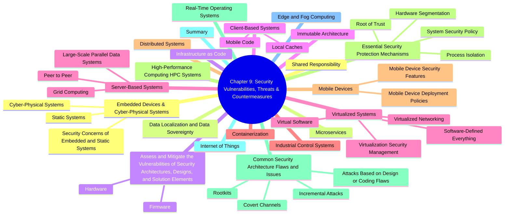

# Chapter 9: Security Vulnerabilities, Threats, and Countermeasures

- [Shared Responsibility](#shared-responsibility)
- [Data Localization and Data Sovereignty](#data-localization-and-data-sovereignty)
- [Assess and Mitigate the Vulnerabilities of Security Architectures, Designs, and Solution Elements](#assess-and-mitigate-the-vulnerabilities-of-security-architectures-designs-and-solution-elements)
  - [Hardware](#hardware)
  - [Firmware](#firmware)
- [Client-Based Systems](#client-based-systems)
  - [Mobile Code](#mobile-code)
  - [Local Caches](#local-caches)
- [Server-Based Systems](#server-based-systems)
  - [Large-Scale Parallel Data Systems](#large-scale-parallel-data-systems)
  - [Grid Computing](#grid-computing)
  - [Peer to Peer](#peer-to-peer)
- [Industrial Control Systems](#industrial-control-systems)
- [Distributed Systems](#distributed-systems)
- [High-Performance Computing (HPC) Systems](#high-performance-computing-hpc-systems)
- [Real-Time Operating Systems](#real-time-operating-systems)
- [Internet of Things](#internet-of-things)
- [Edge and Fog Computing](#edge-and-fog-computing)
- [Embedded Devices & Cyber-Physical Systems](#embedded-devices--cyber-physical-systems)
  - [Static Systems](#static-systems)
  - [Cyber-Physical Systems](#cyber-physical-systems)
  - [Security Concerns of Embedded and Static Systems](#security-concerns-of-embedded-and-static-systems)
- [Microservices](#microservices)
- [Infrastructure as Code](#infrastructure-as-code)
- [Immutable Architecture](#immutable-architecture)
- [Virtualized Systems](#virtualized-systems)
  - [Virtual Software](#virtual-software)
  - [Virtualized Networking](#virtualized-networking)
  - [Software-Defined Everything](#software-defined-everything)
  - [Virtualization Security Management](#virtualization-security-management)
- [Containerization](#containerization)
- [Mobile Devices](#mobile-devices)
  - [Mobile Device Security Features](#mobile-device-security-features)
  - [Mobile Device Deployment Policies](#mobile-device-deployment-policies)
- [Essential Security Protection Mechanisms](#essential-security-protection-mechanisms)
  - [Process Isolation](#process-isolation)
  - [Hardware Segmentation](#hardware-segmentation)
  - [Root of Trust](#root-of-trust)
  - [System Security Policy](#system-security-policy)
- [Common Security Architecture Flaws and Issues](#common-security-architecture-flaws-and-issues)
  - [Covert Channels](#covert-channels)
  - [Attacks Based on Design or Coding Flaws](#attacks-based-on-design-or-coding-flaws)
  - [Rootkits](#rootkits)
  - [Incremental Attacks](#incremental-attacks)
- [Summary](#summary)

---
## Shared Responsibility

1. **Everyone’s Role** 👥  
  - CISO & security team set up and maintain controls  
  - Employees follow security policies in daily tasks  
  - Auditors monitor for violations

2. **Stakeholder Accountability** 📊  
  - Organizations must protect investor, customer & partner interests  
  - Security decisions safeguard reputation and legal compliance

3. **Cloud Shared Responsibility Model ☁️**  
  - Understand which security tasks you vs. your cloud provider handle  
  - See Chapter 16 for in-depth coverage

4. **Responsible Vulnerability Disclosure 🛠️**  
  - When you find a new flaw, report it to the vendor or threat-intel hub  
  - Protect users by sharing details responsibly

**Automated Indicator Sharing (AIS) 🤖**  
  - DHS initiative for “machine-speed” sharing of IoCs (Indicators of Compromise)  
  - **Observable** = a fact (e.g., malicious file hash)  
  - **Indicator** = observable + threat hypothesis

**Standards & Protocols for Threat Exchange 🚀**  
  - **STIX** = Structured Threat Information eXpression (common threat language)  
  - **TAXII** = Trusted Automated eXchange of Intelligence Information (transport)

**NCCIC Management 🏢**  
  - AIS run by National Cybersecurity & Communications Integration Center  
  - More info: https://us-cert.gov/ais

---

## Data Localization and Data Sovereignty
- **Data Localization** 📍  
  - **Definition**: Storing/processing data within a country’s borders  
  - **Why It Matters**:  
    - Ensures compliance with local laws on privacy & security  
    - May restrict cross-border data flows  
    - Drives decisions on where to build data centers or use regional cloud services  
- **Data Sovereignty** ⚖️  
  - **Definition**: Data is subject to the laws of the country where it resides  
  - **Implications**:  
    - Governments control data collected within their jurisdiction  
    - Requires adherence to local regulations on data protection  
    - Affects data governance, legal compliance, and vendor contracts  
- **Comparing the Two**  
  | Aspect      | Data Localization                       | Data Sovereignty                              |
  |-------------|-----------------------------------------|-----------------------------------------------|
  | Focus       | Physical storage location               | Legal authority & control over data          |
  | Scope       | “Where” data lives                      | “Who” has rights & “how” data is governed     |
  | Drivers     | Specific regulations on data location   | Broader legal/political/cultural considerations |
  | Impact      | Infrastructure costs, latency, design   | Data governance, third-party agreements      |

---
## Assess and Mitigate the Vulnerabilities of Security Architectures Designs and Solution Elements

> **What it is:** Computer architecture is about designing systems at a logical level and building in controls like layering, abstraction, data hiding, trusted recovery, process isolation, and hardware segmentation.  
> **Why it matters:** More complexity → more attack surface → lower assurance. Keep it simple! 🛠️

### Hardware

- **Definition:** Any tangible part of a computer you can touch (CPU, memory chips, disks, keyboard, monitor).  
- **Note:** Data on disks/flash is _not_ hardware, it’s software/data (bits).

#### Processor (CPU) ⚙️
- **Role:** “Nerve center” that performs or coordinates all calculations.  
- **Instruction set:** Limited low-level operations—designed for speed.  
- **OS & compilers:** Translate high-level code into CPU instructions.

##### Execution Types 🚀

> Users want “doing two things at once” → various techniques:

| Term                | What it Means                                                                 | Emoji  |
|---------------------|-------------------------------------------------------------------------------|--------|
| **Multitasking**    | OS _simulates_ → juggles multiple processes on a single core, time- slicing 🤹‍♂️ | 🤹‍♂️   |
| **Multicore**       | CPU chip with multiple independent cores → true parallelism 🧩                  | 🧩     |
| **Multiprocessing** | Multiple CPU chips/cores run threads in parallel (sometimes pinned=affinity) 🤝 | 🤝     |
| **Multiprogramming**| OS batches many jobs on 1 CPU → each waits for I/O, then next runs ⏳            | ⏳     |
| **Multithreading**  | Multiple threads _within_ one process share resources, low context-switch overhead ⚡ | ⚡ |

##### Protection Mechanisms 🔒

> When running, OS + apps form a **runtime environment**. We need controls to enforce:
> - Integrity of OS ✔️  
> - Which users access which data 👤  
> - Authorize/deny operations ✅  

##### PROTECTION RINGS 🎯

- **Concept:** Code/components in concentric rings by privilege (inner = highest).  
- **Classic Model:** Rings 0–3  
  - **Ring 0:** Kernel (always in memory) – full access 👑  
  - **Ring 1:** OS services & drivers ⚙️  
  - **Ring 2:** I/O drivers & utilities 📂  
  - **Ring 3:** User apps 📱  
- **Enforcement:** Lower-ring code preempts higher. Higher-ring must call lower via _system call_ (mediated access).

##### Rings Compared to Levels 🆚

- **Similarity:**  
  - Ring 0 ↔ top layer (highest privilege)  
  - Ring 3 ↔ bottom layer (least privilege)  
- **Usage:** Some OSs collapse rings 0–2 into “kernel mode” and ring 3 into “user mode.”

##### Process States 📋
> A process’s lifecycle in the OS:

1. **New → Ready**  
   - Queued, waiting for CPU 📝  
2. **Ready → Running**  
   - Executes until done, time slice end, or blocked ▶️  
3. **Running → Waiting**  
   - Paused for I/O, then back to Ready when I/O done ⏸️  
4. **Running → Stopped**  
   - Finished or terminated (error/resource failure) ❌  
5. **Supervisory (Kernel Mode)**  
   - When code needs _higher_ privilege than user mode (e.g., changing config) 🔧  

🎓 Key Takeaways:
- Keep it simple to reduce vulnerabilities 🔍
- Understand each execution type’s parallelism model 🤔
- Protection rings enforce privilege separation 🛡️
- Process states define how tasks run and wait ⏳

#### Memory
##### Read-Only Memory (ROM) 💾
- **Definition:** Non-volatile storage burned at manufacture; system **can read** but **not write**.  
- **Uses:**  
  - **Bootstrap code** (e.g., POST diagnostics) 🔧  
  - **Firmware** that must not change ✔️  
- **Variants:**  
  - **PROM:** User “burns” data once; then read-only 🔥  
  - **EPROM (UVEPROM):** Erase with UV light → re-program ☀️  
  - **EEPROM:** Electrically erase/write ⚡  
  - **Flash:** Block-level erase/write (e.g., SSDs, thumb drives) 🔋  

##### Random Access Memory (RAM) 🔄
- **Definition:** Volatile, read/write memory; loses data on power-off ⚡❌  
- **Never store critical data only in RAM!** Backup elsewhere. 💾

###### Real (Main) Memory 🏦
- **Dynamic RAM (DRAM):** Cheap; capacitor-based → CPU must refresh periodically 🔄  
- **Static RAM (SRAM):** Flip-flop based; faster, no refresh; more expensive 💨  

###### Cache RAM 🗄️
- **Purpose:** Speed up repeated access → small, fast memory layers  
- **Levels:**  
  - **L1/L2:** On-core, per CPU core 🧩  
  - **L3:** Shared among cores 🔗  
  - **L4:** Onboard motherboard/GPU (rare) 🎮  
- **Peripheral caches:** HDD, SSD caches must be **flushed** before power-off 🔥  

##### Dynamic vs. Static RAM ⚔️
| Feature        | DRAM                          | SRAM                          |
| -------------- | ----------------------------- | ----------------------------- |
| Technology     | Capacitors (must refresh)     | Flip-flops (no refresh)       |
| Speed          | Slower (refresh overhead)     | Faster (no refresh)           |
| Cost           | Cheaper                       | More expensive                |
| Use Case       | Main memory                  | CPU registers, cache          |

##### Registers 📋
- **Definition:** Tiny, on-CPU storage (8–32 registers of 32/64 bits)  
- **Use:** Holds operands/instructions for the ALU → highest speed 🚀  

##### Memory Addressing 🗺️
| Scheme            | How It Works                                                                                             |
| ----------------- | -------------------------------------------------------------------------------------------------------- |
| **Register**      | CPU accesses data directly in register (e.g., “R1”)                                                      |
| **Immediate**     | Operand given in instruction itself (e.g., “ADD 2”)                                                      |
| **Direct**        | Instruction supplies an address → CPU reads data there                                                    |
| **Indirect**      | Instruction supplies an address → that holds another address → CPU reads final data                       |
| **Base+Offset**   | CPU adds offset from instruction to base pointer (in register) → access data                              |

> **Pointers & Race Conditions:**  
> - **Pointer:** Variable holding a memory address → must be _dereferenced_ to read/write the actual data 📍  
> - **Race Condition:** Two processes access/modify pointer simultaneously → may dereference a null/corrupted pointer → crash 🏃‍♂️💥  

##### Secondary & Virtual Memory 💽
- **Secondary Memory:** HDDs, SSDs, optical, flash → **OS pages** data into main memory when needed 📂  
- **Virtual Memory:**  
  - **Pagefile/Swapfile** on disk extends RAM address space  
  - **Paging:** Swap infrequently used pages to disk → bring back when accessed ↔️  
  - **Drawback:** Slower I/O → “thrashing” if over-used 🐢💤  
  - **Mitigations:** More physical RAM, SSD/NVMe for pagefile 🚀  

> 🎯 **Key Points:**  
> - **ROM variants** trade immutability vs. flexibility 🔒⚡  
> - **RAM types** balance cost vs. speed (DRAM vs. SRAM) 💰💨  
> - **Registers** and **cache** are critical for CPU performance 🏎️  
> - **Addressing modes** let CPU locate data in memory 🗺️  
> - **Virtual memory** avoids OOM but can slow down if abused 🐢  

#### Data Storage Devices 💾

##### Primary vs Secondary 🖥️ vs 📦
- **Primary Storage**  
  - RAM used by CPU for active tasks  
  - Fast, volatile, “working memory”  
- **Secondary Storage**  
  - Long-term media: HDDs, SSDs, tapes, CDs/DVDs, flash cards  
  - Nonvolatile, persists after power off

##### Volatile vs Nonvolatile 🔌❌ vs 💾✅
- **Volatile** (RAM)  
  - Loses all data when power turns off  
  - Examples: DRAM, SRAM  
- **Nonvolatile** (ROM, magnetic, optical, flash)  
  - Retains data without power  
  - Examples: HDD, SSD, USB sticks, ROM/EPROM

##### Random vs Sequential 🎯 vs 🔄
- **Random Access**  
  - Direct read/write at any address  
  - Examples: RAM chips, most HDDs/SSDs  
- **Sequential Access**  
  - Must read through preceding data  
  - Example: Magnetic tape drives

##### Memory Security Issues 🔒🧠
- **Data Leakage in Volatile Memory**  
  - Cold-boot attacks: freeze RAM to slow data decay  
  - Attackers dump memory image/crash logs to extract keys  
- **Data Remanence**  
  - RAM cells may hold charge briefly after power-off  
  - Sensitive data could be retrieved if not purged quickly  
- **Sanitization Needed**  
  - Purge all memory before disposal or reprovisioning  
  - Special utilities or physical destruction

##### Storage Media Security 🛡️📀
- **Data Remanence on Secondary Media**  
  - Deleted/reformatted files often recoverable  
  - Use sanitization (overwrite) or destroy media  
- **SSDs Special Considerations**  
  - **Reserved Blocks** replace worn-out cells (like bad sectors)  
  - **Wear Leveling** spreads writes to extend lifespan  
  - Traditional wipes may miss hidden/bad blocks  
- **Theft & Confidentiality**  
  - Physical media theft → data breach risk  
  - **Full-disk encryption** on HDDs/SSDs/USB drives  
  - Many devices support native hardware encryption  
- **Removable Media Risks**  
  - Easy to lose or steal  
  - Always encrypt before transport or storage

#### Emanation Security  
Many electronic devices unintentionally emit electromagnetic or radio signals (emanations)  
that can be intercepted and decoded by adversaries to steal sensitive data. 🔍

- **Everyday Risks**  
  - Beyond Wi-Fi/Bluetooth/GPS: monitors, cables, drives leak data  
- **Goal**  
  - Understand and block these side-channel leaks  

#### TEMPEST/EMSEC 🛡️  
Originally a set of gov’t standards to shield electronics from leaking EM signals.  
Now called EMSEC (Emission Security).

- **Purpose**  
  - Minimize spurious emissions that reveal confidential info  
- **Scope**  
  - Cryptographic gear, network gear, AIS, telecom equipment  

#### Van Eck Radiation ⚡  
Also known as Van Eck phreaking: eavesdropping on a device’s EM leaks from a distance.

- **Attack**  
  - Capture and reconstruct screen images, keystrokes, data  
- **Defense**
  - TEMPEST/EMSEC countermeasures  

#### Faraday Cage 🏰  
A metal enclosure (box, room, building) that blocks EM signals in/out.

- **How It Works**  
  - Metal skin acts as EM-absorbing capacitor  
- **Use Cases**  
  - SCIFs, secure meeting rooms  

#### White Noise 🔊  
Broadcasting masking signals to drown out real emanations for eavesdroppers.

- **Types**  
  - Random RF noise  
  - Constant or variable jamming  
- **Key Point**  
  - Does NOT disrupt authorized users  

#### Control Zone 🚧  
Combines a Faraday cage + white noise to protect a specific area.

- **Scope**  
  - Room, floor, or whole building  
- **Benefit**  
  - Localized EM containment  

#### Shielding & Antenna Management 🛡️📶  
Additional EM defenses beyond TEMPEST/EMSEC:

- **Cable Shielding**  
  - STP cabling, shielded conduits, fiber-optic replacement  
- **Antenna Control**  
  - Limit external antennas, antenna placement  

#### Input & Output Devices ⌨️🖥️

##### Monitors  
- **Risk**  
  - Van Eck attacks on video cables or monitor electronics  
  - Shoulder-surfing & hidden cameras 🚶‍♂️📸  

##### Printers  
- **Risk**  
  - Printouts left unattended  
  - Local HDD in printers stores sensitive jobs indefinitely  
- **Mitigations**  
  - Pull-printing, auto-delete, secure release stations  

##### Keyboards & Mice  
- **Risk**  
  - EM leaks or planted bugs intercept keystrokes  
  - Wireless intercept via radio sniffing  
- **Mitigations**  
  - Use shielded cables, encrypted wireless protocols  

#### POTS Telephone Modems ☎️  
Old-school dial-up modems on landlines create unmonitored network backdoors.

- **Risks**  
  - Bypass firewalls, create rogue egress paths  
- **Controls**  
  - Disable or ban modems in policy  
  - Track, secure, and monitor any required modems  

### Firmware
- **What it is**  
  Software (microcode) stored on ROM/EEPROM/flash chips  
- **Key points**  
  - Rarely updated (never on true ROM)  
  - Drives basic device functions (printers, modems, IoT)  

#### Embedded Mini-OS in Devices 📦
- Many peripherals run a tiny OS from firmware  
- **Examples**: Mobile phones, IoT gear, edge/fog nodes, industrial controllers  
- **Benefit**: Offloads complexity from main OS  

#### BIOS 💻
- Legacy low-level firmware on motherboard EEPROM/flash  
- **Roles**  
  - Hardware init (CPU, RAM, drives, video)  
  - Bootstrap loader for main OS  
- **Limitations**  
  - Keyboard-only setup  
  - <2.2 TB boot drives  
  - Slow boot  

#### UEFI 🚀
- Modern replacement for BIOS  
- **Improvements**  
  - GUI + mouse support  
  - Fast boot, large-drive support  
  - CPU-independent drivers & networking in pre-OS  
- **Security**  
  - Secure Boot  
  - Measured Boot  
  - Forward/backward compatibility  

#### Flashing Firmware 🔄
- **Definition**: Rewriting BIOS/UEFI/firmware chip contents  
- **Risk**: Malware can inject rootkits or backdoors  
- **Phlashing**  
  - Installing malicious firmware “update”  
  - Persists below OS level  

#### Secure Boot (Boot Attestation) 🛡️
- Ensures only digitally signed OS/drivers load  
- Uses preapproved certificates to verify signatures  
- **Defends** against boot-level malware (rootkits, covert loaders)  
- **Limitation**: Advanced attacks may bypass it on some hardware  

#### Measured Boot 📊
- Hashes every boot component and logs to TPM  
- **Purpose**: Post-boot integrity verification  
- **Behavior**: Records “video” of boot actions, doesn’t block them  
- **Use case**: Audit compromised components after the fact  

## Client-Based Systems  

- **Definition**: Attacks targeting the end‐user device or processes, not just servers  
- **Examples**:  
  - Malicious websites delivering harmful applets or scripts  
  - Any protocol—not only HTTP—can carry client‐side threats  
- **Risks**:  
  - System compromise, data theft, corruption 🔓  
  - Local cache poisoning (e.g., DNS, ARP, browser cache)  

### Mobile Code
- **What it is**: Self‐contained code snippets (applets, scripts) sent from server to client  
- **Benefits**:  
  - Offloads processing to user’s device ⚙️  
  - Faster interactive responses 🚀  
  - Keeps sensitive input local (if coded correctly) 🔒  
- **Types & History**:  
  - Java applets (rare today) ☕  
  - ActiveX controls (legacy, IE‐only)  
  - JavaScript (ubiquitous, embedded in HTML) 💻  
- **Security Concerns**:  
  - Executes untrusted code → Trojan, backdoor, ransomware ⚠️  
  - Applets/scripts can exfiltrate data silently  
  - JS sandbox/same‐origin policy bypasses (XSS, CSRF)  
- **Defenses**:  
  - Keep browsers & JS engines updated 🔄  
  - Enforce Content Security Policy (CSP) 🛡️  
  - Validate & sanitize all user inputs (prevent injection)  
  - Use Web Application Firewall (WAF) / NGFW  
  - Limit or audit browser add-ons/extensions  

### Local Caches
- **Types**: DNS cache, ARP cache, browser’s temporary internet files  
- **Threats**:  
  - Split‐response attacks poison cache entries 🐟  
  - DOM-based XSS can inject malicious files  
  - Cached malware executes on valid page loads  
- **Mitigations**:  
  - Shorten cache retention periods ⏱️  
  - Minimize cache size 📉  
  - Disable content preloading  
  - Auto‐wipe cookies & cache on browser exit  
  - Schedule automated cache cleaning tools  

## Server-Based Systems  
- **Data Flow Control** 🔄  
  - Manages movement of data between processes/devices/networks  
  - Ensures low latency, reliable throughput (hashing 🛡️, encryption 🔐)  
  - Prevents overloads & DoS by throttling or buffering traffic  
- **Load Balancer** ⚖️  
  - Distributes network load across multiple servers or links  
  - Goals:  
    - ✔️ Optimize resource use  
    - ⏱️ Minimize response time  
    - 📶 Maximize throughput  
    - 🚫 Avoid overloads/bottlenecks  
  - Methods: random choice, round robin, monitored utilization, weighted preferences  
- **DoS Attacks** 🚫📶  
  - Flood servers to disrupt data flow  
  - Mitigations: traffic shaping, rate limiting, scrubbing centers, anomaly detection  

### Large-Scale Parallel Data Systems
- **Parallel Processing**  
  - Breaks large tasks into sub-tasks 🧩, runs them simultaneously  
  - Uses multi-core CPUs, clusters, virtual nodes  
  - Concerns: performance, power, reliability ⚡🔋✅  

#### Symmetric Multiprocessing (SMP) 🤝
- Multiple identical CPUs under one OS  
- Shared memory & bus  
- Ideal for many processors working on single tasks in unison  

#### Asymmetric Multiprocessing (AMP) 🏷️
- CPUs have separate OS or task sets  
- Each has dedicated memory & bus  
- “Affinity” can pin tasks to specific CPUs  

#### Massive Parallel Processing (MPP) 🚀
- Network of many AMP nodes acting as one system  
- Hundreds to thousands (millions!) of cores  
- Master node divides job → workers process → results reassembled  
- Suited for extremely large, compute-intensive problems  

### Grid Computing
- **Definition**: Loosely connected, volunteer nodes share idle CPU cycles  
- **Use Cases**: SETI@home, protein folding, climate models, financial simulations  
- **Risks**:  
  - 🔓 Data in work packets exposed to any participant  
  - ⏳ Unpredictable availability: late/missing/corrupt results  
  - ⚠️ Central coordinator compromise → whole grid risk  

### Peer to Peer
- **Definition**: Decentralized sharing of resources/services among equals  
- **Examples**: BitTorrent, VoIP apps, streaming services  
- **Security Concerns**:  
  - 📂 Piracy & copyright issues  
  - 👂 Eavesdropping on shared content  
  - 🔄 No central control → malware distribution, bandwidth hogging  

**📝 CISSP Tip**  
> - Understand each parallel model’s architecture & use cases  
> - Know load-balancing techniques & DoS defenses  
> - Remember grid & P2P expose data—avoid for confidential workloads  

## Industrial Control Systems

- **What is ICS?**  
  A class of operational technology (OT) devices that automate and control industrial processes (manufacturing, power, water, oil, etc.)  

- **Types of ICS:**  
  - **PLC (Programmable Logic Controller)** 💻➡️🤖  
    - Single-purpose digital computer controlling one device (assembly line, stadium lights, etc.)  
  - **DCS (Distributed Control System)** 🌐🏢  
    - Controls large process plants via dispersed controllers + central HMI  
    - Can be analog (flow control) or digital (voltage)  
  - **SCADA (Supervisory Control & Data Acquisition)** 📡🕹️  
    - Monitors & controls wide‐area processes, often networked to IT  
    - Event‐driven, HMI for operators  
    - Legacy = buttons/knobs; modern = rich GUIs & remote software  

- **PLC vs DCS vs SCADA:**  
  - PLC: single transformer  
  - DCS: single power station (state‐driven, limited scale)  
  - SCADA: entire power grid (event‐driven, wide geographic)  

- **Key Protocol – Modbus** 🔌📶  
  - De facto open standard since 1979 for PLC↔SCADA communication  
  - Interoperability across vendors  

- **Security Posture:**  
  - Historically minimal security → high vulnerability (e.g. Stuxnet) 🔓🐛  
  - Hardening controls:  
    - Network isolation & segmentation  
    - Physical & logical access limits 🔒  
    - Change default creds & restrict code  
    - Comprehensive logging/auditing 📋  
  - Primary OT goal: **Availability** of real‐time control signals ⏱️✅  

- **Standards & Guidance:**  
  - ISA99 / IEC 62443 series 📜  
  - NIST SP 800-82 🏛️  
  - NERC, ERNCIP for critical infrastructure protection 🌐  

## Distributed Systems

- **Definition:** Multiple computers working together as one logical system  
- **Benefits:** Resiliency, reliability, performance, scalability 🚀  
- **Architectures:**  
  - Client-server, 3-tier, multi-tier, peer-to-peer  
  - Key uses: DNS, SSO, SDN, microservices, MMORPGs 🎮  

- **Interface Definition Language (IDL):**  
  - Standardizes cross-language & cross-location calls (RPC, CORBA, DCOM) 🔄  

- **Security Risks:**  
  - Expanded attack surface → lateral movement & pivoting  
  - Unauthorized access, spoofing, DoS, eavesdropping 🔓🕵️‍♂️  

- **Mitigations:**  
  - Encrypt data at rest, in transit, and during processing 🔐  
  - Enforce strong MFA & patch consistency  
  - Homogeneous component sets & clear data‐sovereignty policies 🌍  

## High-Performance Computing (HPC) Systems

- **Purpose:** Ultra-fast processing of massive datasets in real/near-real time  
- **Components:**  
  - Compute nodes, high-speed networks, large-scale storage 🔗  
- **Bottleneck Risks:**  
  - Any slow component causes latency or benign DoS (resource exhaustion) ⚠️  

## Real-Time Operating Systems

- **Definition:** OS designed for minimal latency in task execution  
- **Modes:**  
  - Hard real-time: zero tolerance for delay (e.g. automotive safety)  
  - Soft real-time: small delays acceptable (e.g. audio/video sync)  
- **Scheduling:**  
  - Event-driven (priority‐based)  
  - Time-sliced (clock interrupt)  
- **Security Challenges:**  
  - Single-purpose → limited built-in security  
  - Proprietary code → hidden bugs 🐛  
- **Hardening:**  
  - Network/device isolation  
  - Strict communication monitoring 👀  

## Internet of Things
- **What is IoT?**  
  A network of standalone “smart” devices (thermostats, cameras, assistants, fitness trackers, etc.) that offer automation, remote control, or AI/ML processing—distinct from embedded systems, which are built into a larger machine.  

- **Smart Devices vs Embedded Systems**  
  - **IoT Device:** Separate hardware, connects to cloud or LAN (e.g. smart thermostat)  
  - **Embedded System:** Controller integrated into the device’s chassis (e.g. car ECU)  

- **Common IoT Examples** 🎛️  
  - Smartphones, tablets, home assistants  
  - VR/AR headsets, sport cameras, music players  
  - Fitness bands, smart appliances  

- **Industrial IoT (IIoT)** 🏭☁️  
  - Evolution of ICS/DCS with cloud-based data collection, analytics & automation  
  - Enables edge & fog computing in factories, energy grid, supply chains  

- **Key Risks & Threats** ⚠️  
  - **Weak Defaults:** Default creds & configs rarely changed  
  - **Lack of Encryption:** Data often sent in cleartext  
  - **Network Pivoting:** Compromised IoT → attack other LAN devices  
  - **Vendor Trust:** Poorly maintained firmware & no‐patch devices  

- **Security Controls** 🔒  
  - **Network Segmentation:** “Three-router” isolation for IoT VLAN (Gibson’s 3-router design)  
  - **Access Limits:** Physical & logical ACLs on IoT endpoints  
  - **Strong Authentication:** Change default passwords, use MFA where possible  
  - **Patching & Updates:** Keep firmware/software current  
  - **Monitoring & Logging:** Track all IoT activity, alert on anomalies  
  - **Firewalls & Filtering:** Restrict inbound/outbound IoT traffic  

- **Wearables** ⌚👟  
  - Smartwatches, health trackers—IoT you wear  
  - **Privacy Concerns:** What data is collected? Where is it stored? Is it encrypted? Can you delete it?  

- **Business Use Cases** 🏢  
  - Environmental controls (HVAC, lighting)  
  - Access control & asset tracking  
  - Inventory sensors & auto-reordering  
  - **NIST Cybersecurity for IoT:** guidance at nist.gov/itl/applied-cybersecurity/nist-cybersecurity-iot-program  

- **Sensors** 🌡️  
  - Measure temperature, humidity, motion, flow, light, particles  
  - Feeds ICS/DCS/SCADA for automation (e.g., AC kicks on when temp ↑)  

## Edge and Fog Computing
- **What is Edge Computing?**  
  Processing data **at or near** the data source (device) to minimize latency & bandwidth use. Each device “thinks” for itself.  

- **What is Fog Computing?**  
  Centralized processing **on the LAN** for data collected by dispersed sensors & IoT devices. The “fog” hub aggregates & analyzes before cloud.  

- **Computing Evolution** 💻  
  1. Mainframes & thin clients  
  2. Client/Server on endpoints  
  3. Virtualization → Cloud computing  
  4. **Edge computing** ← as close to user/device as possible  
  5. **Fog computing** ← LAN-level central hub  

- **Use Cases** 🚗🎥  
  - **Edge:** Autonomous vehicles, local CDN caches, smart cameras, VR/AR rendering  
  - **Fog:** IIoT hubs, industrial analytics, building management systems  

- **Security Considerations** 🔐  
  - Edge devices often lack built-in security → enforce strong auth & encryption  
  - Fog nodes become high-value targets → harden OS, monitor traffic  
  - Isolate edge/fog networks, apply zero-trust segmentation  
  - Ensure regular updates & patches on all edge/fog components  

## Embedded Devices and Cyber-Physical Systems
**Embedded Devices 🖥️⚙️**
- **Definition:** A compute module grafted onto a larger mechanical/electrical system to add automation, remote control, or monitoring.  
- **Typical Components:** CPU, RAM, I/O ports, nonvolatile storage (Flash/ROM).  
- **Use Cases:** Industrial machines, smart appliances, medical devices.  

**Microcontrollers 🧩📟**
- **What They Are:** Small computers on a chip (CPU + RAM + I/O + storage).  
- **Examples:** Raspberry Pi, Arduino, FPGA boards.  
- **Difference from SoC:** Less complex, often single-purpose; SoC integrates many cores/peripherals.  

### Static Systems
- **Definition:** “Non-persistent” environments reset to a known state on reboot.  
- **Examples:** Airport kiosks, ATMs, hotel guest PCs.  
- **Implementation:**  
  - Local VM snapshots  
  - VDI with session rollback  
- **Goal:** Block unauthorized config changes & malware persistence.  

### Cyber-Physical Systems
- **Definition:** Compute-driven devices that **act** on the physical world or **sense** it.  
- **Robotics vs Sensors:**  
  - **Robots:** Cause movement (e.g., surgical robots).  
  - **Sensors:** Measure conditions (temp, motion, flow).  
- **Use Cases:** Prosthetics, collision-avoidance, SCADA, smart grids.  

### Security Concerns of Embedded and Static Systems
1. **Limited Resources:**  
   - Low-power CPUs & batteries → can’t run heavy security  
2. **Patch Challenges:**  
   - Few/no updates → known vulnerabilities remain  
3. **Weak Defaults:**  
   - Hard-coded creds, preshared keys → easy breach  
4. **Network Limits:**  
   - Single‐protocol (Zigbee, BLE, Wi-Fi v1) → hard to enforce ACLs  
5. **Cost-Driven Design:**  
   - Security often omitted to minimize price  
6. **Physical Harm Risk:**  
   - A breach can cause real-world damage  

**Mitigations:**  
- **Network Segmentation:** Isolate in own VLAN or air-gap  
- **Firewalls & Filtering:** Internal segmentation firewalls (ISFW)  
- **Strict Update Policy:** Manual, tested firmware patches only  
- **Monitoring & Logging:** External collectors if device can’t log  

## Microservices
### Microservices Architecture
#### ✅ Concept
- **Microservices** = A collection of small, loosely coupled, independently deployable services.
- Each service represents **a single business capability**, has its **own database**, and communicates via **well-defined APIs**.
- Evolved from **Service-Oriented Architecture (SOA)**, but with more granularity and autonomy.

#### 📚 Key Features
- Modularization 🧱
- Independent deployment 🔄
- Fast, Agile development cycles ⚡
- Scalable and maintainable code base 🛠️

#### 🔐 Security Considerations
- **Authentication & Authorization**: Secure access control for each service (e.g., OAuth, JWT) 🛡️
- **Data Encryption**: Use TLS for transit and AES for storage 🔐
- **API Security**: Input validation, rate limiting, gateway enforcement 📲
- **Monitoring & Logging**: Track behaviors, detect anomalies, log events 📈
- **Container Security**: Harden containers, use secure base images, scan regularly 🐳

#### 📌 CISSP Exam Tips
- Microservices increase **attack surface** due to distributed nature.
- **API Gateway** centralizes control, enforcing security and traffic shaping.
- Use **Zero Trust** principles to isolate and protect services.

## Infrastructure as Code
### ✅ Concept
- Treat **hardware configuration** and **infrastructure** as **version-controlled software**.
- Aligns with **DevSecOps** principles.
- Defined via machine-readable config files (e.g., YAML, JSON) 📝

### 🧠 Benefits
- Repeatable, scalable, and auditable deployments 🔁
- Pre-deployment testing and rollback support ✅
- Easy to automate across distributed environments 🤖

### 🔐 Security Considerations
- Store definitions in **secure version control** (e.g., Git) 🗂️
- Use **review and approval pipelines** for deployment 🔍
- Harden templates and scan IaC files for vulnerabilities 🚫

## Immutable Architecture

### ✅ Concept
- Servers or services are **never modified** post-deployment.
- Changes = destroy old + deploy new ("phoenix servers" 🔥🕊️)
- No manual patching or config drift 🎯

### 🧠 Benefits
- Predictable, consistent deployments 📦
- Reduces human error and midstream bugs 🧹
- Aligns with **continuous delivery and IaC** models

### 🐄 Pets vs Cattle Analogy
- **Pets**: Manual, unique, cared-for servers.
- **Cattle**: Disposable, replaceable systems managed by automation.

### 🌐 Software-Defined Networking (SDN)

#### ✅ Concept
- Networking functions (routing, switching, ACLs) are **virtualized** and centrally managed via software 🎛️
- Separation of **control plane** and **data plane** 🧠➡️🚚
- Part of **virtualized infrastructure**, integrated with IaC and DCE.

#### 📌 Use Cases
- Cloud automation ☁️
- Traffic segmentation and QoS 🎯
- Rapid deployment of secure, isolated environments 🔐

#### 🔐 Security Considerations
- Central controller must be **secured** (access, integrity, availability).
- SDN can **enforce security policies dynamically** across networks.
- Visibility and control allow **fine-grained monitoring** of network behavior 👀

### Exam Perspective

| Concept                  | CISSP Focus |
|--------------------------|-------------|
| Microservices            | Modular security enforcement; API security; container security |
| Infrastructure as Code   | Configuration integrity; automation; DevSecOps alignment |
| Immutable Architecture   | Consistency, rollback safety, reduced human error |
| Software-Defined Networking | Network segmentation; dynamic policy enforcement |

