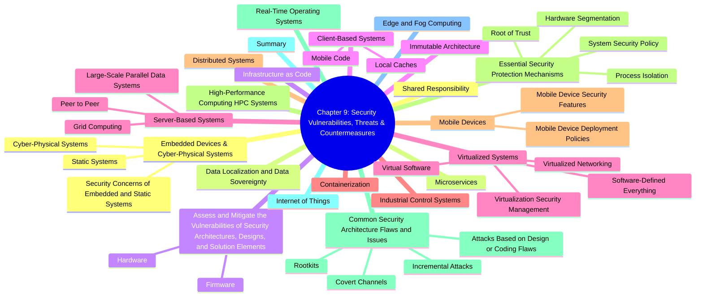

# Chapter 9: Security Vulnerabilities, Threats, and Countermeasures

- [Shared Responsibility](#shared-responsibility)
- [Data Localization and Data Sovereignty](#data-localization-and-data-sovereignty)
- [Assess and Mitigate the Vulnerabilities of Security Architectures, Designs, and Solution Elements](#assess-and-mitigate-the-vulnerabilities-of-security-architectures-designs-and-solution-elements)
  - [Hardware](#hardware)
  - [Firmware](#firmware)
- [Client-Based Systems](#client-based-systems)
  - [Mobile Code](#mobile-code)
  - [Local Caches](#local-caches)
- [Server-Based Systems](#server-based-systems)
  - [Large-Scale Parallel Data Systems](#large-scale-parallel-data-systems)
  - [Grid Computing](#grid-computing)
  - [Peer to Peer](#peer-to-peer)
- [Industrial Control Systems](#industrial-control-systems)
- [Distributed Systems](#distributed-systems)
- [High-Performance Computing (HPC) Systems](#high-performance-computing-hpc-systems)
- [Real-Time Operating Systems](#real-time-operating-systems)
- [Internet of Things](#internet-of-things)
- [Edge and Fog Computing](#edge-and-fog-computing)
- [Embedded Devices & Cyber-Physical Systems](#embedded-devices--cyber-physical-systems)
  - [Static Systems](#static-systems)
  - [Cyber-Physical Systems](#cyber-physical-systems)
  - [Security Concerns of Embedded and Static Systems](#security-concerns-of-embedded-and-static-systems)
- [Microservices](#microservices)
- [Infrastructure as Code](#infrastructure-as-code)
- [Immutable Architecture](#immutable-architecture)
- [Virtualized Systems](#virtualized-systems)
  - [Virtual Software](#virtual-software)
  - [Virtualized Networking](#virtualized-networking)
  - [Software-Defined Everything](#software-defined-everything)
  - [Virtualization Security Management](#virtualization-security-management)
- [Containerization](#containerization)
- [Mobile Devices](#mobile-devices)
  - [Mobile Device Security Features](#mobile-device-security-features)
  - [Mobile Device Deployment Policies](#mobile-device-deployment-policies)
- [Essential Security Protection Mechanisms](#essential-security-protection-mechanisms)
  - [Process Isolation](#process-isolation)
  - [Hardware Segmentation](#hardware-segmentation)
  - [Root of Trust](#root-of-trust)
  - [System Security Policy](#system-security-policy)
- [Common Security Architecture Flaws and Issues](#common-security-architecture-flaws-and-issues)
  - [Covert Channels](#covert-channels)
  - [Attacks Based on Design or Coding Flaws](#attacks-based-on-design-or-coding-flaws)
  - [Rootkits](#rootkits)
  - [Incremental Attacks](#incremental-attacks)
- [Summary](#summary)

---
## Shared Responsibility

1. **Everyone’s Role** 👥  
  - CISO & security team set up and maintain controls  
  - Employees follow security policies in daily tasks  
  - Auditors monitor for violations

2. **Stakeholder Accountability** 📊  
  - Organizations must protect investor, customer & partner interests  
  - Security decisions safeguard reputation and legal compliance

3. **Cloud Shared Responsibility Model ☁️**  
  - Understand which security tasks you vs. your cloud provider handle  
  - See Chapter 16 for in-depth coverage

4. **Responsible Vulnerability Disclosure 🛠️**  
  - When you find a new flaw, report it to the vendor or threat-intel hub  
  - Protect users by sharing details responsibly

**Automated Indicator Sharing (AIS) 🤖**  
  - DHS initiative for “machine-speed” sharing of IoCs (Indicators of Compromise)  
  - **Observable** = a fact (e.g., malicious file hash)  
  - **Indicator** = observable + threat hypothesis

**Standards & Protocols for Threat Exchange 🚀**  
  - **STIX** = Structured Threat Information eXpression (common threat language)  
  - **TAXII** = Trusted Automated eXchange of Intelligence Information (transport)

**NCCIC Management 🏢**  
  - AIS run by National Cybersecurity & Communications Integration Center  
  - More info: https://us-cert.gov/ais

---

## Data Localization and Data Sovereignty
- **Data Localization** 📍  
  - **Definition**: Storing/processing data within a country’s borders  
  - **Why It Matters**:  
    - Ensures compliance with local laws on privacy & security  
    - May restrict cross-border data flows  
    - Drives decisions on where to build data centers or use regional cloud services  
- **Data Sovereignty** ⚖️  
  - **Definition**: Data is subject to the laws of the country where it resides  
  - **Implications**:  
    - Governments control data collected within their jurisdiction  
    - Requires adherence to local regulations on data protection  
    - Affects data governance, legal compliance, and vendor contracts  
- **Comparing the Two**  
  | Aspect      | Data Localization                       | Data Sovereignty                              |
  |-------------|-----------------------------------------|-----------------------------------------------|
  | Focus       | Physical storage location               | Legal authority & control over data          |
  | Scope       | “Where” data lives                      | “Who” has rights & “how” data is governed     |
  | Drivers     | Specific regulations on data location   | Broader legal/political/cultural considerations |
  | Impact      | Infrastructure costs, latency, design   | Data governance, third-party agreements      |

---
## Assess and Mitigate the Vulnerabilities of Security Architectures Designs and Solution Elements

> **What it is:** Computer architecture is about designing systems at a logical level and building in controls like layering, abstraction, data hiding, trusted recovery, process isolation, and hardware segmentation.  
> **Why it matters:** More complexity → more attack surface → lower assurance. Keep it simple! 🛠️

### Hardware

- **Definition:** Any tangible part of a computer you can touch (CPU, memory chips, disks, keyboard, monitor).  
- **Note:** Data on disks/flash is _not_ hardware, it’s software/data (bits).

#### Processor (CPU) ⚙️
- **Role:** “Nerve center” that performs or coordinates all calculations.  
- **Instruction set:** Limited low-level operations—designed for speed.  
- **OS & compilers:** Translate high-level code into CPU instructions.

##### Execution Types 🚀

> Users want “doing two things at once” → various techniques:

| Term                | What it Means                                                                 | Emoji  |
|---------------------|-------------------------------------------------------------------------------|--------|
| **Multitasking**    | OS _simulates_ → juggles multiple processes on a single core, time- slicing 🤹‍♂️ | 🤹‍♂️   |
| **Multicore**       | CPU chip with multiple independent cores → true parallelism 🧩                  | 🧩     |
| **Multiprocessing** | Multiple CPU chips/cores run threads in parallel (sometimes pinned=affinity) 🤝 | 🤝     |
| **Multiprogramming**| OS batches many jobs on 1 CPU → each waits for I/O, then next runs ⏳            | ⏳     |
| **Multithreading**  | Multiple threads _within_ one process share resources, low context-switch overhead ⚡ | ⚡ |

##### Protection Mechanisms 🔒

> When running, OS + apps form a **runtime environment**. We need controls to enforce:
> - Integrity of OS ✔️  
> - Which users access which data 👤  
> - Authorize/deny operations ✅  

##### PROTECTION RINGS 🎯

- **Concept:** Code/components in concentric rings by privilege (inner = highest).  
- **Classic Model:** Rings 0–3  
  - **Ring 0:** Kernel (always in memory) – full access 👑  
  - **Ring 1:** OS services & drivers ⚙️  
  - **Ring 2:** I/O drivers & utilities 📂  
  - **Ring 3:** User apps 📱  
- **Enforcement:** Lower-ring code preempts higher. Higher-ring must call lower via _system call_ (mediated access).

##### Rings Compared to Levels 🆚

- **Similarity:**  
  - Ring 0 ↔ top layer (highest privilege)  
  - Ring 3 ↔ bottom layer (least privilege)  
- **Usage:** Some OSs collapse rings 0–2 into “kernel mode” and ring 3 into “user mode.”

##### Process States 📋
> A process’s lifecycle in the OS:

1. **New → Ready**  
   - Queued, waiting for CPU 📝  
2. **Ready → Running**  
   - Executes until done, time slice end, or blocked ▶️  
3. **Running → Waiting**  
   - Paused for I/O, then back to Ready when I/O done ⏸️  
4. **Running → Stopped**  
   - Finished or terminated (error/resource failure) ❌  
5. **Supervisory (Kernel Mode)**  
   - When code needs _higher_ privilege than user mode (e.g., changing config) 🔧  

🎓 Key Takeaways:
- Keep it simple to reduce vulnerabilities 🔍
- Understand each execution type’s parallelism model 🤔
- Protection rings enforce privilege separation 🛡️
- Process states define how tasks run and wait ⏳

## Memory
### Read-Only Memory (ROM) 💾
- **Definition:** Non-volatile storage burned at manufacture; system **can read** but **not write**.  
- **Uses:**  
  - **Bootstrap code** (e.g., POST diagnostics) 🔧  
  - **Firmware** that must not change ✔️  
- **Variants:**  
  - **PROM:** User “burns” data once; then read-only 🔥  
  - **EPROM (UVEPROM):** Erase with UV light → re-program ☀️  
  - **EEPROM:** Electrically erase/write ⚡  
  - **Flash:** Block-level erase/write (e.g., SSDs, thumb drives) 🔋  

### Random Access Memory (RAM) 🔄
- **Definition:** Volatile, read/write memory; loses data on power-off ⚡❌  
- **Never store critical data only in RAM!** Backup elsewhere. 💾

#### Real (Main) Memory 🏦
- **Dynamic RAM (DRAM):** Cheap; capacitor-based → CPU must refresh periodically 🔄  
- **Static RAM (SRAM):** Flip-flop based; faster, no refresh; more expensive 💨  

#### Cache RAM 🗄️
- **Purpose:** Speed up repeated access → small, fast memory layers  
- **Levels:**  
  - **L1/L2:** On-core, per CPU core 🧩  
  - **L3:** Shared among cores 🔗  
  - **L4:** Onboard motherboard/GPU (rare) 🎮  
- **Peripheral caches:** HDD, SSD caches must be **flushed** before power-off 🔥  

### Dynamic vs. Static RAM ⚔️
| Feature        | DRAM                          | SRAM                          |
| -------------- | ----------------------------- | ----------------------------- |
| Technology     | Capacitors (must refresh)     | Flip-flops (no refresh)       |
| Speed          | Slower (refresh overhead)     | Faster (no refresh)           |
| Cost           | Cheaper                       | More expensive                |
| Use Case       | Main memory                  | CPU registers, cache          |

### Registers 📋
- **Definition:** Tiny, on-CPU storage (8–32 registers of 32/64 bits)  
- **Use:** Holds operands/instructions for the ALU → highest speed 🚀  

### Memory Addressing 🗺️
| Scheme            | How It Works                                                                                             |
| ----------------- | -------------------------------------------------------------------------------------------------------- |
| **Register**      | CPU accesses data directly in register (e.g., “R1”)                                                      |
| **Immediate**     | Operand given in instruction itself (e.g., “ADD 2”)                                                      |
| **Direct**        | Instruction supplies an address → CPU reads data there                                                    |
| **Indirect**      | Instruction supplies an address → that holds another address → CPU reads final data                       |
| **Base+Offset**   | CPU adds offset from instruction to base pointer (in register) → access data                              |

> **Pointers & Race Conditions:**  
> - **Pointer:** Variable holding a memory address → must be _dereferenced_ to read/write the actual data 📍  
> - **Race Condition:** Two processes access/modify pointer simultaneously → may dereference a null/corrupted pointer → crash 🏃‍♂️💥  

### Secondary & Virtual Memory 💽
- **Secondary Memory:** HDDs, SSDs, optical, flash → **OS pages** data into main memory when needed 📂  
- **Virtual Memory:**  
  - **Pagefile/Swapfile** on disk extends RAM address space  
  - **Paging:** Swap infrequently used pages to disk → bring back when accessed ↔️  
  - **Drawback:** Slower I/O → “thrashing” if over-used 🐢💤  
  - **Mitigations:** More physical RAM, SSD/NVMe for pagefile 🚀  

> 🎯 **Key Points:**  
> - **ROM variants** trade immutability vs. flexibility 🔒⚡  
> - **RAM types** balance cost vs. speed (DRAM vs. SRAM) 💰💨  
> - **Registers** and **cache** are critical for CPU performance 🏎️  
> - **Addressing modes** let CPU locate data in memory 🗺️  
> - **Virtual memory** avoids OOM but can slow down if abused 🐢  

### Firmware
* UEFI rootkits, BMC/iLO backdoors.  
* Signed updates, Secure Boot, measured boot (**TPM PCRs**), firmware SBOM.

---

## Client-Based Systems  

### Mobile Code
- Java, JavaScript, ActiveX, Flash → sandbox, CSP, code signing.

### Local Caches
- Browser, DNS, SSO tokens → poisoning & side-jacking; use *no-store*, cache-busting, TLS.

---

## Server-Based Systems  

### Large-Scale Parallel Data Systems
* Hadoop/Spark risk: unauth REST, mis-set ACLs.  
* Use **Kerberos, TLS, Ranger**, node segmentation.

### Grid Computing
* Federated volunteer nodes; sign work units, encrypt comms.

### Peer to Peer
* Threats: DDoS amplification, data leakage; fix via **whitelist peers, rate-limit**.

---

### Industrial Control Systems
* **SCADA, DCS, PLC**; legacy protocols (Modbus, DNP3) unauth’d.  
* ISA/IEC 62443 zoning, data diodes, passive monitoring (ICS-IDS).

---

### Distributed Systems
* CAP-theorem trade-offs; secure gRPC, clock integrity, service-mesh mTLS.  

---

### High-Performance Computing (HPC) Systems
* MPI job hijack, high-speed interconnect eavesdropping; InfiniBand VLANs, node-level SELinux.  

---

### Real-Time Operating Systems
* Deterministic timing > complex crypto; use lightweight algorithms, MPU, static analysis.

---

### Internet of Things
* Constrained devices, default creds, insecure OTA.  
* Controls: SBOM, secure element, MUD profiles, micro-segmentation.

---

### Edge and Fog Computing
* Push compute near data; threats = physical capture, rogue workload.  
* Zero-trust, slice isolation (5G), lightweight EDR.

---

## Embedded & Cyber-Physical Systems  

### Static Systems
* Fixed-function (ATM, kiosk). Patch difficulty → compensate with physical hardening, template rebuild.

### Cyber-Physical Systems
* Sensors+actuators; safety first. IEC 61508, NIST 800-82.

### Security Concerns of Embedded and Static Systems
* Hard-coded keys, JTAG ports, EEPROM dumps.  
* Mitigation: conformal coating, fuse bits, secure enclave.

---

### Microservices
* Small stateless units; issues: **API sprawl, broken authZ, secret leakage**.  
* Use OPA policies, short-lived JWT, service mesh.

---

### Infrastructure as Code
* Terraform/Ansible; risks = secrets in code, drift.  
* Guardrails: SAST, policy-as-code (OPA), secret vaults.

---

### Immutable Architecture
* Re-deploy not patch → eliminates drift, speeds rollback.  
* Requires CI/CD, image signing, blue-green canaries.

---

## Virtualized Systems  

### Virtual Software
* Hypervisor escape (VENOM); prefer Type-1, keep patch cadence.

### Virtualized Networking
* vSwitch/VXLAN; inspect via vTAP, enforce micro-segmentation.

### Software-Defined Everything
* SDN, SDS, SDC; protect controllers (RBAC, certs, MFA).

### Virtualization Security Management
* Harden vCenter/SCVMM, template VMs, secure snapshot chain.

---

### Containerization
* Risks: poisoned images, breakout (runC).  
* Controls: namespaces, seccomp, AppArmor/SELinux, signed images (Notary, cosign).

---

## Mobile Devices  

### Mobile Device Security Features
* Secure Element, biometric auth, FDE, sandbox, SafetyNet/Attestation.

### Mobile Device Deployment Policies
* BYOD, COPE, CYOD. Enforce via MDM/UEM, enterprise container, remote wipe.

---

## Essential Security Protection Mechanisms  

### Process Isolation
* Address space separation, ring protections, ASLR.

### Hardware Segmentation
* IOMMU (VT-d), SR-IOV, TPM PCRs.

### Root of Trust
* Hardware anchor → verifies firmware, OS chain.

### System Security Policy
* Formal MAC rulesets, multilevel labels, ABCS matrices.

---

## Common Security Architecture Flaws and Issues  

### Covert Channels
* Storage vs timing. Mitigate w/ noise, strict reference monitor, auditing.

### Attacks Based on Design or Coding Flaws
* Buffer overflow, integer wrap, race (TOCTOU). Counter: memory-safe lang, fuzzing, SAST.

### Rootkits
* Kernel-mode, firmware. Detect with offline baseline, IMA, trusted boot logs.

### Incremental Attacks
* “Salami slicing,” bit-flipping, Rowhammer; mitigated by boundary checks, ECC.

---

## Summary
- Modern stacks (cloud, edge, IoT, OT) widen the attack surface.  
- Map **shared-responsibility** & **data-sovereignty** to control selection.  
- Harden every layer: hardware → firmware → OS → container → microservice.  
- Core mechanisms = **isolation, segmentation, secure boot, IaC guardrails**.  
- Recognize covert channels, rootkits, and design-level flaws; employ defense-in-depth + continuous monitoring for mitigation.  
- Expect CISSP scenarios on *who owns what risk*, patch vs immutability, and safeguarding ICS / IoT environments.
