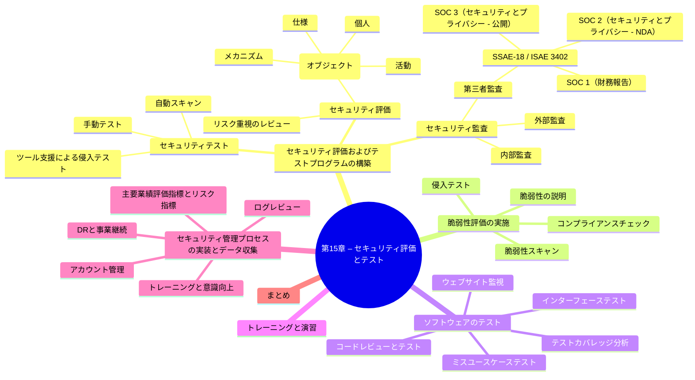

# 第15章 セキュリティ評価とテスト

- [セキュリティ評価およびテスト プログラムの構築](#building-a-security-assessment-and-testing-program)
  - [セキュリティテスト](#security-testing)
  - [セキュリティ評価](#security-assessments)
  - [セキュリティ監査](#security-audits)
- [脆弱性評価の実行](#performing-vulnerability-assessments)
  - [脆弱性の説明](#describing-vulnerabilities)
  - [脆弱性スキャン](#vulnerability-scans)
  - [侵入テスト](#penetration-testing)
  - [コンプライアンスチェック](#compliance-checks)
- [ソフトウェアのテスト](#testing-your-software)
  - [コードレビューとテスト](#code-review-and-testing)
  - [インターフェーステスト](#interface-testing)
  - [ミスユースケーステスト](#misuse-case-testing)
  - [テストカバレッジ分析](#test-coverage-analysis)
  - [ウェブサイト監視](#website-monitoring)
- [トレーニングと演習](#training-and-exercises)
- [セキュリティ管理プロセスの実装とセキュリティプロセスデータの収集](#implementing-security-management-processes-and-collecting-security-process-data)
  - [ログレビュー](#log-reviews)
  - [アカウント管理](#account-management)
  - [災害復旧と事業継続性](#disaster-recovery-and-business-continuity)
  - [トレーニングと意識向上](#training-and-awareness)
  - [主要業績評価指標とリスク評価指標](#key-performance-and-risk-indicators)
- [要約](#summary)

> **この章の目標:** オンプレミス、クラウド、ハイブリッド環境全体でセキュリティ制御が *存在し、正しく動作し、有効である* ことを証明するテスト、評価、監査を **計画、実行、評価** する方法を理解します。

## セキュリティ評価およびテストプログラムの構築
| 何 | なぜ |
|------|-----|
|**セキュリティ テスト**|**制御操作** (意図したとおりに動作している) を確認します。|
|**セキュリティ評価**|より広範な**リスク重視のレビュー**; 弱点を特定して修正します。|
|**セキュリティ監査**|**独立した認証** 制御が定義された標準を満たしていることを認証し、結果をサードパーティと共有します。|

> ✅ **CISSP キー:** *テスト* はコントロールをチェックします。*評価* はリスクを評価して推奨事項を提供します。*監査* はコンプライアンスを **独立して** 証明します。

### セキュリティテスト
＃＃＃＃ 意味  
自動スキャン、ツール支援による侵入テスト、または手動のエクスプロイトは、**スケジュールに従って、リスクの優先順位に基づいて**実行されます。

#### スケジュール / 優先順位付けの要因  
- ❑ セキュリティテストリソースの可用性
- ❑ テストされたコントロールによって保護されるシステムとアプリケーションの重要度
- ❑ テスト対象のシステムおよびアプリケーションに含まれる情報の機密性
- ❑ 制御を実施するメカニズムの技術的障害の可能性
- ❑ セキュリティを危険にさらすような制御の誤った構成の可能性
- ❑ システムが攻撃を受けるリスク
- ❑ 制御構成の変化率
- ❑ 制御パフォーマンスに影響を与える可能性のある技術環境のその他の変化
- ❑ 管理テストの実施の難しさおよび所要時間
- ❑ テストが通常の業務運営に与える影響

#### 良い実践  
1. **包括的な計画** を設計します (無計画に「すべてをスキャンする」アプローチは避けます)。  
2. **頻繁な自動**スキャン（影響は少ない）と**定期的な手動**テスト（より高い保証）を組み合わせます。  
3. **結果を確認する**:  
   * アナリストによる手動検証 *または*  
   * 自動ログ + 検出結果のアラート/チケット。  

### セキュリティ評価
＃＃＃＃ 意味  
**訓練を受けたセキュリティ専門家** が、**脅威、脆弱性、資産価値、将来のリスク** を考慮した総合的なリスク評価を実行します。  
**成果物:** *管理レポート* (平易な言葉で) + **改善の推奨事項**。

#### 実行  
- **社内**または**外部委託**の場合があります。  
- テスト ツール**プラス**推論と専門家の判断 (生のスキャン出力を超えて) を使用します。

#### NIST SP 800-53A「セキュリティとプライバシー管理の評価」  
| 評価 **オブジェクト** | 意味 |
|-|-|
|**仕様**|ドキュメント: ポリシー、手順、要件、設計。|
|**メカニズム**|セキュリティ制御 (ハードウェア / ソフトウェア / ファームウェア)|
|**アクティビティ**|人的アクション (バックアップ、ログのレビュー)。|
|**個人**|上記を実施する人々。|

*評価者は**これらのオブジェクトを検査、インタビュー、テスト**して、制御の有効性を評価します。*

### セキュリティ監査
**目的:** 標準に対する制御の有効性について、**公平で偏見のない意見**を提供します。  
*コントロールを設計/運用する者から**独立した**監査人によって実行される必要があります。*

#### 監査の種類  
| タイプ | 誰がスコープを管理するのか? | 主な対象者 |
|-|-|-|
|**内部**|組織独自の**独立監査部門** | 経営陣/取締役会 |
|**外部**|組織が雇用した外部監査会社 (例: **Big 4**) | 株主、規制当局 |
|**サードパーティ**|**別のエンティティ** (クライアント、規制当局) によって開始およびスコープ設定 | 要求エンティティ |

> **試験のヒント:** *エンゲージメントの管理* では、内部監査、外部監査、およびサードパーティ監査を区別します。

#### SOC / SSAE-18 / ISAE 3402 監査  
| エンゲージメント | フォーカス |
|-|-|
|**SOC 1**|**財務報告**に影響を及ぼす統制。|
|**SOC 2**|**セキュリティ、可用性、機密性、処理の整合性、プライバシー** に対する制御 (結果 = 機密)。|
|**SOC 3**|SOC 2 と同じドメインですが、**公開レポート**です。|

**レポートの種類**  
- **タイプ I:** **ある時点**でのコントロールの設計と説明。  
- **タイプ II:** 6 か月以上**にわたる設計 **および運用効率** (試験でより信頼されます)。

#### 実際の例  
*2015 GAO 監査* → **FAA 航空交通管制** システム (境界、認証、暗号化、ログ記録) に重大な弱点が見つかりました。

#### 監査基準とフレームワーク
| 標準 | CISSP コンテキストでの使用 |
|-|-|
|**COBIT (ISACA)**|IT および保証フレームワークの制御目標。|
|**ISO 27001**|**ISMS** 要件を指定します (認証できます)。|
|**ISO 27002**|実践規範 - 詳細な**管理カタログ**。|

*(監査/評価では、組織の統制を選択した**標準**と比較することを理解してください。)*

#### 試験の重要なポイント
1. **テスト ≠ 評価 ≠ 監査** – 定義と目標を把握します。  
2. **リスクを優先したスケジュール** によりテストの頻度が決まります。  
3. **NIST 800-53A** に準拠した評価対象: 仕様、メカニズム、アクティビティ、個人。  
4. 監査の独立性: 内部 vs 外部 vs サードパーティ、**SOC レポート (タイプ I vs II)**。  
5. 共通フレームワーク (COBIT、ISO 27001/27002) は、監査の**制御目標**を提供します。

## 脆弱性評価の実行  
脆弱性評価では、ホスト、アプリ、またはネットワーク内の技術的な弱点 (🔑 *脆弱性*) を体系的に **検出、検証、優先順位付け** して、リスクを許容レベルまで低減します。  
プロセス フロー ➜ *検出 → 検証 → 修復* (ワークフローは組織の**脆弱性管理プログラム**の一部になります)。

### 脆弱性の説明  
共通言語を話すために、業界では **NIST SCAP** (🔑 *セキュリティ コンテンツ自動化プロトコル*) に依存しています。  
| SCAP コンポーネント | 目的 | 覚えておいてください |
|----------------|---------|--------------|
| **CVE** | 個々の脆弱性の命名スキーム | *CVE-2023-1234* スタイル ID |
| **CVSS** | 0～10 の重大度スコア (基本/一時/環境) | 試験では「**悪用可能性 × 影響度**」のコンセプトが重視されます |
| **CCE** | 名前の誤った構成 | 強化ベンチマークは CCE にマップされます |
| **CPE** | 製品/プラットフォームに名前を付けます | 例: *cpe:/o:microsoft:windows_10* |
| **XCCDF** | チェックリスト言語 | ベンチマーク コンテンツ用の SCAP スキャナーによって使用されます |
| **OVAL** | テスト/プローブ言語 | 自動チェックを駆動 |

### 脆弱性スキャン  
**スケジュールに従って** 実行し、時間の経過とともに結果を比較できる自動プローブ。  
主なカテゴリーと典型的な🛠:

| スキャンタイプ | 目標 | ツールの例 |
|-----------|------|---------------|
| **ネットワーク検出** | ライブホストと開いているポートを検索 | Nmap、Masscan |
| **ネットワークの脆弱性** | サービスを既知の CVE と一致 | Nessus、Qualys |
| **Web アプリの脆弱性** | SQLi、XSS、CSRF などを検出 | OWASP ZAP、Burp スキャナー |
| **データベースの脆弱性** | DB エンジンの誤った構成と SQLi を調査 | sqlmap、AppDetective |

> ⚠️ 攻撃者は *まったく同じ* スキャナーを使用します。「スキャン ノイズ」を潜在的な偵察として扱ってください。

#### ネットワーク検出スキャン  
- Nmap の **ポート状態用語**: *open、closed、filtered、unfiltered、open|filtered*  
- 一般的なプローブ手法 (覚えておきましょう):  
  - **TCP SYN** (ハーフオープン)  
  - **TCP 接続** (完全な 3 ウェイ ハンドシェイク)  
  - **TCP ACK** (ファイアウォールルールのマッピング)  
  - **UDPスキャン** (ハンドシェイクなし)  
  - **クリスマススキャン** (FIN + PSH + URG フラグ)

#### ネットワーク脆弱性スキャン  
- 認証されていないスキャンと**認証されたスキャン** (後者は誤検知/誤検出を減らします)。  
- **誤検知** = 脆弱性が報告されているが、実際はそうではない。  
- **偽陰性** = 実際の脆弱性を見逃す (⚠️ より危険)。  
- **ゼロデイ** を検出できません (CVE はまだ存在しません)。

#### Webアプリケーションスキャン  
- 試験では **PCI-DSS** 要件が重視されます: 年次の Web スキャン **または** WAF。  
- ベースライン スキャンを、製品リリース前、コード変更後、重要度に応じて定期的に実行します。  
- ツール: Burp Suite、OWASP ZAP、Acunetix。  
- バナー取得とバージョン フィンガープリンティングの一般的な手法。

#### データベーススキャン  
- SQL Server、Oracle、MySQL などを対象とし、SQLi、弱い認証、デフォルトの資格情報を探します。  
- sqlmap は発見された脆弱性を *悪用* する可能性があります → 侵入テストの領域に橋渡しする場合があります。

##### 知っておくべきTCPポート  
| サービス | ポート | 注記 |
|---------|---------|--------|
| SSH | 22 | セキュア CLI 管理者 |
| HTTP / HTTPS | 80 / 443 | Web トラフィック |
| RDP | 3389 | Windows リモート デスクトップ |
| *…本からリストを知る* |

#### 脆弱性管理ワークフロー

| フェーズ | 目的 | 一般的なアクション |
|-------|------------|-----------------|
| **1·検出** | 潜在的な弱点を特定します。 | - スケジュールされた継続的な脆弱性スキャンを実行します。 - 脅威フィードまたはベンダーのアラートを使用します。 |
| **2· 検証** | 実際の問題をノイズから切り離します。 | - セキュリティ チームが各発見事項を確認します。 - 真陽性を確認し、偽陽性を破棄します。 - 検証された脆弱性を追跡システムに記録します。 |
| **3· 修復** | 検証されたリスクを排除または軽減します。 | - ベンダーのパッチ/ホットフィックスを適用します。 - 構成を強化するか、脆弱なサービスを無効にします。 - 補償制御 (例: WAF ルール、セグメンテーション、回避策) を展開します。 |

##### 優先順位マトリックス
1. **重大度 / CVSS** – 欠陥のビジネスへの影響。  
2. **悪用される可能性** – 公開された悪用、攻撃の容易さ、露出。  
3. **修復の労力とコスト** – ダウンタイム、人員、複雑さ。

> **目標:** リスクベースの順序で脆弱性を **検出 → 検証 → 修復** する繰り返し可能なパイプラインを確立し、問題が迅速かつ一貫して処理されるようにします。

### 侵入テスト  
**脆弱性スキャンとの違い**: 影響を証明するために、積極的に弱点を*悪用*します。  
NIST SP 800-115 フェーズ (図を暗記してください):  
1. **計画** – 範囲、交戦規則、*書面による承認*。  
2. **検出** – 情報収集 + 脆弱性分析。  
3. **攻撃** – 悪用、エスカレーション、ピボット、アクセスの維持。  
4. **レポート** – 詳細な調査結果、ビジネスへの影響、修復ロードマップ。

| ペンテストの種類 | 提供される知識 | 別名 |
|---------------|--------------------|-----|
| **ホワイトボックス** | 詳細 | 既知の環境 |
| **グレーボックス** | 限定的/部分的 | 部分的に既知 |
| **ブラックボックス** | 詳細なし | 環境不明 |

ツールと自動化:  
- **Metasploit Framework** (エクスプロイト スクリプト、ペイロード、エクスプロイト後)。  
- **侵入および攻撃シミュレーション (BAS)** プラットフォーム (継続的かつ自動化された「ミニ侵入テスト」)。  

> ⚠️ ペンテストによってサービスが中断される可能性があります。メンテナンス期間とロールバック プランを確保してください。

### コンプライアンスチェック  
- **規制上の義務** → **セキュリティ管理** → 運用の検証をマッピングします。  
- 例: HIPAA、GDPR、SOX、PCI-DSS。  
- 定期的なコンプライアンス監査により罰金を回避し、**十分な注意/勤勉さ** を実証します (ドメイン 1 の流行語)。

#### クイックフラッシュカード  
- **SCAP** = アンブレラ フレームワーク (CVE、CVSS、CCE、CPE、XCCDF、OVAL)。  
- **偽陽性 vs 偽陰性** – どちらがよりリスクが高いですか？（偽陰性）。  
- **認証されていないスキャンと認証されたスキャン** – 速度と精度のトレードオフ。  
- **ポート 22/80/443/3389** – 本から少なくとも上位 15 個を把握している。  
- **ペンテストのフェーズ** – 計画 → 検出 → 攻撃 → レポート。

#### 試験当日の持ち帰り  
1. スキャンやテストを行う前に**承認を得てください**。そうしないと、ハッキングになります。  
2. **スキャンの種類** と、それぞれの適切なタイミングを区別します。  
3. SCAP の各部分と **CVSS スコアリング** の目的を覚えておいてください。  
4. **Nmap ポートの状態とフラグ** を理解できるようになります。  
5. 脆弱性管理を**ワークフローと優先順位付け**に結び付けます (重大度 × 可能性 × 修復作業)。  

---

## ソフトウェアのテスト
- ソフトウェアは多くの場合、**特権** で実行され、**機密データ** を操作し、**ビジネスに不可欠です**。  
- **例外処理** の原則: アプリは無効な入力や悪意のある入力を*予測* する必要があり、ユーザーを信頼してはなりません。  
- すべてのテストの目標: 実稼働リリース前に **機密性、整合性、可用性** (CIA) を保証する。

### コードレビューとテスト

#### コードレビュー
| 事実 | 試験のナゲット |
|------|--------------|
| 製品版前のソースのピア検査 | 別名 **ピアレビュー** または **ウォークスルー** |
| **セキュリティ、信頼性、パフォーマンス** の欠陥を早期に検出 | 最も安価な修正が展開前に実施されます |
| 出力: *承認* ⟶ 本番環境 **または** *再作業* して開発に戻す | SDLC の一部 📚 |

##### コードレビュープロセス - Fagan Inspections
厳密にゲートされた 6 つのステップ (高リスクの業界で使用):  
計画 → 概観 → 準備 → 検査 → 手直し → フォローアップ

#### 静的テスト（SAST）
- **実行なし**。**ソースまたはバイナリ**を分析します。  
- 典型的なコーディング エラー (バッファ オーバーフロー、インジェクション シンク) を検出します。  
- セキュリティの *シフトレフト* のために IDE/CI に統合されています。

#### 動的テスト（DAST）
- **ランタイム** でコードを実行します。サードパーティ アプリにとってブラック ボックスに適しています。  
- 共通: **Web アプリ スキャナー** (XSS、SQLi)。  
- **調整** 停止を回避するために、本番環境で慎重に調整します。

##### 合成トランザクションとベンチマーク
- 既知の出力を持つ**合成/スクリプト化された**アクション → 正確性とパフォーマンスを検証します。  
- **ベンチマーク** = ターゲット メトリック (応答時間、スループット、エラー率)。

##### IAST と RASP
- **IAST**: リアルタイムのアプリ内センサー。SAST+DAST を組み合わせます。  
- **RASP**: ランタイム内の保護エージェント。悪意のある呼び出しを傍受してブロックします。

#### 倫理的開示
1. 発見された脆弱性を**ベンダーに非公開で通知**します。  
2. **適切な修正期間を許可します。**  
3. 無視された場合は、ユーザーが自分自身を保護できるように**公開**します。  
*目的: 顧客の安全性とベンダーの準備のバランスをとる。*

#### ファズテスト
**無効/予期しない**入力を与えてストレス テストを実行します。

##### 突然変異 vs. 世代
| スタイル | 仕組み | 長所 | 短所 |
|-------|--------------|------|------|
| **ミューテーション (ダム)** | **実際の** 入力を微調整 | 高速、仕様は不要 | コード カバレッジが低い |
| **世代別 (インテリジェント)** | **データ モデル** から入力を構築 | より深いロジック到達 | より多くの準備作業 |

##### ビット反転と **zzuf**
- `zzuf` はランダムなビット反転によってファイル/ストリームを変更し、クラッシュやオーバーフローを明らかにします。

##### ファズの制限
- 100% のパスをカバーすることはほとんどなく、**単純な入力駆動型の**脆弱性に最適です。  
- **テスト カバレッジ分析** と組み合わせて、リーチを定量化します。

#### インターフェーステスト  
個別に構築されたモジュールが**安全に通信する**ことを確認します。

| インターフェースタイプ | 確認事項 | 例 |
|----------------|---------------|------------|
| **API / Web サービス** | • 認証 / 承認 • 入力検証と出力エンコード • レート制限 / スロットル | アカウント間で資金を移動する *RESTful* `POST /accounts/transfer` エンドポイント、顧客 PII クエリ用の *GraphQL* スキーマ |
| **ユーザー インターフェイス (GUI / CLI)** | • 使いやすさとアクセシビリティ • 一貫したエラー/例外処理 • セッション管理 (タイムアウト、再認証) | 現金引き出し用の ATM タッチスクリーン ワークフロー、特権コマンド用の Linux `sudo` CLI プロンプト |
| **ネットワーク インターフェース** | • 転送中の暗号化 (TLS/IPsec) • 帯域幅 / レイテンシー / スループット • 耐障害性: 再試行、エラー回復 | e コマース チェックアウト用の TCP 443 上の HTTPS、HQ とクラウド VPC 間の IPsec トンネル |
| **物理インターフェース (ICS、PLC)** | • 安全インターロックとフェールセーフ状態 • EMI シールドと改ざん検出 • コマンド認証 | 化学プラントのバルブを制御する Modbus シリアル リンク、自動車のブレーキバイワイヤ システムの CAN バス |

#### 誤用（乱用）ケースのテスト
- *攻撃者/悪意のあるユーザーがどのように機能を悪用するか*を列挙します。  
- それらのシナリオを**活用**するためのテストを作成し、防御を検証します。

#### テストカバレッジ分析
式：  
カバレッジ率 % = (テストされたユースケースの数 ÷ 考えられるユースケースの合計) × 100

試験で好まれる共通の基準:

| 基準 | 意味 |
|-----------|----------|
| **分岐** | すべての `if/else` パス |
| **条件** | 各ブール式の結果 |
| **関数** | 呼び出されて返されるすべてのメソッド |
| **ループ** | ループは 0 回、1 回、複数回実行されます |
| **ステートメント** | 実行されるすべての行 |

#### ウェブサイト監視
| テクニック | 方法 | 強み | 弱み |
|-----------|---------|----------|----------|
| **パッシブ (リアルユーザーモニタリング)** | ライブトラフィックをキャプチャ | 実際のユーザービュー | 問題発生後のみ検出 |
| **合成 (アクティブ)** | ボットがスクリプト化されたトランザクションを実行 | ユーザーより先に問題を検出 | スクリプト化されていない問題を見逃す可能性がある |

> **ベスト プラクティス:** 完全なカバレッジを得るには両方を使用します。

#### 🔑 試験のポイント
* **多層テスト** を採用する (SAST → DAST → IAST/RASP → ファズ)。  
* **ピア コード レビュー** がベースラインです。**Fagan** は高い保証を実現します。  
* **倫理的開示** フローを理解する。  
* **テスト タイプ ↔ 目標 ↔ サンプル ツール** を一致させることができる。  
* **カバレッジ メトリック** を使用してテストを定量化します。  
* **インターフェース、誤用例、ウェブサイトの監視** はすべて公正な質問です。

### トレーニングと演習

| **概念** | **CISSP について知っておくべきこと** |
|-------------|----------------------------------------|
| **サイバー演習の目的** | • 侵入テストと同様の結果で、目に見えない脆弱性を安全に発見します。 • 攻撃と防御の両方の**実践的なスキル**を構築します。 • 企業全体のサイバー意識を高めます。 |
| **演習チーム** | - **レッド チーム** → _攻撃側_。 - **ブルー チーム** → _防御側_ (多くの場合、強化するためのリード タイムが得られます)。 - **ホワイト チーム** → _オブザーバー / 審査員 / 審判_。公平性を確保し、**生産性を保護します。 |
| **パープル チーム** | 演習後の知識共有セッションでレッド チームとブルー チームが戦術を統合し、継続的な改善を実現します。(_レッド + ブルー = パープル_)。 |
| **キャプチャー・ザ・フラッグ (CTF)** | • ゲーム化されたシナリオ - 赤チームは攻撃目的を達成することで得点し、青チームは阻止することで得点します。 • 明確で測定可能な目標 (例: ファイルの盗難、サイトの改ざん)。 |
| **テスト環境** | • 本番環境を保護するために、**分離されたラボ/サンドボックス** を優先します。 • テーブルトップ演習 = ディスカッションのみのシミュレーション - 実際のシステムは必要ありませんが、手順はテストします。 |

### セキュリティ管理プロセスの実装とセキュリティプロセスデータの収集

> これらの継続的なレビューにより、内部関係者を抑止し、弱い管理を明らかにし、リスクガバナンスに指標を供給する**フィードバック ループ**が作成されます。

#### ログレビュー
- **SIEM + syslog/NXLog/Windows GPO** はイベント データを一元管理します。
- 正確なタイムラインには **NTP 同期** が必須です。
- マネージャーは**特権アクティビティを監査**する必要があります (例: eDiscovery 検索)。
- **NetFlow**/フロー ログ = インシデントフォレンジックの貴重な情報 (「誰が誰と話したか」とバイト数を記録)。

#### アカウント管理
1. 管理者（監視下）から実際の特権アカウント リストを取得します。  
2. **承認済み権限リスト**と比較します。  
3. 不一致を解決します (過剰な権限、孤立したユーザー/終了したユーザー)。
- **サンプリング** は、選択が **完全にランダム** である場合にのみ許可されます。
- 最新の IAM スイートは、**ワークフローと監査証跡** の自動化を提供します。

#### 災害復旧と事業継続の監視
- 定期的な**バックアップ検証**: ログを確認したり、ハッシュを比較したり、実際の復元を実行したりします。
- 定期的な **DR/BC テスト** (ウォークスルー、並列、完全中断など) により準備状況を検証します。

#### トレーニングと意識向上プログラム
| **フェーズ** | **重要なポイント** |
|-----------|---------------|
| **初期 / 役割ベース** | 新規採用者や職務変更する従業員に合わせてカスタマイズします。 |
| **定期的** | 年間を通じての更新。新たな脅威とポリシーの変更を反映します。 |
| **フィッシング シミュレーション** | 脆弱性を測定し、クリッカーを自動トレーニングします。 |

#### 主要業績評価指標およびリスク指標（KPI / KRI）
一般的なダッシュボードのメトリック:
- 未解決の脆弱性と**平均修復時間 (MTTR)**
- 脆弱性/欠陥の**再発率**
- 侵害されたアカウント数
- 試作段階のコードの欠陥数
- 監査結果の繰り返し
- ユーザーが悪意のあるURLにアクセスしようとする  
⮩ **イントラネット ダッシュボード** に結果を表示して、常に確認できるようにします。

#### 🔑 試験のポイント
- **赤/青/白** の役割、**紫のチーム分け**、および **CTF** の目標。
- ラボやテーブルトップの設定が実際の製品よりも安全な理由。
- 継続的な監視の 3 つ: **ログのレビュー**、**アカウント監査**、**KPI ダッシュボード**。
- バックアップ チェックと DR/BC ドリルは管理者の責任です。
- セキュリティ意識の向上は一度で終わるものではありません。**初期トレーニングと定期トレーニング**や**フィッシング シミュレーション**に関する質問が予想されます。
