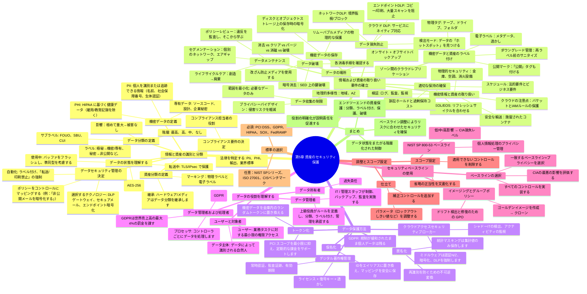

# 第5章 資産のセキュリティ保護

- [情報と資産の識別と分類](#identifying-and-classifying-information-and-assets)  
  - [機密データの定義](#defining-sensitive-data)  
  - [データ分類の定義](#defining-data-classifications)  
  - [資産分類の定義](#defining-asset-classifications)  
  - [データの状態を理解する](#understanding-data-states)  
  - [コンプライアンス要件の決定](#determining-compliance-requirements)  
  - [データセキュリティ管理の決定](#determining-data-security-controls)  
- [情報および資産の取り扱い要件の確立](#establishing-information-and-asset-handling-requirements)  
  - [データメンテナンス](#data-maintainance)  
  - [データ損失防止](#data-loss-prevention)  
  - [機密データと資産のラベル付け](#labeling-sensitive-data-and-assets)  
  - [機密情報および資産の取り扱い](#handling-sensitive-information-and-assets)  
  - [データ収集の制限](#data-collection-limitation)  
  - [データの場所](#data-location)  
  - [機密データの保存](#storing-sensitive-data)  
  - [データ破壊](#data-destruction)  
  - [適切なデータと資産の保持の確保](#ensuring-appropriate-data-and-asset-retention)  
- [データ保護方法](#data-protection-methods)  
  - [デジタル著作権管理](#digital-rights-management)  
  - [クラウド アクセス セキュリティ ブローカー](#cloud-access-security-broker)  
  - [仮名化](#仮名化)  
  - [トークン化](#tokenization)  
  - [匿名化](#anonymization)  
- [データロールの理解](#understanding-data-roles)  
  - [データ所有者](#data-owners)  
  - [データ管理者および処理者](#data-controllers-and-processors)  
  - [データ管理者](#data-custodians)  
  - [ユーザーとサブジェクト](#users-and-subjects)  
- [セキュリティ ベースラインの使用](#using-security-baselines)  
  - [テーラリングとスコープの比較](#comparing-tailoring-and-scoping)  
  - [標準の選択](#standards-selection)  
- [要約](#summary)

[CISSP 学習ガイド 10ed 2024 第 5 章](https://www.youtube.com/watch?v=c-D9SBeHBl4&t=679s)

## 情報と資産の識別と分類

### 機密データの定義
*機密データ* とは、**不正に開示、変更、または破壊** されると個人、組織、または公共に損害を与える可能性がある情報です。  
主なカテゴリは次のとおりです:

| カテゴリ | 定義 | 代表的な例 | 主な法的要因 |
|----------|------------|------------------|------------------------|
| 個人を特定できる情報 (PII) | 個人を一意に識別または追跡できるデータ。 | 氏名、パスポート番号、社会保障番号、電子メール、生体認証 | GDPR、NIST SP 800-122、CCPA |
| 保護対象医療情報 (PHI) | 対象となる事業体/ビジネスアソシエイトによって作成、受信、または保存された医療データ。 | 医療記録、検査結果、保険請求 | HIPAA、HITECH |
| 専有 / 企業秘密 | 競争上の優位性をもたらすデータ | ソースコード、研究開発計画、計算式 | 企業秘密法、NDA 契約 |
| 財務データ | 金銭取引に関する情報 | クレジットカードの PAN、銀行口座の詳細、納税申告 | PCI-DSS、SOX |
| 政府機密 | 公開されると国家安全保障に損害を与えるデータ | 軍事計画、外交電報 | 大統領令 13526 |

🔑 **試験のヒント:** 各カテゴリを保護する必要がある *理由* を理解してください (プライバシー権、競争上の優位性、国家安全保障など)。

### データ分類の定義
分類により、*値*と*影響レベル*がデータにマッピングされ、安全対策が導かれます。

| 政府 (米国) | 開示された場合の影響 | 商業的に同等 | 一般的な管理 |
|-------------------|---------------------|-----------------------|------------------|
| 最高機密 | 極めて重大な損害 | 機密 / 専有 | 知る必要がある者のみ、エアギャップ、MFA、AES-256 |
| 秘密 | 重大な損害 | プライベート | 保存時および転送時の暗号化、DLP |
| 機密 | 損害 | 機密 | 最小権限、安全な消去 |
| 未分類 | 被害は予想されません | 公開 | 整合性制御 (ハッシュ、WAF) |

*分類機関* (例: データ所有者、政府の OCA) がラベルを割り当て、定期的にレビューします。  
🛡️ 適切な*マーキング、取り扱い、保管、破棄*の手順は、ラベルに準拠する必要があります。

### 資産分類の定義
ハードウェア、ファームウェア、メディアは、処理するデータの最高分類を継承します。

* **デバイス:** *秘密*データを処理するラップトップは *秘密*資産となり、暗号化されたドライブ、TEMPEST シールド、安全な廃棄が必要になります。  
* **リムーバブル メディア:** *機密*プロジェクトを保存する外部 SSD にはラベルを付け、ロックされたコンテナーに保管する必要があります。  
* **クラウド リソース:** PHI をホストする仮想マシンは、HIPAA の技術的保護手段 (監査ログ、強力なアクセス制御) を満たしている必要があります。

| 資産タイプ | 共通ラベル | 追加の安全対策 |
|------------|-------------|------------------|
| ワークステーション | データと同じ | フルディスク暗号化、エンドポイント DLP |
| サーバー | 最高のデータ ラベル | キー ストレージ用の HSM、強化された OS |
| バックアップ テープ | バックアップ コンテンツと一致 | オフサイト保管、保管チェーン |
| モバイル デバイス | 企業制限 | リモート ワイプ、コンテナ化 |

### データの状態を理解する

| 状態 | 定義 | 一般的な脅威 | 主な保護 |
|-------|------------|----------------|---------------------|
| **保存データ** | 物理メディアまたは仮想メディア (HDD、SSD、バックアップ、クラウド オブジェクト ストレージ) に保存されたデータ。 | 盗難、不正コピー、不適切な廃棄、オフラインでの改ざん。 | AES-256 以上の強力な暗号化、FIPS 140-3 検証済みの暗号モジュール、アクセス制御リスト (ACL/RBAC)、安全な保管室、HSM 管理キー。 |
| **転送中のデータ** | **外部または信頼できないネットワーク** (インターネット、パートナー リンク、リムーバブル メディア) を経由して移動するデータ。 | パケット スニッフィング、中間者 (MITM) 攻撃、ダウングレード/ストリップ攻撃、不正な Wi-Fi AP。 | TLS 1.3、IPSec VPN、SMTP STARTTLS、S/MIME、DNSSEC、証明書ピンニング。 |
| **移動中のデータ** | **信頼できる環境または半信頼できる環境** 内で移動するデータ (データセンター、OT ネットワーク、内部メッセージ キュー、マイクロサービス呼び出し内の東西トラフィック)。 | 横方向の移動、トラフィック リプレイ、ARP スプーフィング、タップウェア インプラント。 | MACsec、TLS 相互認証、ゼロ トラスト セグメンテーション、セキュア サービス メッシュ (mTLS)、ネットワークベースの DLP、マイクロ セグメンテーション ファイアウォール。 |
| **使用中のデータ** | 処理のためにメモリ、CPU キャッシュ、またはレジスタにアクティブにロードされるデータ。 | メモリ スクレイピング マルウェア、サイドチャネル攻撃 (Spectre、Meltdown)、DMA 攻撃、デバッガーの露出。 | 信頼できる実行環境 (Intel SGX、ARM TrustZone)、安全なコーディングと入力検証、メモリのゼロ化、準同型 / フォーマット保持暗号化、エンドポイント EDR。 |

🔍 *常に* データは **3 つの状態すべて** を通過すると想定し、コントロールはそれぞれをカバーする必要があります。

### コンプライアンス要件の決定
1. **管轄区域を特定する:** データが収集、保存、処理、またはアクセスされる場所をマップします (複数の国に及ぶ影響)。  
2. **適用可能な法律/基準をマップする:**  
   * プライバシー → GDPR、LGPD、CCPA、PIPEDA  
   * 健康 → HIPAA、GDPR第9条  
   * 金融 → SOX、GLBA、PCI-DSS  
   * セクター固有 → FedRAMP、NERC CIP、CJIS  
3. **ギャップ分析:** 現在の管理を法定要件と比較します。  
4. **責任を割り当てる:** 監督のために*データ保護責任者*または*コンプライアンス責任者*を任命します。  
5. **文書化と監査:** 規制当局や電子情報開示のための証拠を維持します。

📌 **注意:** コンプライアンス違反のリスクには、罰金、法的措置、認証の失効、評判の低下などがあります。

### データセキュリティ管理の決定
コントロールは、分類とコンプライアンスに応じた機密性、整合性、可用性を強化するために選択されます。

| 分類 | 電子メール制御の例 | ストレージ制御 | 追加の保護手段 |
|----------------|------------------------|------------------|-----------------------|
| 機密 / 専有 | • AES-256 エンドツーエンド暗号化 • 外部受信者なし • DRM: 転送/印刷不可 | 暗号化ファイル システム、HSM キー エスクロー | ポケット不要のクリーン デスク ゾーン、文書シュレッダー ビン |
| プライベート | • TLS で保護された送信 • 内部受信者のみ | データベースの列レベルの暗号化 | RBAC、プライバシーに関する通知 |
| 機密 | • 便宜的 TLS が許可されています | コンテナの暗号化 | ログ記録、SIEM アラート |
| パブリック | クリアテキストを許可 | 整合性のためのチェックサム | ウェブサイト コンテンツ用の WAF |

**技術的、管理的、および物理的** 制御は相乗効果を発揮する必要があります。

* 技術 → 暗号化、DLP、CASB、IAM 🔐  
* 管理 → ポリシー、分類トレーニング、NDA 📚  
* 物理的 → アクセスバッジ、金庫、CCTV 🏢

### クイックレビューチェックリスト
- ✅ PII、PHI、独自データ、公開データを区別できますか?  
- ✅ 政府と民間の分類階層とその影響ステートメントの両方を知っていますか?  
- ✅ *保存中*、*転送中*、*使用中*のデータの保護に精通していますか?  
- ✅ GDPR や PCI-DSS などの法律を特定のデータ タイプにマッピングできますか?  
- ✅ 分類に応じてコントロールがどのように拡張されるかを理解していますか?

📝 これらのポイントをマスターすれば、第 5 章の情報/資産の識別と分類のトピックの **コア試験目標** をカバーできます。

## 情報および資産の取り扱い要件の確立
| データ ライフサイクル フェーズ | 簡潔な定義 | コア セキュリティ目標 | 一般的な制御 / ベスト プラクティス |
|------------------|--------------------|----------|-----------------------------------|
| **データ収集** | 対象、センサー、トランザクションなどからのデータの取得または生成 | • 必要なものだけを収集する（データ最小化） • 法的根拠/同意を取得する 💡 | - プライバシー影響評価（PIA/DPIA） - 安全な収集チャネル（TLS、入力検証） |
| **データメンテナンス** | 継続的なケア: パッチ適用、再構築、品質保証、移行。 | • 変更中の整合性と機密性を維持 • 正確なメタデータ/分類を維持 | - 変更管理ワークフロー - バージョン管理とチェックサム - データ品質ダッシュボード |
| **データ破壊** | データ/メディアを最終的に、不可逆的に消去します。| • 廃棄後の機密性を保証 • NIST SP 800-88 および業界規制に準拠 | - 細断、粉砕、焼却（NSA に基づき SSD は 2 mm） - 破壊証明書および監査ログ |

### データのメンテナンス
- **目標:** 機密データを整理し、保護し、制御を適用できる場所に保管します。🛡️  
- **集中化 vs. 無秩序化**  
  - **集中ストレージ** により、アクセス制御と監視が簡素化されます。  
  - **分散ストレージ** により攻撃対象領域が拡大し、分類の適用が複雑になります。  
- **分離されたネットワーク**  
  - *エアギャップ*: 分類されたネットワークを分類されていないネットワークから物理的に分離します。  
  - *単方向ブリッジ (データ ダイオード)*: 一方向のトラフィックを許可します (例: 機密のエンクレーブへのパッチ)。  
  - *ガード ソリューション*: ネットワーク間のデータを検査してサニタイズするハードウェア/ソフトウェア フィルター。  
- **ポリシーの更新:** 最近の侵害から得た教訓を定期的に確認し、それに応じて手順、バックアップ、パッチ チャネルを更新します。

### データ損失防止
| DLP タイプ | 監視ポイント | 一般的な使用例 | 制限事項 |
|----------|------------------|-------------------|------------|
| ネットワーク DLP | インターネット ゲートウェイ、SMTP リレー、VPN コンセントレータ | 送信トラフィックを検査し、PII/PHI/PCI の漏洩をブロック | SSL プロキシなしでは TLS を復号化できず、ローカル コピーはブロック |
| エンドポイント DLP | ホスト OS カーネル/エージェント | USB コピー、スクリーンショット、印刷、許可されていないファイル タイプを防止 | エージェントは最新の状態に保つ必要があります。ユーザーが改ざんする可能性があります |
| クラウド DLP | API 統合、CASB | SaaS、IaaS バケットでリスクのあるオブジェクトをスキャンし、ラベルを適用 | プロバイダー API に依存、異なるマルチクラウド ポリシー |

- **技術:** キーワードスキャン、パターンマッチング (例: SSN の場合は \d{3}-\d{2}-\d{4})、フィンガープリンティング、光学文字認識。  
- **検出モード:** 保存されている機密データをインベントリし、修復を優先順位付けします。  
- **対応アクション:** ブロック、隔離、暗号化、レッドフラグ通知、または正当な理由による許可。

### 機密データと資産のラベル付け
- **物理ラベル:** 最高のデータ分類を示すテープ、サーバー、ラップトップ上のステッカー。  
- **電子ラベル:** ヘッダー、フッター、透かし、メタデータ タグ。DLP または DRM によって認識されます。  
- **デスクトップの背景:** 画面上で分類を視覚的にリマインダーします。  
- **ダウングレードのルール:** *サニタイズ* を行った後のみ。極秘メディアの場合は許可されないことが多く、代わりに破棄してください。☑️

### 機密情報と資産の取り扱い
- **輸送セキュリティ:** 密封容器、不正開封防止バッグ、保税宅配便、保管連鎖ログ。  
- **クラウド同等機能:** バケット ACL、オブジェクト暗号化 (SSE-KMS、クライアント側キー)、およびログ記録 (S3 アクセス ログ、CloudTrail) を適用します。  
- **信頼しつつも検証する:** 継続的な監視、監査証跡、インシデント対応訓練により、ポリシーのコンプライアンスを強化します。

### データ収集の制限
- **原則:** *守れないものは集めない。*  
- 違反の影響を最小限に抑え、規制の範囲を縮小し（GDPR データの最小化）、ストレージ コストを削減します。🎯  
- **目的の評価**を実施し、収集された各属性を明示的なビジネス上または法的理由にマッピングします。

### データの場所
- **オンサイト + オフサイト** バックアップ戦略。地域的に異なる DR サイトを検討します。  
- **データの保存場所と主権:** 保存場所がプライバシー規制 (GDPR、ローカリゼーション法など) に準拠していることを確認します。  
- **クラウド レプリケーション:** プロバイダーのレプリケーション領域を確認し、同じ危険区域 (地震/洪水氾濫原) を回避します。

### 機密データの保存
- **保存時の暗号化:** AES-256、データベース TDE、列レベルまたはフィールド レベルの暗号化、HSM 内のキー。  
- **物理的制御:** 施錠された金庫、サーバー室のケージ、入室用のスマートカード、CCTV。  
- **環境制御:** HVAC、消火装置、湿度センサー。  
- **高信頼性メディア:** エンタープライズグレードの SSD/HDD、生体認証ロック解除機能付き暗号化 USB。🔐

### データ破壊
| 方法 | メディア タイプ | セキュリティ レベル | CISSP のキー ポイント |
|--------|--------------|---------------|------------------|
| **消去 (削除)** | すべて | 低 | ディレクトリ ポインターのみを削除します。データは回復可能です。 |
| **クリア (上書き)** | HDD、一部の SSD | 中程度 | シングル/マルチパス書き込み。スペア セクターが失われる可能性があります。 |
| **パージ** | HDD | 高 | 複数回の上書きパス + 検証。政府機関での *極秘* 使用には依然として適していません。 |
| **消磁** | 磁気メディアのみ | 高 | 強力な磁場によりドライブが無効になります。SSD/光学式では効果がありません。 |
| **暗号消去** | 暗号化されたメディア | 高* | キーを破棄し、バックアップが存在しないことを確認し、可能な場合は上書きと組み合わせます。 |
| **物理的破壊** | すべて | 非常に高い | 細断 (SSD の場合は 2 mm 未満)、焼却、粉砕。NSA 基準を満たしています。🔥 |

NIST SP 800-88 に従って、方法を分類レベルに合わせて調整します。

| ランク | 方法 | 説明 | 有効性 | NIST 分類 | 注記 |
|------|----------------------------|------------------------------------------------------------------------------------------------------------------------|------------------|------------------------------------------------------------------------------------|
| 🥇 1 | **破壊** | メディアを物理的に破壊します (例: 細断、粉砕、NSA 承認の ≤2mm 粒子サイズ) | ✅✅ 最大 | **破壊** | 不可逆的。HDD、SSD、テープ、光学メディアに適用されます |
| 🥈 2 | **消磁** | 強力な磁場が HDD やテープ内の磁気ドメインを破壊します | ✅ 高 | **パージ (磁気)** | SSD や光学ドライブには効果がありません。また、メディアが使用できなくなります |
| 🥉 3 | **パージ** | 高保証のファームウェアベースまたはソフトウェアレベルのセキュア消去 | ✅ 高 | **パージ** | 検証済みの場合は HDD/SSD に適していますが、隠しセクターが残る場合があります |
| 4️⃣ | **クリア** | 1 つ以上のパターン (例: 0xFF、0x00、ランダム) でデータを上書きします | ⚠️ 中高 | **クリア** | HDD の場合は信頼性が高いですが、SSD の場合は **不十分** です |
| 5️⃣ | **ディスクのフォーマット** | ファイルシステム構造を削除します (クイック/フル)。実際のデータは上書きされません | ❌ 低～中 | ❌ NIST 認定ではありません | 完全フォーマットの方が望ましいですが、回復はまだ可能です |
| 6️⃣ | **消去 (ファイルの削除)**| ディレクトリ テーブルからファイル ポインターを削除しますが、ディスク上のデータはそのまま残ります | ❌ 非常に低い | ❌ NIST 認定ではありません | フォレンジック ツールを使用して簡単に回復できます |
| 7️⃣ | **ディスクのデフラグ** | パフォーマンス向上のためにデータ ブロックを再構成します。**データの削除や変更は行いません** | ❌ なし | ❌ 破壊方法ではありません | データ セキュリティへの影響はゼロ — ディスク レイアウトにのみ影響します |

*元々強力な暗号化が使用されていた場合は高くなります。*

- **データ残留:** 残留磁束または電荷。実験室での回復技術を無効にするには消磁または破壊が必要です。  
- **NIST SP 800-88 Rev. 1:** サニタイズの決定と方法に関する信頼できるガイド。

### 適切なデータと資産の保持の確保
- **保持スケジュール:** 法律 (SOX、HIPAA、PCI-DSS) およびビジネス ニーズに準拠します (例: 1 年以上にわたる監査ログ)。  
- **訴訟ホールド:** 法的措置が*合理的に予想される*場合、削除を一時停止します。⚖️  
- **電子メールとファイルの消去ポリシー:** 電子情報開示の範囲を制限するために、X か月後に自動的に削除されます (Boeing の 9,250 万ドルの訴訟を参照)。  
- **ハードウェア ライフサイクル:** EOL/EOS を追跡し、パッチが適用されていない脆弱性を回避するためにサポートされていない機器を交換します。  
- **レガシー アクセス:** アーカイブ メディアの読み取り専用の最小限のレガシー システムを維持し、分離して強化します。  
- **費用対効果:** 保管コストと規制による罰金や証拠の紛失とのバランスを取ります。

### クイックレビューチェックリスト
- エアギャップ、単方向ブリッジ、ガードの違いを概説していただけますか?  
- 3 つの DLP 展開モデルとその盲点をご存知ですか?  
- サニタイズ用語 (クリア、パージ、消磁、破棄) を正しいユースケースに一致させることができますか?  
- 保持と訴訟ホールドの違い、そして過剰な保持がなぜ危険なのかを確信していますか?

## データ保護方法

### デジタル著作権管理
デジタル著作権管理 (DRM) は、著作権で保護されたデジタル コンテンツの **アクセス、変更、配布を制御する** 一連のテクノロジとポリシーです。  
主なテクニックと用語:

| テクニック | 目的 | CISSP ノート |
|-----------|----------|-------------|
| DRM ライセンス | 復号化キーと使用条件を提供 | 多くの場合、小さなファイルまたはアプリケーション メタデータとして埋め込まれます |
| 永続的なオンライン認証 | 認証サーバーとの定期的な接続が必要 | オフラインでの著作権侵害をブロックします。サーバーがダウンしている場合は可用性リスクがあります |
| 継続的な監査証跡 | 各アクセス/使用イベントを記録 | 否認防止とフォレンジック調査をサポート 🕵️ |
| 自動有効期限 | サブスクリプションまたはレンタル期間の終了後にアクセスを取り消します | 時限キーまたはトークンの有効期間ウィンドウを介して実装されます |

*試験の観点:* DRM に対する一般的な議論 (公正使用の制限、ユーザビリティの問題) を理解し、DRM は **著作権のみを保護し**、商標、特許、または企業秘密は保護しないことを理解します。

### クラウド アクセス セキュリティ ブローカー
クラウド アクセス セキュリティ ブローカー (CASB) は、クラウド コンシューマーとクラウド ワークロードの間に位置する **ポリシー適用ポイント** です。

| 機能 | 説明 | コントロールの例 |
|------------|-------------|------------------|
| 可視性 | 承認済み/未承認のアプリを列挙し、シャドー IT を検出 | API 検出、ファイアウォール ログの取り込み |
| コンプライアンス | 規制義務を SaaS の使用にマッピング | PCI スコープのタグ付け、HIPAA 暗号化チェック |
| データ セキュリティ | 転送中および保存中のデータに DLP、暗号化、トークン化を適用 | インライン暗号化、検疫ポリシー |
| 脅威保護 | ユーザーの行動を監視し、異常をフラグ付け | UEBA、不可能移動アラート |

デプロイメント モードには、**API ベース**、**リバース プロキシ**、**フォワード プロキシ**、または**ホスト エージェント** モデルが含まれます。🔑 CASB はオンプレミスのセキュリティ スタック (DLP、IAM、ログ記録) を複製して、マルチクラウド環境で一貫したガバナンスを実現できることに留意してください。

### 仮名化
仮名化では、識別子を、別の検索キーを使用して **再マッピング** できる **永続的な仮名** に置き換えます。

- 個人との直接的なつながりを断つことで、GDPR コンプライアンスの負担を軽減します 🙂  
- データ管理者によって元に戻すことは依然として可能（ルックアップテーブル、セキュアインデックス）  
- 医療研究でよく使用されます（例：完全な PHI の代わりに *Patient-12345*）  

セキュリティは **マッピング データベースを分離する** ことにかかっています。両方のデータセットが侵害されると、プライバシーが失われます。

### トークン化
トークン化では、機密値が、安全な金庫に保存されている**ランダムで非決定的なトークン**に置き換えられます。

| プロセスステップ | 誰が何を保管しますか? |
|--------------|------------------|
| ボールト | 暗号化された元のデータ + トークン マッピングを保持 |
| アプリ / POS | トークンのみを保存し、実際の PAN/SSN は保存しません |
| 承認 | トークン → ボールト → 実データ → 決済ネットワーク |

特徴的な特徴:

* 高速検索（支払い承認）用に設計されています🏦  
* トークンは通常、ビジネスロジックを支援するために**フォーマットを保持**（最後の4桁を保持）します  
* ボールトにアクセスできない場合、トランザクションは失敗します。冗長性を確保してください。

### 匿名化
匿名化により、**個人識別子が**不可逆的に削除**されるため、データ主体は**再識別できなくなります**（理論上）。

方法:

1. **集計/一般化** – 粗いバケット（年齢20～29歳）  
2. **ランダム化マスキング/シャッフル** – 統計特性を維持しながら列の値を入れ替える  
3. **ノイズの追加** – 差分プライバシーは数学的に制限されたノイズを追加します  

⚠️ **リンケージ攻撃や推論攻撃**による再識別リスクは依然として存在します。真の匿名化は非常に困難であり、試験問題では、匿名化されたデータは効果的に匿名化された後、**GDPRの適用範囲外**となることがしばしば強調されています。

### 比較スナップショット

| 機能 | 仮名化 | トークン化 | 匿名化 |
|---------|------------------|--------------|---------------|
| 元に戻せますか? | はい (コントローラー経由) | はい (ボールト経由) | いいえ |
| 一般的な用途 | 研究データセット、ログ | 支払い処理、API 呼び出し | オープン データ セット、統計 |
| マッピングの保存 | 個別の DB またはインデックス | 安全なトークン ボールト | なし |
| 規制の影響 | GDPR の義務は軽減されるが、個人データは残る | 多くの場合、販売者から PCI ストレージ要件が削除される | 完全に匿名の場合、GDPR/PCI は適用されない |
| パフォーマンスへの影響 | 最小 | ルックアップの遅延、ボールトの冗長性が必要 | なし |

*メモリ ジョグ:* **仮名 ≈ 別名**、**トークン ≈ ランダム スタブ**、**匿名化 ≈ 一方向**。

## データロールの理解

組織のデータには多くの人が関わり、それぞれに異なる責任を負っています。明確な役割定義によって、説明責任が確保され、機密情報を適切に保護することができます。

| **役割** | **説明** | **主な責任** | **例** |
|----------------------|--------------------------------------------------------------------------------------------------------------|--------------------------------------------------------------------------------------------------------------|
| **データ所有者** | データセットに対して最終的な責任を負う個人または団体 | - データ分類を定義する - アクセス権を承認する - 使用ポリシーを設定する - データが保護されていることを確認する | 部門長が財務データの分類とアクセス ポリシーを設定する |
| **データ コントローラー** | 個人データが処理される **理由** と **方法** を決定するエンティティ (GDPR 固有) | - 処理の目的と手段を決定する - GDPR 準拠を確保する - プロセッサーを選択して監視する | HR 部門が従業員データの収集方法と管理方法を定義する |
| **データ プロセッサ** | **管理者に代わって**データを処理する第三者 (指示に従ってのみ) | - 指示に従って処理を実行する - 技術的および組織的な保護手段を実装する | 給与計算会社がクライアント企業の給与データを処理します |
| **データ管理者** | 日常的なデータのセキュリティとストレージを管理する技術的な役割 | - 暗号化、バックアップ、ログ記録を適用する - アクセス制御を維持する - データの整合性と可用性を確保する| システム管理者は、サーバーのバックアップとセキュリティ パッチを管理します |
| **データ ユーザー** | 業務の一環としてデータにアクセスまたは使用するエンド ユーザー | - ポリシーに従ってデータにアクセスする - 責任を持ってデータを使用する - 異常または違反を報告する | 営業担当者は CRM で顧客データを表示してリードを追跡する |

### ✅ 概要表

| **機能** | **所有者** | **コントローラー** | **プロセッサー** | **管理者** | **ユーザー** |
|-------------------------|-----------|----------------|----------------|----------------|----------|
| 使用目的を設定します | ✅ | ✅ | ❌ | ❌ | ❌ |
| データを直接使用 | ❌ | ✅ (場合によっては) | ✅ | ❌ | ✅ |
| 技術的制御を実装します | ❌ | ❌ | ✅ (委任されている場合) | ✅ | ❌ |
| 法的責任 | ✅ | ✅ | ✅ (共有) | ❌ | ❌ |

> 📝 **CISSP向けのヒント:**  
> - **法的に責任を負うのは誰なのか**を理解する（所有者、管理者）  
> - **制御を実施**する者（処理者、管理者）を知る  
> - ユーザーは**最小権限**とセキュリティポリシーに従う必要があることに注意してください

### データ所有者
- **説明責任:** 特定のデータ セットに対する **最終権限** を持つ上級管理職または部門長。
- **主な職務**
  - 分類とラベル付けを決定する 🏷️
  - 「行動規範」（AUP）と許容される使用方法を定義する
  - アクセスレベルを承認し、権限を確認する
  - セキュリティ管理がポリシーと法的要件を満たしていることを確認する
  - 過失（十分な注意/勤勉さの欠如）に対して責任を問われる可能性があります

#### NIST SP 800-18 情報（データ）所有者の責任

| 役割 | 主な責任（抜粋） |
|------|--------------------------------|
| **システム オーナー** | - **システム セキュリティ プラン (SSP)** を開発および維持します。 - セキュリティ コントロールを選択、実装、および検証します。 - システム ユーザーが適切なセキュリティ トレーニングを受けていることを確認します。 - **行動計画とマイルストーン (POA&M)** を通じて残留リスクを追跡します。|
| **情報/データ所有者** | - データ資産を分類してラベルを付ける - 「**行動規則**」 (利用規定に相当) を定義する - 誰がどのような条件でデータにアクセスできるかを決定する - 継承された/共通のセキュリティ制御の特定と評価を支援する |

| 責任 | 実践的解釈 | CISSP 接続 |
|----------------|---------------------------|------------------|
| **「行動規則」を定義する** | 適切な取り扱い、セキュリティの期待、および誤用に対する罰則を規定した許容使用ガイドラインを公開します。 | **AUP** に相当します。ユーザーは定期的にコンプライアンスを確認する必要があります (多くの場合、電子署名を介して)。 |
| **システム所有者にセキュリティ要件を提供する** | システム所有者が適切な制御を選択できるように、ビジネス主導の機密性、整合性、および可用性のニーズを提供します。 | データ分類を技術的な保護手段 (暗号化、IAM など) に結び付けます。 |
| **アクセスと権限レベルを承認する** | 情報システムにアクセスできる *ユーザー* と、そのユーザーに付与される *権限* (読み取り、書き込み、管理者) を決定します。 | **最小限の権限** と **必要最低限の権限** を適用します。 |
| **共通管理の評価を支援します** | 共有管理（施設のセキュリティ、エンタープライズ ファイアウォールなど）の特定、評価、および文書化に参加します。 | リスク管理と管理の継承をサポートします。 |

> **行動規範** ≈ 利用規約 (AUP)  
> • ユーザーの期待と責任を確立します。  
> • 定期的に確認する必要があります。多くの代理店はデジタル承認用の Web ポータルを提供しています。  

**CISSP の重要なポイント:**  
データ (情報) 所有者は、情報がどのように保護されるか、誰がそれを使用できるかを定義し、システムがそれらの要件に沿った制御を実装することを保証する最終的な責任を負います。

### データ管理者および処理者
| 役割 | コア機能 | 代表的な例 | GDPR の責任 |
|------|---------------|------------------|----------------|
| データ コントローラー | 個人データが処理される **理由** と **方法** を決定 | 雇用主 HR、SaaS ベンダー | 完全なコンプライアンス責任、最大 4 % の全世界売上高の罰金 |
| データ プロセッサ | **コントローラーに代わってのみ** データを処理します | 給与計算機関、クラウド IaaS | コントローラーの指示に従う必要があります。過失があった場合は罰則の対象となります |

- **データ保護責任者 (DPO):** 多くの EU 対応組織に必須であり、GDPR の遵守を監督します。

### データ管理者
- 所有者によって**委任**され、日常的な保護タスクを実行する IT スタッフまたはセキュリティ スタッフ。
- 責任: バックアップ/復元、パッチ適用、ログ記録、アクセスのプロビジョニング、ストレージの暗号化。
- 技術的制御を運用しますが、ビジネス目的や分類を決定することはありません。

### ユーザーとサブジェクト
- **ユーザー (アクセス制御の対象):** 作業を実行するためにデータにアクセスするすべての個人。最小権限と AUP 要件に従う必要があります。
- **データ主体 (GDPR):** 個人データが処理される特定された、または特定可能な人物。アクセス、訂正、消去などの権利を持ちます。

## セキュリティベースラインの使用

### ベースラインコンセプト
- **ベースライン:** システムまたは環境の合意された最小限のセキュリティ構成。多くの場合、ゴールデン イメージまたは構成テンプレートを介して実装されます。
- **NIST SP 800-53B ベースライン**
  - 低影響
  - 中程度の影響
  - インパクト大
  - プライバシー（PIIを処理するすべてのシステム）

### テーラリングとスコープの比較
| 側面 | 調整 | スコープ設定 |
|--------|-----------|----------|
| 目的 | **ミッション/ビジネス ニーズ** に合わせてベースライン コントロールを調整する | **システム特性** に基づいて該当しないコントロールを削除する |
| アクション | - 補正コントロールを選択する - コントロール パラメータを設定する (例: ロックアウト = 3 回の試行) - 拡張機能を追加する | - 除外されたコントロールごとに根拠を文書化する - コントロールの適用範囲が不足しているシステムにのみ適用する |
| 結果 | リスク許容度に合わせてカスタマイズされたコントロール セット | 不要なコントロールのない合理化されたベースライン |

*補償制御* は、ベースライン制御が実行不可能な場合に代替の安全策を提供します。

### 標準の選択
- 制御は**外部義務** (PCI DSS、HIPAA、GDPR、ISO 27001) を満たす必要があります。
- 法的義務がない場合でも、よく知られたフレームワーク (NIST、CIS など) を採用すると、一貫性と監査の準備が向上します。
- 重複を評価する: PCI スコープの環境は、EU 顧客データを保存する場合、GDPR 要件を継承します。

＃＃ まとめ
- **役割:** 所有者はポリシーを設定し、管理者は目的を決定し、処理者は指示に従って行動し、管理者は管理し、ユーザーは操作し、データ主体は保護されたエンティティです。  
- **ベースライン:** 基本的な保護手段を確立し、調整 (変更/拡張) とスコープ設定 (無関係なものの削除) を通じて改良します。  
- **コンプライアンス:** 外部標準に従ってコントロールを選択します。一致しないと、罰則、違反、評判の低下などのリスクが生じます。  
これらの概念を習得すると、責任をマッピングし、最小限の制御を実装し、逸脱を正当化できるようになります。これは、CISSP 資産セキュリティ ドメインでテストされるコア コンピテンシーです。
